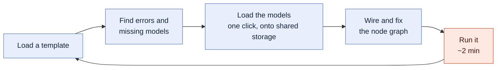
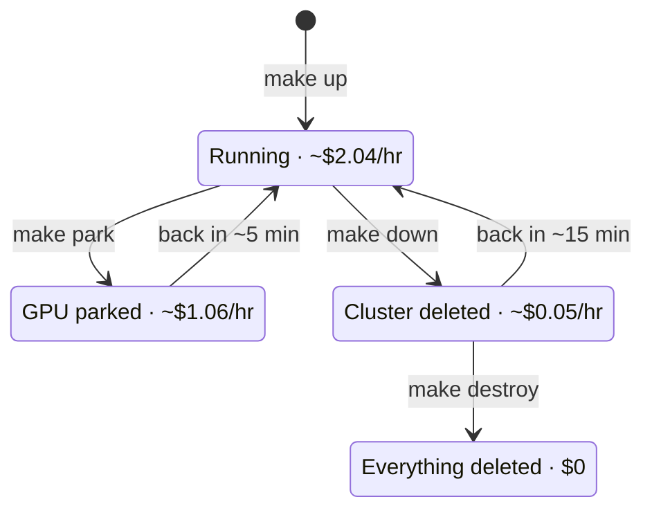
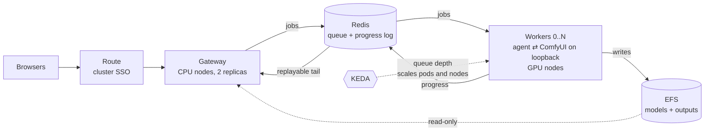
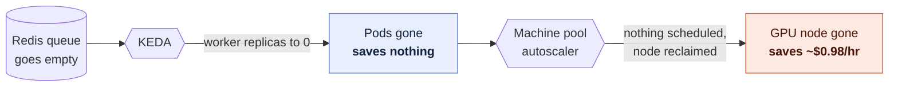
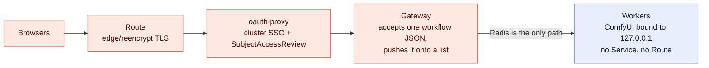
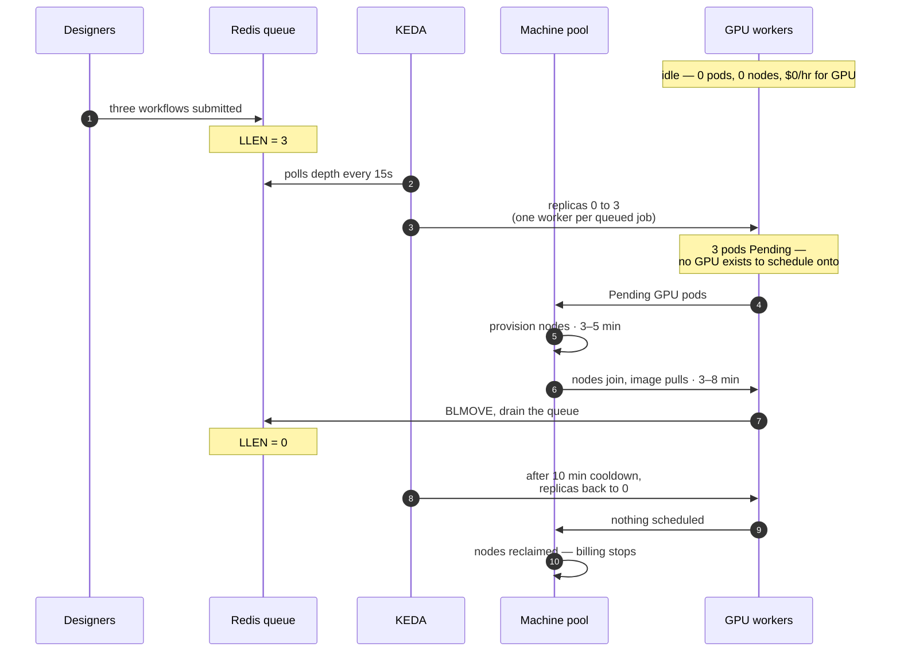
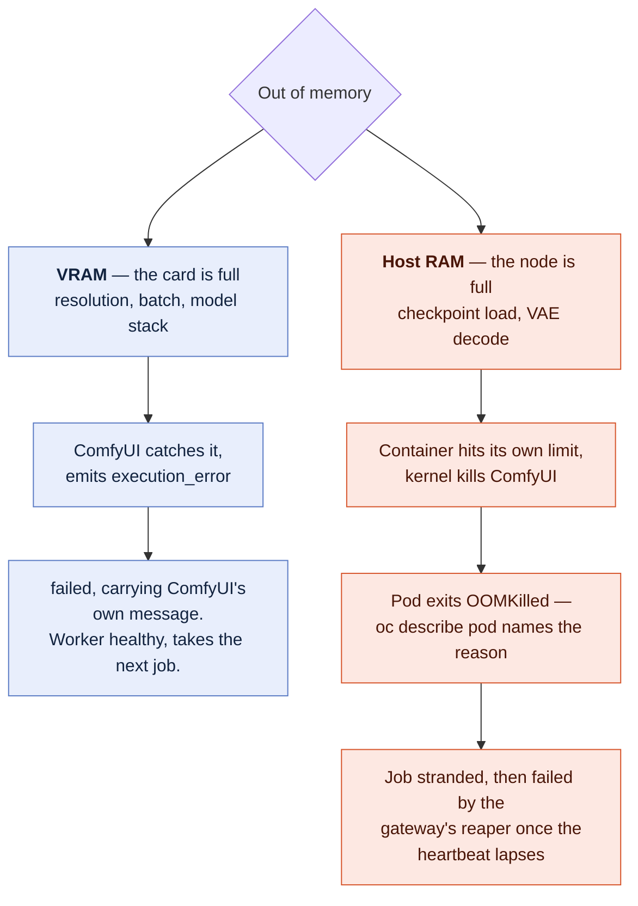
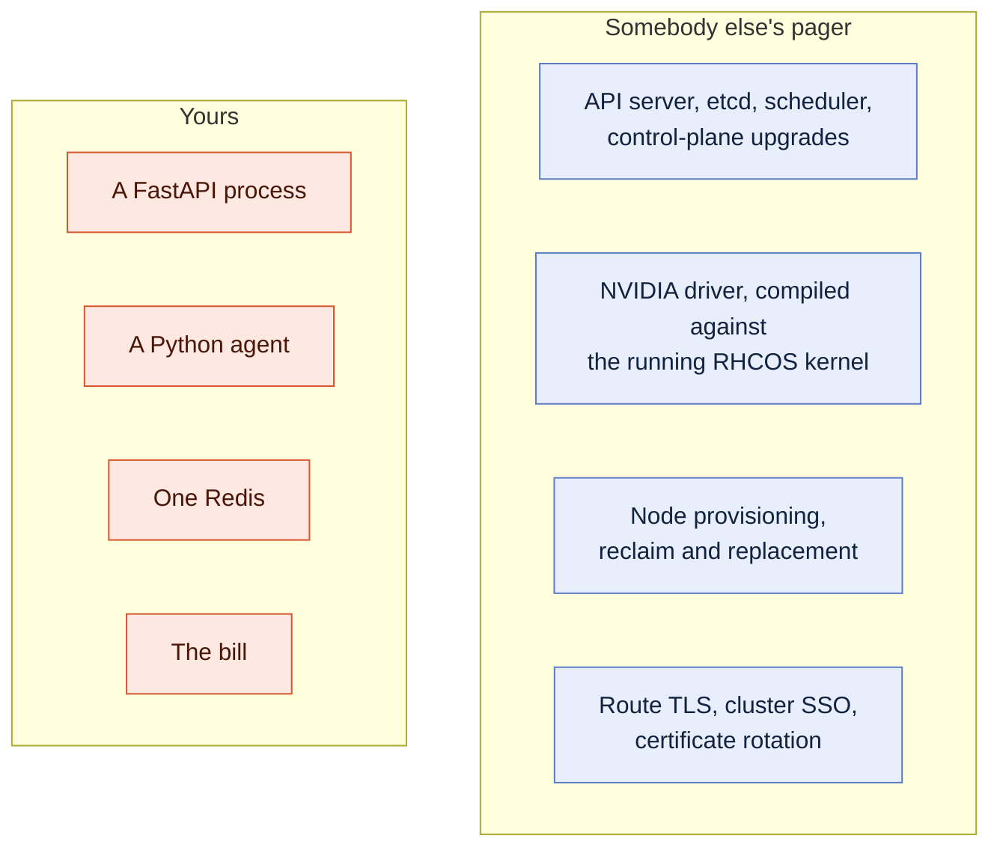

# ComfyUI on OpenShift

[](https://github.com/redhat-et/comfyui-on-openshift/actions/workflows/ci.yaml)

A ComfyUI (PyTorch) inference backend on GPU nodes, built for **ROSA** — Red
Hat OpenShift Service on AWS — and portable to any OpenShift 4.x cluster you
already have.

ComfyUI is a single-user desktop application wearing a web UI. It has no
authentication, its custom-node system executes arbitrary Python by design, and
it runs on the most expensive idle resource in your cloud account. Put it in
front of a team and you own two problems at once: an unauthenticated
remote-code-execution endpoint, and a GPU per person because a GPU is
indivisible under Kubernetes.

**OpenShift already solves both, and this repo is the wiring.** Cluster SSO,
a queue that lets GPU workers appear and vanish, a machine pool that autoscales
to *zero nodes*, driver lifecycle, arbitrary-UID isolation, network policy,
audit logging, in-cluster image builds with no registry credential to rotate —
none of that is written here. It is the platform. What is written here is the
~8,700 lines that connect ComfyUI to it, and every place that connection turns
out to be subtle.

Two configurations share one cluster, one GPU operator, and one set of volumes:
a single-user pod for one person and one GPU, and a multi-user configuration
with a queue, cluster SSO, and a GPU pool that scales to zero. The queue and
gateway logic is covered by an end-to-end test suite that runs on your laptop
in about a minute — no cluster, no GPU, no AWS account (`make test`).

## What changes for the people using it

Almost nothing. This is stock ComfyUI — the upstream project at a pinned tag,
not a reimplementation and not a wrapper — so the loop a designer already has
survives intact:

| Their loop | On this platform |
|---|---|
| Load a template | Stock ComfyUI, the same workflow JSON. Identical. |
| Find errors and missing models | ComfyUI-Manager lists exactly what the workflow needs and you do not have. Identical. |
| Load the models | One click — into `/models`, a volume that outlives the cluster, pulled at datacenter bandwidth rather than over a home connection. Same action, better outcome. |
| Run a complicated node graph | Stock ComfyUI on an L4 24 GB. For most designers, a bigger card than the one under their desk. |
| Load the next template, repeat | Identical. |

Two things are genuinely different, and both are better known up front than
discovered. **Model downloads persist; runtime custom-*node* installs do not** —
Manager will tell you a node is missing, but making it stick means
`app/src/custom_nodes/` and a rebuild. And in the multi-user configuration **the
gateway is not the ComfyUI canvas**: authoring stays in ComfyUI, and the gateway
is where a finished workflow goes to run on a shared GPU.

The reason any of this is worth doing is where the time actually goes:



Four of those five steps never touch a GPU. Setting a scenario up — finding a
template, chasing the models it needs, wiring and fixing the graph — takes far
longer than the inference, which is often a couple of minutes or less. A
designer needs a GPU for a small fraction of their working day, so ten designers
do not need ten GPUs. They need one pool, a queue, and a card that turns off in
between.

## One GPU, ten people

The sharpest number here, using this repo's own rates.

A `g6.xlarge` worker node is **$0.976/hour all-in** — $0.805 to AWS for the
card, $0.171 to Red Hat for its vCPUs. A pod per person means a card per
person, because a GPU is indivisible under Kubernetes:

| Ten users | GPU line, per month |
|---|---:|
| A pod per person, running | ~$7,100 |
| One autoscaled pool, ~4 GPU-hours/day of real generation | ~$120 |

That second row assumes about **0.4 GPU-hours per person per day** — roughly a
dozen two-minute generations each. A designer iterating hard is closer to 1.3,
which is three times the GPU line and still nowhere near a card each. The
assumption is stated because it drives the number.

That is not a discount, it is a structural consequence of separating the thing
users touch from the thing that costs money. The ratio moves with your
utilization; the direction does not.

## The numbers, briefly

The smallest useful cluster — one ComfyUI pod on an L4, us-east-2, on-demand:

| State | $/hour | Getting back |
|---|---:|---|
| Running | ~2.04 | — |
| GPU parked (`make park`) | ~1.06 | ~5 min |
| Cluster torn down (`make down`) | ~0.05 | ~15 min |



| Habit | Monthly |
|---|---:|
| Left running 24/7 | ~$1,490 |
| Weekdays 9–6, `make park` nightly | ~$800 |
| Weekdays 9–6, `make down` nightly | ~$370 |
| Up one day a week | ~$85 |

**A single cron line is a 75% cut.** Not a migration and not a rewrite — a
scheduled `make down` and a Monday-morning `make up`, with models on EFS or S3
so the rebuild costs nothing but time you were asleep for. Three things to do
about cost:

1. **`make account` first.** A new AWS account has a GPU quota of exactly
   zero, and the increase is the one step with a lead time measured in days.
2. **Set `BUDGET_ALERT_EMAIL` in `.env`.** The budget alarm is free and it is
   the guardrail between you and a four-figure surprise.
3. **Park at lunch, down overnight.** `make park` and `make down` — and
   `docs/02-cost.md` has crontab lines that make the habit automatic.

The full accounting — every fee, the monthly patterns, and where money leaks
— is in `docs/02-cost.md`.

## How it fits together

One pod and one GPU for a single person. For a team, a FastAPI gateway on cheap
CPU nodes, Redis as the queue and progress bus, and GPU workers that are
unreachable by design and scale between 0 and N on queue depth:




Nothing in that picture is a component this repo invented. The queue is Redis,
the scaling is KEDA and a machine pool, the login is the cluster's own identity
provider, and the thing doing the generating is stock ComfyUI.

## Which path are you on?

| You | Do this |
|---|---|
| No AWS account yet | `docs/01-aws-account.md` — ~20 minutes of browser work — then the quickstart below |
| Your own ComfyUI on a GPU, managed for you | The single-user quickstart below |
| A team sharing a GPU pool, with SSO and scale-to-zero | The multi-user quickstart below |
| Already have an OpenShift cluster | `PLATFORM=openshift` in `.env`, `oc login`, then `make gpu storage deploy` (or `make gpu storage enterprise`) — nothing in those steps is ROSA-specific |
| Just evaluating the code | `make test` runs the gateway and worker against a real Redis and a stub ComfyUI, locally |
| Taking this over from someone | `docs/09-engineering-handoff.md` |

## Why this platform, specifically

This repo will run on any OpenShift, but ROSA with hosted control planes is
where it is designed to feel best. Seven reasons, each of which is a file in
this repository rather than a claim.

### Cost — the platform can turn the GPU off, and turn the cluster off

- **Scale-to-zero means zero *nodes*, not zero pods.** KEDA watches Redis
  queue depth and drops the worker Deployment to 0 replicas; the ROSA machine
  pool autoscaler then reclaims the GPU node underneath it. Only the second
  layer saves money — an idle GPU node bills identically whether a pod is
  scheduled on it or not — and it is the layer most tutorials skip.
  (`enterprise/manifests/03-autoscale.yaml`)


- **A ~15-minute rebuild makes teardown a habit instead of a heroic act.**
  HCP's flat $0.25/hour control-plane fee and fast build are what turn
  `make down` into a cron line. On a cluster that takes forty minutes to
  rebuild, nobody tears down and everybody overpays. (`docs/02-cost.md`)
- **The bill is a command, not a spreadsheet.** `make status` reads your live
  machine pools and prints the hourly burn — including the ROSA service fee
  that people forget also applies to the GPU node's vCPUs.
  (`scripts/06-status.sh`)
- **A budget alarm before the first dollar.** `make account` files the GPU
  quota request and arms an AWS budget alarm in the same step, because human
  discipline is exactly what an alarm exists to distrust.

### Utilization — one pool serves the team

- **A queue instead of a card per person.** A FastAPI gateway on cheap CPU
  nodes holds every browser session; workers pull jobs from a Redis list. Ten
  users stop meaning ten GPUs and start meaning a deeper queue.
- **Redis is the entire interface.** No browser ever holds a connection to a
  worker, so workers can vanish mid-shift with no connection state to repair.
  That property is what makes scale-to-zero possible at all.
- **Elastic to a ceiling you set.** One queued job asks for one worker, up to
  `MAX_GPU_WORKERS`. Burst rendering gets parallel cards; a quiet afternoon
  gets none.

### Security — the strongest control is architectural

- **The GPU pods are unreachable by construction.** Every worker binds ComfyUI
  to `127.0.0.1` and has no Service and no Route. This is not defence in depth,
  it is the primary control, and it removes ComfyUI's entire vulnerability
  class from the network. (`docs/04-exposing.md`)


Everything on the left is reachable and authenticated. The worker on the right
is reachable by nothing at all — which is why ComfyUI having no login of its own
stops being a problem rather than becoming one.

- **SSO you already own.** An `oauth-proxy` sidecar puts the cluster's own
  identity provider in front of the gateway, and rebinds the gateway to
  loopback so the login cannot be bypassed from inside the cluster either.
- **Authorization is a role, not a user database.** Access is a
  SubjectAccessReview against the namespace: grant with
  `oc adm policy add-role-to-user`, revoke by removing it, and read the whole
  history in the cluster audit log. Nothing to build, secure, or forget to
  secure.
- **Least privilege all the way down.** Redis carries a generated password and
  a NetworkPolicy admitting only the gateway and the workers; the S3 model role
  is read-only so a compromised pod cannot corrupt the canonical store; the
  gateway blocks path traversal on the output endpoint.

### Operations — the hard parts are somebody else's job

- **The control plane is SRE-managed**, under the joint Red Hat + AWS support
  model. You operate one namespace, not a cluster.
- **Nobody hand-installs a CUDA driver.** NFD labels the cards, the NVIDIA GPU
  Operator compiles and rolls the driver against the running RHCOS kernel, and
  a smoke test proves `nvidia-smi` before you deploy anything.
- **No registry credential to rotate.** Images build in-cluster into the
  internal registry, which sidesteps the ECR trap: a 12-hour pull token that
  works the day you create it and fails the first job of every morning after.
- **Termination is routine, and handled.** The worker traps SIGTERM and drains
  the running job; a TTL'd heartbeat plus a per-worker processing list means
  even an OOM kill surfaces a real failure rather than a progress bar that
  never moves.

### Time to value

- **Four commands to a working GPU cluster** — `make cluster gpu storage deploy`,
  roughly 55 minutes, mostly unattended. Every script is idempotent;
  re-running skips what is already done.
- **Preflight catches the multi-day blocker first.** A new AWS account has a
  GPU quota of exactly zero and the increase takes days. `make preflight` is
  read-only and tells you before, not after, a twenty-minute cluster build.
- **Evaluate it with no cluster, no GPU, and no AWS account.** `make test`
  runs the real gateway and the real worker agent against a real Redis and a
  stub ComfyUI, in about a minute.
- **The eight-step EFS setup is scripted.** RWX storage on an STS cluster is
  eight things that must all be right simultaneously; getting six right yields
  a PVC stuck in `Pending` with no useful event. That is why it is a script.
- **The failure modes are written down** — eight documents covering what
  actually goes wrong, including a dedicated page on why the force-delete
  everyone reaches for causes the symptom it claims to cure.

### Correctness — the bugs that only appear in a cluster, already fixed

- **Redis Streams, not pub/sub.** `XREAD` from `0-0` replays history and then
  tails live in one call, so a browser that opens its socket a beat after the
  POST — the common case, not the edge case — loses nothing.
- **Every event filtered by `prompt_id`.** One ComfyUI multiplexes all prompts
  onto one socket; without the filter, another job's terminal event ends yours
  and reports success on work still running.
- **Backpressure instead of a silent Redis OOM.** The gateway rejects
  submissions past a configurable depth and Redis runs `noeviction` — the
  default would quietly evict queued jobs, which looks exactly like work
  disappearing at random.
- **Long jobs keep their connection.** HAProxy's 30-second default kills a
  generation mid-render and reads like an application bug. Every Route carries
  a four-hour timeout.

### Portability and oversight

- **Not a ROSA lock-in.** `PLATFORM=openshift`, `oc login`, and the same GPU,
  storage and deploy steps run against any OpenShift 4.x cluster — on-prem,
  bare metal, vSphere.
- **Metrics the cluster already knows how to graph.** The gateway exports
  `comfy_queue_depth` and `comfy_workers_registered`, and `setup.sh` applies a
  ServiceMonitor so user-workload monitoring can alert on a wedged pool before
  a human notices.
- **Every job has a name attached.** The gateway stamps the authenticated
  username onto job state, so when the GPU bill asks whose job this was, there
  is an answer.
- **Reproducible by policy.** ComfyUI is pinned to a tag both images build,
  custom nodes are baked in from `app/src/custom_nodes/`, and runtime
  installers are off by default — so the image that passed review is the image
  that renders.

## GPU machines scale up automatically with demand

Nobody provisions anything. Queue depth is the only input, and it drives both
layers — the pods, and then the machines underneath them:



**`Pending` is the mechanism, not a symptom.** A GPU pod with nowhere to run is
exactly what makes the machine pool provision a node — the thing that looks like
a failure is the signal. The ceiling is `MAX_GPU_WORKERS`, so a burst cannot
quietly become a four-figure afternoon.

The timings are the honest part. The second worker pays the same cold start as
the first, so autoscaling out serves a sustained batch well and often arrives
after a short spike has already been drained by the worker that was already
warm.

## Single user — one pod, one GPU

```bash
cp .env.example .env && $EDITOR .env

make tools        # aws, rosa, oc, jq
make preflight    # checks everything, changes nothing
make account      # quota requests + budget alarm   <-- run this first, it has a lead time
make cluster      # ROSA HCP + GPU machine pool     (~20 min)
make gpu          # NFD + NVIDIA GPU Operator       (~20 min)
make storage      # model and output volumes
make deploy       # build and run ComfyUI           (~15 min)
make forward      # http://localhost:8188
```

## Multi user — queue, SSO, GPU pool that scales to zero

Same cluster, different last step:

```bash
# STORAGE_MODE=rwx in .env — the gateway and the workers share a volume
make cluster gpu storage
make enterprise                        # one script does the rest
```

The shape of it is in **How it fits together** above.

`enterprise/README.md` to run it, `docs/06-enterprise-architecture.md` for why
it is shaped that way.

<details>
<summary><b>What happens when things fail</b> — every failure mode, what the system does, and what the user sees</summary>

<br>

Most of this repository's design is failure handling, so it is worth being able
to read it in one place. Nothing below is aspirational: each row is a code path
you can find, and most are covered by an assertion in `enterprise/test/`.

#### Out of memory — three different failures that people call one thing

ComfyUI makes it easy to exceed memory, and the three ways it happens are not
handled alike. Knowing which one you hit is most of the diagnosis.

| | What actually happens | What the user sees |
|---|---|---|
| **VRAM / CUDA OOM** — the common one: a resolution, batch size or model stack that does not fit the card | ComfyUI catches it and emits `execution_error`. The agent (`worker_agent.py:279`) turns that into a terminal `failed` carrying ComfyUI's own exception message. The worker stays healthy and takes the next job. | `failed: Allocation on device ...` — the real message, not a generic error. Nothing is retried, because the same workflow would fail the same way on any card. |
| **Host RAM OOM** — a large checkpoint load, a VAE decode, a wide batch | The container hits its own memory limit and the kernel kills ComfyUI inside that cgroup. `start.sh` waits on both children, so the pod exits rather than limping on with a dead ComfyUI and a live agent claiming jobs it cannot run. | The job is stranded, then failed by the gateway's reaper (below) once the worker's heartbeat lapses. At the queue level this is still indistinguishable from infrastructure death — but the pod is not: it terminates as `OOMKilled` and `oc describe pod` names the reason. |
| **Node-level pressure** — eviction rather than a container kill | The kubelet evicts with a grace period, so SIGTERM arrives first and the drain below applies. A GPU pod is Guaranteed QoS, so it is the last thing evicted, not the first. | Usually nothing: the job finishes before the pod goes. |

That the second row says `OOMKilled` and not "the node decided" is a property of
the manifest, not of luck: the GPU pod's memory limit is set to something the
node can actually give it, so the container reaches its own ceiling first. A
limit larger than the node — the shape this repo shipped with, `24Gi` on a
16 GiB `g6.xlarge` — can never be reached, which turns the second row into the
third and costs you the attribution. `scripts/lint.sh` fails a GPU pod that
drifts back to it.



#### Worker death

| Failure | Handling | User-visible result |
|---|---|---|
| **Graceful termination** — scale-to-zero, a node drain, a rolling deploy, a spot interruption notice | The agent traps SIGTERM, stops accepting new work, and **finishes the job in flight** before exiting (`worker_agent.py`, note 4). Termination is routine on a pool that scales to zero, so this is the common path, not the exceptional one. | The generation completes normally. Asserted by the e2e suite. |
| **Hard kill** — SIGKILL, kernel OOM, node death | The agent parks each job in a per-worker processing list with `BLMOVE` and holds a TTL'd heartbeat (note 5), and writes a `phase` breadcrumb as it goes (note 6). When the heartbeat lapses, the gateway's reaper reads that breadcrumb and either fails the stranded job **naming the dead worker**, or — only if the worker died before ComfyUI was ever handed the workflow — requeues it once. | Died mid-generation: `failed: worker comfy-worker-xxxx died`, loudly, rather than a progress bar that never moves. Failed and not requeued on purpose — a workflow that OOM-killed one worker would OOM-kill the next one too, at GPU prices — and the message points at `oc describe pod`, which *can* tell an OOM kill from a reclaim. Died before it started: a non-terminal `retry` event the browser reads past, and a second worker finishes the job. Both asserted by the e2e suite. |
| **A worker that comes straight back** — the container is restarted inside its own pod, which is how `restartPolicy: Always` answers a kernel OOM | The heartbeat key and the processing list are named from the worker's *incarnation* — its pod name plus a nonce chosen at process start (`worker_agent.py`, note 9) — not from the pod name alone, which a restart keeps. The reaper's whole liveness test is pairing those two keys by name, so an id that outlives the process it names lets the replacement vouch for its own predecessor. | The restart is invisible to the stranded job: it is failed by the reaper on exactly the schedule it would have been if the pod had never come back. Without the nonce the *same* row above silently stops applying — the job never reaches a terminal state at all, its GPU seconds land in neither bucket, and its queue entry stays in Redis for the life of the pod. Asserted by the e2e suite, restart and all. |
| **ComfyUI wedges or dies mid-job** | The agent's `recv()` is bounded and each job carries a deadline (`JOB_TIMEOUT`, 1800s). On every timeout it re-checks `/history` in case a completion event was simply missed. | The job fails with a reason instead of the pod sitting `Running` and `Ready` while silently consuming nothing — which is worse than a crash, because KEDA sees a growing queue and adds more workers beside the dead one. |

#### The job itself

| Failure | Handling | User-visible result |
|---|---|---|
| **Invalid workflow** — wrong format, missing input, unknown node | ComfyUI rejects it at submit and the agent propagates the rejection verbatim. | `failed: required input is missing: ckpt_name` rather than `failed`. The difference is most of the support burden. |
| **Job runs too long** | The per-job deadline fires. | `failed: job exceeded 1800s`. Raise `JOB_TIMEOUT` if your workflows legitimately run longer. |
| **Cancel** | Cooperative: a queued job is removed, a running one is asked to stop between events. Truly interrupting a running sampler would need ComfyUI's `/interrupt`, and the workers are not reachable from the gateway by design. | Queued jobs stop immediately; running ones stop at the next event boundary. |

#### The connection

| Failure | Handling | User-visible result |
|---|---|---|
| **The browser opens its WebSocket after the job already started** | Progress lives in a Redis Stream, not pub/sub. `XREAD` from `0-0` replays the whole history and then tails live in one call. | Nothing is lost. This is the common case — the POST and the socket open are two separate round trips — not an edge case. |
| **Laptop sleeps, network drops, gateway pod rolls** | Same mechanism: reconnecting replays identically from the beginning. A PodDisruptionBudget keeps one gateway serving through drains and upgrades so both replicas cannot go at once. | The progress bar picks up where it was. |
| **A long generation outlives the router's idle timeout** | Every Route carries both `haproxy.router.openshift.io/timeout: 4h` and `timeout-tunnel` — on edge and reencrypt Routes only the tunnel timeout governs the upgraded WebSocket. | Long jobs keep their connection. Without both annotations they drop at a fixed point every time, which reads exactly like an application bug. |

#### The system

| Failure | Handling | User-visible result |
|---|---|---|
| **Queue grows faster than the pool drains** | The gateway refuses submissions past `MAX_QUEUE_DEPTH`, and Redis runs `maxmemory-policy noeviction`. | An explicit rejection. The default eviction policy would silently drop queued jobs instead, which presents as work disappearing at random. |
| **Redis restarts** | AOF persistence. | Queued and in-flight state survives a pod restart. It does not survive a zone outage — Redis is a single instance, deliberately, at one-GPU scale. |
| **A dead pod will not release its volume** | `scripts/08-unstick-storage.sh --repair`, which confirms the EC2 instance is genuinely terminated before force-detaching. | Repairable. Do **not** reach for `oc delete pod --force --grace-period=0`: it strands the volume permanently instead of freeing it. `docs/08-stuck-volumes.md`. |
| **No GPU capacity, or no quota** | The worker pod stays `Pending`. `make preflight` distinguishes the two — quota is a multi-day fix, capacity is a region or instance-family change. | `docs/05-troubleshooting.md`. |
| **First job after an idle period** | Not a failure, but it looks like one: a node has to be provisioned and a ~10 GB image pulled. | 8–17 minutes, and the gateway says so rather than leaving a bar that has not moved. Removed entirely by one warm worker — see "Where this loses". |
| **Someone requests a path outside the output directory** | Resolved and compared against the output root before anything is served. | `/outputs/../../etc/passwd` does not resolve. Asserted by the e2e suite. |
| **A submitter's name, or a workflow's filename prefix, tries to become a path** | Both are caller-supplied and both end up on the filesystem, so both are handled as hostile. The username is sanitized to a name that cannot contain a separator, then joined, then resolved, then verified inside the output root — in that order. A `filename_prefix` carrying `..` or an absolute path is refused outright. | A username of `../../etc/passwd` gets an ordinary confined workspace rather than a traversal; a workflow trying to write outside its workspace fails with a message naming the prefix. Asserted by the e2e suite. |
| **ComfyUI's own reported output filename tries to become a path** | Not caller-supplied, but not trusted either: `output_subfolder()` confines the reported `subfolder` *and* the reported `filename` on the same footing, and `collect_outputs()` refuses to build a served URL from either half until both pass. A filename that is not a single bare path component (a `/`, a `..`, a NUL) is dropped from the manifest outright rather than served under a rewritten name. | A node reporting `{subfolder: "", filename: "../../OUTSIDE/secret.txt"}` produces no image entry at all — not a traversal, and not a same-named file served from the wrong place either. Asserted by the e2e suite (`check-65-output-filename-confinement.py`). |
| **Someone reads another user's output workspace** | Deliberately possible, not a bug: `/outputs/...` is served to any caller with the URL, and the workspace name a job lands in is a *pure, publicly computable* function of the username (allowlist slug + a truncated `sha256`) — no lookup or prior URL is needed, only the username itself. Output workspaces are scoped for organisation, not for isolation; see `docs/06-enterprise-architecture.md`. | Knowing (or guessing) `alice@example.com`'s username is enough to compute her workspace path and fetch whatever is in it. Real read isolation would need an identity the gateway can trust in every `AUTH_MODE`, which is a different, unbuilt item. |
| **Under `AUTH_MODE=none`, a caller writes into someone else's workspace** | `X-Forwarded-User` is client-supplied in this mode (`hub.py` says so in three places), and the worker writes into whichever workspace that header names, overwriting an existing same-named file there. Inherent to `AUTH_MODE=none`: with nobody authenticated, there is no "someone else" for the header to misrepresent. | Setting `X-Forwarded-User: alice` writes into (and can silently overwrite) alice's output workspace, no login required — on top of the GPU budget `AUTH_MODE=none` already warns about. Run `AUTH_MODE=oauth` if either matters to you. |

</details>

## Where this loses, and what to do about it

Both boundaries are narrow, both are priced, and both have a flag that changes
them.

**Interactive iteration against a cold pool.** The first job after an idle
period is 8–17 minutes: provision a node, pull a ~10 GB image, initialise CUDA,
load the checkpoint. For a designer adjusting a prompt every four minutes,
that lands in the middle of a creative loop.

```mermaid
gantt
    title Minutes to first image
    dateFormat X
    axisFormat %M
    tickInterval 5minute
    todayMarker off
    section Cold pool
    Provision a GPU node        :0, 300
    Pull the ~10 GB image       :300, 780
    CUDA init, custom node scan :780, 900
    Load the checkpoint         :900, 1020
    Generate                    :crit, 1020, 1140
    section Warm worker
    Generate                    :crit, 0, 120
```



The fix is a warm worker, and it is one variable:

```bash
SCALE_TO_ZERO=false     # in .env — pins one worker; KEDA still scales 1..N above it
```

That removes the cold start entirely — the first job of the day starts in
seconds, and the pool still bursts to `MAX_GPU_WORKERS` under load. It costs
one GPU node for as long as you leave it up: **~$195/month if you pin it
weekdays 9–6 and `make park` or `make down` at night**, which is less than one
designer waiting fifteen minutes every morning.

Worth being precise about what "cold" costs, because the two layers are
separable:

| What is cold | Cost of the first job | Removed by |
|---|---:|---|
| No node — provision + ~10 GB image pull | 6–13 min | pinning the machine pool at 1 during work hours |
| Node warm, no pod — CUDA init + checkpoint load | 1.5–4 min | a warm worker pod (`SCALE_TO_ZERO=false`) |
| Warm worker | seconds | — |

So the honest shape for a design team is not "scale-to-zero or don't". It is:
**one warm card during working hours, zero at night and at weekends.** The
cold start then happens at most once, before anyone is at their desk, and
scale-to-zero still does its job for the other fourteen hours a day. See
"Ideas worth doing next" for scheduling that automatically.

Scale-to-zero earns its keep unmodified on bursty, batch and out-of-hours work,
where a ten-minute wait for a job nobody is watching costs nothing.

**One person, one GPU, nothing to share.** If you are not exercising OpenShift
semantics and there is no team to serve, a plain EC2 instance with podman is
$0.81/hour and this is a heavier answer than the question. `docs/02-cost.md`
says so itself, with a comparison table.

## Running alongside model-serving workloads

This is not a model server and is not trying to be one. The difference is the
unit of work, not the quality of either.

A serving engine like vLLM holds one model resident and multiplexes many
requests against it — continuous batching, a shared KV cache, throughput from
packing concurrent sequences into a single forward pass. That is the right
shape when the model is fixed and the requests are many.

ComfyUI's unit of work is a graph, not a prompt: a DAG of dozens of nodes whose
composition changes per job, over a model set the user keeps changing.
Diffusion is not autoregressive, so there is no KV cache to share and no
token-level interleaving to exploit — batching means batching identical
configurations, which ComfyUI already does inside a single workflow. And the
custom-node ecosystem, arbitrary Python per node, is both why designers use it
and exactly what does not fit behind a fixed serving API.

The economics follow from that, and they are what decides it. A serving engine
earns its throughput by keeping a model resident, so serving N models means N
deployments, each pinning a GPU — and a server that has scaled to zero is not
serving. Adapters can be multiplexed onto a shared base model; different base
checkpoints cannot. A design team's library is many base models — SD1.5, SDXL,
FLUX, a video model, and whatever last week's template pulled in — so residency
would mean close to a machine per model, held warm whether or not anyone
touches it that afternoon.

This workload inverts both sides of that. Many models, few requests each,
loaded per job from a shared volume onto a card that turns off in between. It
is the same observation as the loop at the top of this README: the models are
many and the requests are few, so residency optimises the wrong thing.

None of which makes them competitors. They are layers, and **everything this
README argues applies to both** — the GPU operator, the machine pool that
scales to zero, cluster SSO, the audit log, quota and the cost controls are
properties of the platform, not of ComfyUI. A cluster built this way hosts a
serving deployment as readily as it hosts this one.

If you run both, give them separate machine pools. A serving deployment wants a
warm resident GPU and suffers under scale-to-zero; this workload is bursty and
depends on it. They also draw on the same GPU quota, which is the constraint
that bites first — `make preflight` checks it, and it is a multi-day fix.

## How far this scales

Roughly a hundred designers on the architecture as it stands, and the limit is
not the one people expect.

The economics are worth stating first, because they run backwards from the
intuition: **this is expensive per person for a small team and cheap for a large
one.** The cluster floor — control plane, base workers, NAT gateway — is about
$1.06/hour whether one person uses it or a hundred. Across five designers that
is over $150 each per month before a single image is generated; across a hundred
it is under $8. If your team is small, the honest comparison is not against
dedicated cloud GPUs, it is against the workstations they already have.

### Why it is cheap, which is not the reason people assume

Not "we remember to turn the cluster off". A designer needs a GPU for roughly
**14% of their working day** — call it 1.3 GPU-hours out of nine. Finding a
template, chasing the models it wants, wiring the graph and fixing what it
reports back is the other 86%, and none of it touches a card. The inference is
a couple of minutes at the end of a long setup.

So a dedicated GPU sits idle about **six of every seven working hours**, not
through carelessness but because that is the shape of the work. Splitting the
saving for thirty designers, GPU line only:

| Arrangement | Card-hours/month | |
|---|---:|---|
| A card each, running 24/7 | 21,900 | — |
| A card each, off outside work hours | 5,940 | **3.7×** — just turning it off |
| Pooled, scaling with demand | 1,257 | **4.7× more** — recovering the setup time |

The first factor is not architectural: anyone disciplined enough to shut
instances down nightly gets it without a cluster. The second is, and it is the
one worth defending. **The queue does not create a saving; it converts one
person's setup time into another person's inference capacity.** You can turn a
card off overnight. You cannot turn it off for the forty minutes somebody
spends wiring a graph and have it back the instant they press run — not without
a pool and a queue.

That also explains the `SCALE_TO_ZERO`, `cooldownPeriod` and warm-worker knobs:
each is a decision about how much of that recovered idleness to hand back in
exchange for latency.

**The bottleneck is storage, not GPUs.** Every cold worker reads a 7 GB
checkpoint over NFS, and a pool that scales means "this node does not have that
model yet" is the normal case rather than the exception. More designers means
more distinct models, which means more first-loads. The queue, the gateway, the
reaper and the security model are all nowhere near their limits.

The reason is a design detail worth naming: **models and outputs have opposite
requirements and share one volume.** Models are read-only, huge, identical
across pods, and perfectly cacheable — a per-node copy is ideal. Outputs are
written by one pod and read by another, which is the *only* reason this design
requires `ReadWriteMany`. EFS exists to solve outputs; models were put on it
because it was already there.

### Five changes, cheapest first

1. **Bake the hot model set into the worker image.** If five checkpoints cover
   most jobs, ship them in the image — the node pulls it anyway, so the
   container runtime becomes the cache. A day's work, and the right thing to
   price before building anything cleverer.
2. **Managed multi-AZ Redis.** Redis is the queue, the progress log and the job
   state, currently one pod that survives a restart but not a zone. ElastiCache
   removes that single point of failure with no application change at all —
   same protocol. The highest ratio of risk removed to work done here.
3. **Outputs to S3, with presigned URLs.** Workers write results straight to
   object storage and the gateway returns a URL rather than serving bytes off a
   mount. This is the one that removes the `ReadWriteMany` requirement outright.
4. **Models to S3, hot copies on node-local NVMe — then group them.** Stage on
   first use so every later load is local. Then cache hit rate becomes a
   placement problem: group models by family, give each family a machine pool,
   pre-warm it, route by declared model. Blocked on a real unknown — ROSA HCP
   exposes no MachineSet, so how instance store is attached at all is
   unanswered. That is the spike in `docs/10-roadmap.md`.
5. **Kueue for scheduling, MIG on the big cards.** The fair-queueing here is
   correct and measured, and it is also a small scheduler written by hand;
   Kueue is the Kubernetes-native one, with quota-aware queueing and fair
   sharing across teams. And on A100/H100 — unlike L4 — MIG partitions a card
   in hardware with genuinely isolated memory, which is the property
   time-slicing lacks and the reason time-slicing is rejected above. Only worth
   it at hundreds of GPUs.

With those, this design reaches several hundred designers and low hundreds of
GPUs without a rewrite; the shape stays the same. Past that it is multi-cluster
with a federated queue, and the hard problems stop being technical.

### One thing to know about the big cards

You cannot buy three H100s. AWS sells them as `p5.48xlarge` — eight of them,
192 vCPU, one node — so the smallest unit you can scale to is eight, the ROSA
service fee alone is about $8.21/hour on that node before EC2, and the worker
sizing in `enterprise/manifests/02-worker.yaml` is calibrated for a 4-vCPU
16 GiB machine and would need rework. Going up the range is a decision about
VRAM, not throughput: it buys the workflows that do not fit at all. If the queue
is simply long, two L4s beat one L40S at about the same price.

## Ideas worth doing next

Ordered by payoff per unit of work. Five have landed, and half of a sixth,
along with three
foundation items that were never on this list — worker resource sizing, a
versioned queue payload, and test-harness discovery. **Struck items stay here:
shipped ones because a roadmap that never visibly moves is a wish list, and
decided-against ones because the reasoning is the useful part.**
`docs/10-roadmap.md` is the worked version and the record: what landed, what
each item deferred to a real cluster, and which two of these should not be done
at all.

1. **Schedule the warm window instead of pinning it.** A pair of cron lines —
   `rosa edit machinepool gpu --min-replicas 1` at 08:30 and `--min-replicas 0`
   at 18:30 on weekdays, with the KEDA `minReplicaCount` following it — gives
   the cold-start-free morning above without paying for a card overnight. This
   is the single highest-value change on the list for a design team, and it is
   two cron entries and one patch. *(Small.)*
2. **Shrink the cold start itself.** The ~10 GB image pull dominates node
   warm-up. Split the worker image so the CUDA + torch layers are a stable base
   that rarely changes, and keep a low-priority placeholder pod on the GPU pool
   so the autoscaler holds one warm node without a real job occupying the card.
   *(Medium — the placeholder/priority-class pattern is standard cluster
   autoscaler practice.)*
3. **Stage models on the node's local NVMe — a spike, not yet a work item.** It cannot be scoped from this repository: ROSA HCP exposes no MachineSet, and the three plausible routes differ enormously in blast radius, with one of them colliding head-on with the arbitrary-UID posture. Answer that before cluster day, not on it. `g6` instances have instance
   store. An init container that copies the active checkpoint from EFS to local
   disk turns every subsequent load from an NFS read into a local read, which
   is the difference EFS costs you today. *(Medium.)*
4. ~~**Narrow retry**~~, and spot separately. These looked like one item and are
   not. Blanket retry re-runs the poison pill: a host-RAM OOM kills the pod and
   is indistinguishable at the queue level from a node reclaim, so "retry on
   worker death" retries the workflow that will kill the next worker too. The
   retry half has **shipped** on exactly those terms: jobs that died *before*
   ComfyUI ever saw the workflow are requeued once, phase breadcrumbs make
   every other death diagnosable, and nothing that reached a GPU is ever
   replayed (`docs/10-roadmap.md`, Q2). Spot never needed retry at all: an
   interruption gives two minutes of notice and the existing SIGTERM drain
   finishes anything that fits in them — its real trade is that longer
   generations are lost. *(Spot remains optional; see `docs/10-roadmap.md`.)*
5. ~~**NVIDIA time-slicing.**~~ **Not doing this** — the decision is made and the reasoning is worth keeping. The device
   plugin can advertise several replicas of one card, but time-slicing provides
   **no memory isolation**: co-resident workflows share the full 24 GB and their
   peak VRAM sums. ComfyUI exceeds VRAM easily on a single tenant, so this turns
   a deterministic per-workflow failure into a non-deterministic one where the
   victim is whichever job allocates second. MIG partitions memory properly and
   is not available on L4. *(Revisit only on MIG-capable hardware.)*
6. ~~**Per-user output workspaces.**~~ **Shipped** — each job now writes into its own
   `/output/<workspace>/`, named from the submitter's identity by the worker
   agent, and every output that comes back is confined there whether or not
   the save node cooperated (`docs/10-roadmap.md`, Q3). Two things it is worth
   knowing it does *not* do. Reads are not caller-scoped: the workspaces are
   organisation and confinement, not access control, because the only identity
   here is a header that is client-supplied under `AUTH_MODE=none` and a
   guarantee that evaporates in one of two modes is worse than a documented
   absence. And usernames are sanitized rather than rejected — an oauth-proxy
   name is an email, so `@` and `.` are the ordinary case. *(The half that
   still needs a cluster is the directory mode: an arbitrary, unstable UID
   means a workspace one pod creates must be group-writable and setgid for the
   next one.)*
7. ~~**Showback from the data you already collect.**~~ **Shipped** —
   `GET /api/showback` reports one UTC month's GPU seconds per submitter, from
   the attribution the queue envelope was already carrying
   (`docs/10-roadmap.md`, Q4). Three things are worth knowing about the number
   before you put it in front of anyone. A **GPU second is one second a worker
   held the card** — wall clock between `running` and the job's terminal
   state, which includes the checkpoint load and any time the agent spent
   parked, and bills a job that failed after twenty minutes for twenty
   minutes. That over-count is deliberate: the pool runs one job per pod on a
   dedicated card, so nobody else could have used it, and an honest over-count
   that says what it includes beats a precise number nobody can reproduce.
   Time from jobs whose **worker died holding the card** is recorded but not
   billed to the submitter — it lands in `excluded_gpu_seconds`, because the
   gateway knows only when it *noticed* the death, not when it happened, and
   that number is inflated by the detection lag; kept visible, it doubles as a
   signal that workers are dying mid-generation. And the accumulator is one
   Redis Hash per month with an expiry and a capped identity count, because
   the name every total is keyed by is a client-supplied header. *(It lives in
   Redis, whose PVC is gp3 — so it does **not** survive `make down`. Capture it
   before a teardown; `docs/09-engineering-handoff.md` §5 has the two lines.)*
8. ~~**Fair queueing.**~~ **Shipped** — one physical Redis list still, with each
   job spliced in at a fairness-computed position rather than always at the
   back, so `LLEN` still means "total jobs waiting", the KEDA trigger needed no
   change, and the pop is the same `BLMOVE` into the per-worker processing
   list. One submitter, or none, degrades to plain FIFO by construction. The
   enqueue cost was measured rather than assumed, and the first implementation
   stalled Redis for 113 ms at full queue depth before it was fixed —
   `enterprise/test/bench-fair-enqueue.py` keeps the number re-measurable.
9. **Scale on queue *wait*, not queue depth.** Depth is a proxy; what a user
   feels is time-to-first-pixel. *(Medium.)* *(The gauge half — Q6 in
   `docs/10-roadmap.md` — is landed: `/metrics` exports
   `comfy_estimated_wait_seconds`, the age of the queue entry served next,
   derived from the `submitted_at` already on every queue envelope. It reads
   zero or absent only when the queue is actually empty, and keeps growing
   with wall-clock time — including with zero workers running, which is the
   scale-to-zero case a Prometheus-scaler trigger needs a real number for.
   Pointing KEDA's Prometheus scaler at it is I4 and still needs a cluster.)*
10. **A model lockfile.** `models.lock` next to `COMFYUI_REF`, enforced by the
    S3 sync job, so an image tag and a model set pin together and a workflow
    that rendered last quarter still renders. Reject anything that is not
    `.safetensors` while you are there — `.ckpt` files are Python pickles and
    loading one executes whatever is inside it. *(Medium.)*
11. ~~**A cost circuit breaker in the gateway.**~~ **Shipped, as the quota
    half** — `QUOTA_GPU_SECONDS` in `.env` gives each user a GPU-second ceiling
    per UTC month, and past it `/api/generate` refuses with a `429` that says
    how much was used, that other submitters are unaffected, and when the
    quota resets (`docs/10-roadmap.md`, Q5). It is **off by default**, and it
    reads the showback accounting from item 7 rather than adding a second one —
    so a refusal is explainable from `GET /api/showback`. The AWS Budgets half
    was deliberately *not* built: it would put cloud credentials on the one pod
    that is the whole public attack surface, to enforce a figure that lags real
    spend by hours. Two properties matter more than the feature. It **fails
    open** — unreadable accounting, an unreachable Redis, a garbled setting,
    all let the job through, loudly, because a breaker that trips on a broken
    dependency halts a cluster you are already paying for. And it is kept out
    of `/readyz` by a lint rule that walks the call graph, because a quota
    check on the readiness probe would take the entire gateway out of service
    the moment one person went over. It is a guardrail on past accrual, not a
    reservation: someone who queues twenty jobs at once goes over while they
    run. The budget alarm remains the backstop.
12. **Build the images with OpenShift Pipelines.** Bumping `COMFYUI_REF`
    becomes a pipeline run with a signed output rather than a laptop running
    `setup.sh`. *(Medium, and the right move once more than one person owns
    this.)*

`docs/10-roadmap.md` turns this list into a work plan — what each item
touches, what proves it, what order they can safely land in, and which of them
cannot be finished without a real cluster. `docs/06-enterprise-architecture.md`
has the complementary list: what is deliberately *not* here and why, including
Redis HA, multi-GPU workers, and interrupting a running sampler.

## What you actually operate

Worth being concrete about, because it is the difference between running this
and running a Kubernetes cluster:



That division is why this repository is around nine thousand lines and not a
distributed system. When you are deciding whether to add something, the first
question is whether OpenShift already does it — because in this problem domain
it usually does, and the version you would write is the version nobody
maintains. `docs/09-engineering-handoff.md` is the long form, for whoever picks
this up next.

## What is in here

```
.env.example              all configuration, one file
Makefile                  one target per step
scripts/
  00-tools.sh             install aws / rosa / oc / jq
  00-preflight.sh         read-only readiness check
  01-bootstrap-account.sh quota requests, budget alarm
  02-cluster.sh           IAM roles, VPC, ROSA HCP cluster, GPU pool
  03-gpu-operators.sh     NFD + NVIDIA GPU Operator + nvidia-smi smoke test
  04-storage.sh           gp3 (default) or EFS RWX
  05-deploy.sh            in-cluster build + deploy
  06-status.sh            what is running and the hourly burn
  07-login.sh             how to reach the cluster
  08-unstick-storage.sh   repair a volume a dead pod never released
  09-s3-models.sh         S3 bucket + IAM role so models outlive everything
  10-push-models.sh       rsync local models into the cluster
  99-teardown.sh          park | cluster | all
  lint.sh                 everything CI checks, runnable locally
  unit-tests.sh           the parsing edge cases, pinned
  ci-smoke-comfyui.sh     real ComfyUI on CPU proving the model-path contract
manifests/base/           single-user Deployment and Service, kustomize
app/
  Containerfile           OpenShift-compatible ComfyUI image
  src/                    >>> your code goes here <<<
enterprise/               the multi-user configuration
  setup.sh                one script: Redis, images, KEDA, SSO, route
  teardown.sh
  gateway/                FastAPI hub — queue jobs, stream progress, serve images
  worker/                 ComfyUI + Redis agent, bound to loopback
  manifests/
  test/                   the e2e suite — real Redis, stub ComfyUI, no cluster
docs/
  01-aws-account.md       the browser-only steps
  02-cost.md              the numbers, and how to keep them down
  03-storage.md           gp3 vs EFS vs S3, and why models are the hard part
  04-exposing.md          how to let other people reach it, safely
  05-troubleshooting.md   the failures you will actually hit
  06-enterprise-architecture.md   hub and spoke, Streams, scale-to-zero economics
  07-design-review.md     what changed from the original design doc, and why
  08-stuck-volumes.md     when a dead pod will not release the volume
  09-engineering-handoff.md  taking ownership: invariants, runbook, open items
  10-roadmap.md           the ideas below, as a work plan with lanes and gates
.github/workflows/ci.yaml lint + the e2e suite, on every PR
```

Scripts are idempotent. Re-running any of them is safe and skips what is
already done.

## Proof, not promises

Four CI jobs run on every pull request, and the local `make` targets are the
same ones CI invokes, so local and CI checks cannot drift.

- **End-to-end with real components.** The real gateway and real worker agent
  against a real Redis and a stub ComfyUI. It asserts that a late subscriber
  loses nothing, a reconnect replays identically, SIGTERM drains rather than
  drops, and a SIGKILLed worker's job fails loudly with the dead worker named.
- **Real ComfyUI, on CPU.** The pinned tag boots with the images' own path
  flags and asserts that checkpoints are visible and custom nodes load.
- **The arbitrary-UID trap, without a cluster.** The gateway image is run as
  UID 1000670000 with GID 0, exactly as `restricted-v2` will run it.
- **Lint.** shellcheck, YAML, Python, and pinned parsing edge cases.

The file-level half of those guarantees is now **mechanically enforced rather
than reviewed**: `scripts/lint.sh` fails the build on a worker that lost its GPU
toleration, a Route that lost `timeout-tunnel`, a Service that regained the
gateway's own port, a Containerfile that lost its `chgrp 0` block, or a GPU pod
whose memory limit no longer fits the node. The end-to-end suite runs no cluster
and reads no manifest, so it can see none of them.

`docs/07-design-review.md` is the most useful artifact here: a written account
of every claim the original design's manifests did not implement and every line
of its Python that would not have run. It is the list of things you would
otherwise have discovered at 2am.

## Configuration

Everything lives in `.env`. The ones you are most likely to change:

| Variable | Default | Notes |
|---|---|---|
| `PLATFORM` | `rosa` | `openshift` to use a cluster you already have |
| `AWS_REGION` | `us-east-2` | good G-family capacity, cheaper than us-east-1 |
| `GPU_INSTANCE_TYPE` | `g6.xlarge` | L4 24 GB, ~$0.80/hr — fits SDXL comfortably |
| `STORAGE_MODE` | `rwo` | `rwx` for EFS shared across pods — see docs/03-storage.md |
| `COMFYUI_IMAGE` | empty | empty means build in-cluster from `app/Containerfile` |
| `COMFYUI_REF` | `v0.32.0` | ComfyUI tag both images build — pinning is deliberate |
| `SCALE_TO_ZERO` | `true` | `false` pins one warm worker — see "Where this loses" |
| `ENABLE_MANAGER` | `false` | **Turn this on for the single-user path.** It is what keeps the familiar loop intact: load a workflow, Manager lists every model you are missing, one click puts them on the persistent volume. Leave it off for the shared pool — there it hands every UI user code execution on a node with cloud credentials, and nothing it writes survives the node being reclaimed. `app/Containerfile` has the full reasoning. |
| `BUDGET_ALERT_EMAIL` | empty | **set this** |

## Three things that will bite you

**The GPU node is tainted** `nvidia.com/gpu=true:NoSchedule`. Anything you
deploy onto it needs the matching toleration. The manifests here have it; your
own pods will not.

**OpenShift runs your container as an arbitrary UID**, not the one in your
Dockerfile. Every path the process writes to must be a mounted volume or be
group-writable and group-root-owned at build time. This is the single most
common reason an image that works under `podman run` crash-loops here — see the
bottom third of `app/Containerfile` for the fix.

**First GPU Operator run takes 10–20 minutes.** It compiles a driver against
the running RHCOS kernel and pulls multi-gigabyte images. It is not hung.

## Sources

- [Set up to use ROSA](https://docs.aws.amazon.com/rosa/latest/userguide/set-up.html)
- [Create a ROSA HCP cluster using the ROSA CLI](https://docs.aws.amazon.com/rosa/latest/userguide/getting-started-hcp.html)
- [ROSA pricing](https://aws.amazon.com/rosa/pricing/)
- [ROSA endpoints and quotas](https://docs.aws.amazon.com/general/latest/gr/rosa.html)
- [rosa create network](https://access.redhat.com/articles/7096266)
- [ROSA with NVIDIA GPU workloads](https://cloud.redhat.com/experts/rosa/gpu/)
