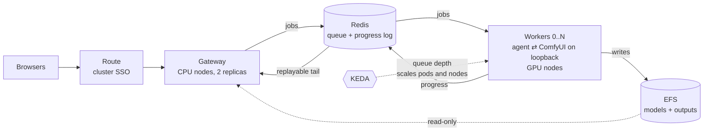
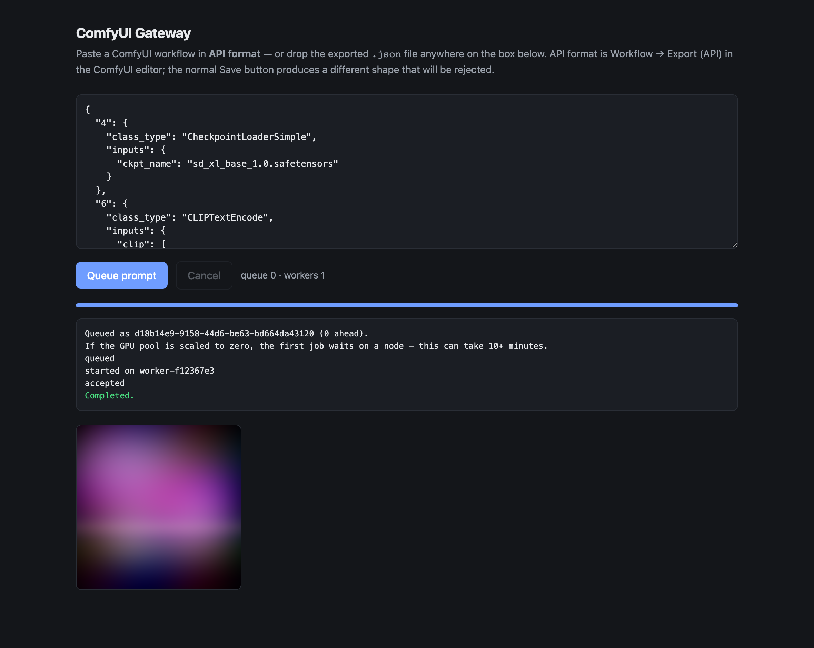

# ComfyUI on OpenShift

[](https://github.com/redhat-et/comfyui-on-openshift/actions/workflows/ci.yaml)

A ComfyUI (PyTorch) inference backend on GPU nodes, built for **ROSA** — Red
Hat OpenShift Service on AWS — and portable to any OpenShift 4.x cluster you
already have.

ComfyUI is a single-user desktop application wearing a web UI. It has no
authentication, its custom-node system executes arbitrary Python by design, and
it runs on the most expensive idle resource in your cloud account. Put it in
front of a team and you own two problems at once: an unauthenticated
remote-code-execution endpoint, and a GPU per person because a GPU is
indivisible under Kubernetes.

**OpenShift already solves both, and this repo is the wiring.** Cluster SSO,
a queue that lets GPU workers appear and vanish, a machine pool that autoscales
to *zero nodes*, driver lifecycle, arbitrary-UID isolation, network policy,
audit logging, in-cluster image builds with no registry credential to rotate —
none of that is written here. It is the platform. What is written here is the
~8,700 lines that connect ComfyUI to it, and every place that connection turns
out to be subtle.

Two configurations share one cluster, one GPU operator, and one set of volumes:
a single-user pod for one person and one GPU, and a multi-user configuration
with a queue, cluster SSO, and a GPU pool that scales to zero. The queue and
gateway logic is covered by an end-to-end test suite that runs on your laptop
in about a minute — no cluster, no GPU, no AWS account (`make test`).

## Which path are you on?

| You | Do this |
|---|---|
| No AWS account yet | `docs/01-aws-account.md` — ~20 minutes of browser work — then the quickstart below |
| Your own ComfyUI on a GPU, managed for you | The single-user quickstart below |
| A team sharing a GPU pool, with SSO and scale-to-zero | The multi-user quickstart below |
| Already have an OpenShift cluster | `PLATFORM=openshift` in `.env`, `oc login`, then `make gpu storage deploy` (or `make gpu storage enterprise`) — nothing in those steps is ROSA-specific |
| Just evaluating the code | `make test` runs the gateway and worker against a real Redis and a stub ComfyUI, locally |
| Taking this over from someone | `docs/09-engineering-handoff.md` |

## Why this platform, specifically

This repo will run on any OpenShift, but ROSA with hosted control planes is
where it is designed to feel best. Seven reasons, each of which is a file in
this repository rather than a claim.

### Cost — the platform can turn the GPU off, and turn the cluster off

- **Scale-to-zero means zero *nodes*, not zero pods.** KEDA watches Redis
  queue depth and drops the worker Deployment to 0 replicas; the ROSA machine
  pool autoscaler then reclaims the GPU node underneath it. Only the second
  layer saves money — an idle GPU node bills identically whether a pod is
  scheduled on it or not — and it is the layer most tutorials skip.
  (`enterprise/manifests/03-autoscale.yaml`)
- **A ~15-minute rebuild makes teardown a habit instead of a heroic act.**
  HCP's flat $0.25/hour control-plane fee and fast build are what turn
  `make down` into a cron line. On a cluster that takes forty minutes to
  rebuild, nobody tears down and everybody overpays. (`docs/02-cost.md`)
- **The bill is a command, not a spreadsheet.** `make status` reads your live
  machine pools and prints the hourly burn — including the ROSA service fee
  that people forget also applies to the GPU node's vCPUs.
  (`scripts/06-status.sh`)
- **A budget alarm before the first dollar.** `make account` files the GPU
  quota request and arms an AWS budget alarm in the same step, because human
  discipline is exactly what an alarm exists to distrust.

### Utilization — one pool serves the team

- **A queue instead of a card per person.** A FastAPI gateway on cheap CPU
  nodes holds every browser session; workers pull jobs from a Redis list. Ten
  users stop meaning ten GPUs and start meaning a deeper queue.
- **Redis is the entire interface.** No browser ever holds a connection to a
  worker, so workers can vanish mid-shift with no connection state to repair.
  That property is what makes scale-to-zero possible at all.
- **Elastic to a ceiling you set.** One queued job asks for one worker, up to
  `MAX_GPU_WORKERS`. Burst rendering gets parallel cards; a quiet afternoon
  gets none.

### Security — the strongest control is architectural

- **The GPU pods are unreachable by construction.** Every worker binds ComfyUI
  to `127.0.0.1` and has no Service and no Route. This is not defence in depth,
  it is the primary control, and it removes ComfyUI's entire vulnerability
  class from the network. (`docs/04-exposing.md`)
- **SSO you already own.** An `oauth-proxy` sidecar puts the cluster's own
  identity provider in front of the gateway, and rebinds the gateway to
  loopback so the login cannot be bypassed from inside the cluster either.
- **Authorization is a role, not a user database.** Access is a
  SubjectAccessReview against the namespace: grant with
  `oc adm policy add-role-to-user`, revoke by removing it, and read the whole
  history in the cluster audit log. Nothing to build, secure, or forget to
  secure.
- **Least privilege all the way down.** Redis carries a generated password and
  a NetworkPolicy admitting only the gateway and the workers; the S3 model role
  is read-only so a compromised pod cannot corrupt the canonical store; the
  gateway blocks path traversal on the output endpoint.

### Operations — the hard parts are somebody else's job

- **The control plane is SRE-managed**, under the joint Red Hat + AWS support
  model. You operate one namespace, not a cluster.
- **Nobody hand-installs a CUDA driver.** NFD labels the cards, the NVIDIA GPU
  Operator compiles and rolls the driver against the running RHCOS kernel, and
  a smoke test proves `nvidia-smi` before you deploy anything.
- **No registry credential to rotate.** Images build in-cluster into the
  internal registry, which sidesteps the ECR trap: a 12-hour pull token that
  works the day you create it and fails the first job of every morning after.
- **Termination is routine, and handled.** The worker traps SIGTERM and drains
  the running job; a TTL'd heartbeat plus a per-worker processing list means
  even an OOM kill surfaces a real failure rather than a progress bar that
  never moves.

### Time to value

- **Four commands to a working GPU cluster** — `make cluster gpu storage deploy`,
  roughly 55 minutes, mostly unattended. Every script is idempotent;
  re-running skips what is already done.
- **Preflight catches the multi-day blocker first.** A new AWS account has a
  GPU quota of exactly zero and the increase takes days. `make preflight` is
  read-only and tells you before, not after, a twenty-minute cluster build.
- **Evaluate it with no cluster, no GPU, and no AWS account.** `make test`
  runs the real gateway and the real worker agent against a real Redis and a
  stub ComfyUI, in about a minute.
- **The eight-step EFS setup is scripted.** RWX storage on an STS cluster is
  eight things that must all be right simultaneously; getting six right yields
  a PVC stuck in `Pending` with no useful event. That is why it is a script.
- **The failure modes are written down** — eight documents covering what
  actually goes wrong, including a dedicated page on why the force-delete
  everyone reaches for causes the symptom it claims to cure.

### Correctness — the bugs that only appear in a cluster, already fixed

- **Redis Streams, not pub/sub.** `XREAD` from `0-0` replays history and then
  tails live in one call, so a browser that opens its socket a beat after the
  POST — the common case, not the edge case — loses nothing.
- **Every event filtered by `prompt_id`.** One ComfyUI multiplexes all prompts
  onto one socket; without the filter, another job's terminal event ends yours
  and reports success on work still running.
- **Backpressure instead of a silent Redis OOM.** The gateway rejects
  submissions past a configurable depth and Redis runs `noeviction` — the
  default would quietly evict queued jobs, which looks exactly like work
  disappearing at random.
- **Long jobs keep their connection.** HAProxy's 30-second default kills a
  generation mid-render and reads like an application bug. Every Route carries
  a four-hour timeout.

### Portability and oversight

- **Not a ROSA lock-in.** `PLATFORM=openshift`, `oc login`, and the same GPU,
  storage and deploy steps run against any OpenShift 4.x cluster — on-prem,
  bare metal, vSphere.
- **Metrics the cluster already knows how to graph.** The gateway exports
  `comfy_queue_depth` and `comfy_workers_registered`, and `setup.sh` applies a
  ServiceMonitor so user-workload monitoring can alert on a wedged pool before
  a human notices.
- **Every job has a name attached.** The gateway stamps the authenticated
  username onto job state, so when the GPU bill asks whose job this was, there
  is an answer.
- **Reproducible by policy.** ComfyUI is pinned to a tag both images build,
  custom nodes are baked in from `app/src/custom_nodes/`, and runtime
  installers are off by default — so the image that passed review is the image
  that renders.

## Single user — one pod, one GPU

```bash
cp .env.example .env && $EDITOR .env

make tools        # aws, rosa, oc, jq
make preflight    # checks everything, changes nothing
make account      # quota requests + budget alarm   <-- run this first, it has a lead time
make cluster      # ROSA HCP + GPU machine pool     (~20 min)
make gpu          # NFD + NVIDIA GPU Operator       (~20 min)
make storage      # model and output volumes
make deploy       # build and run ComfyUI           (~15 min)
make forward      # http://localhost:8188
```

## Multi user — queue, SSO, GPU pool that scales to zero

Same cluster, different last step:

```bash
# STORAGE_MODE=rwx in .env — the gateway and the workers share a volume
make cluster gpu storage
make enterprise                        # one script does the rest
```

A FastAPI gateway on cheap CPU nodes, Redis as the queue and progress bus, and
GPU workers that are unreachable by design and scale between 0 and N on queue
depth:





`enterprise/README.md` to run it, `docs/06-enterprise-architecture.md` for why
it is shaped that way.

## One GPU, ten people

The sharpest number here, using this repo's own rates.

A `g6.xlarge` worker node is **$0.976/hour all-in** — $0.805 to AWS for the
card, $0.171 to Red Hat for its vCPUs. A pod per person means a card per
person, because a GPU is indivisible under Kubernetes:

| Ten users | GPU line, per month |
|---|---:|
| A pod per person, running | ~$7,100 |
| One autoscaled pool, ~4 GPU-hours/day of real generation | ~$120 |

That is not a discount, it is a structural consequence of separating the thing
users touch from the thing that costs money. The ratio moves with your
utilization; the direction does not.

## The numbers, briefly

The smallest useful cluster — one ComfyUI pod on an L4, us-east-2, on-demand:

| State | $/hour | Getting back |
|---|---:|---|
| Running | ~2.04 | — |
| GPU parked (`make park`) | ~1.06 | ~5 min |
| Cluster torn down (`make down`) | ~0.05 | ~15 min |

| Habit | Monthly |
|---|---:|
| Left running 24/7 | ~$1,490 |
| Weekdays 9–6, `make park` nightly | ~$800 |
| Weekdays 9–6, `make down` nightly | ~$370 |
| Up one day a week | ~$85 |

**A single cron line is a 75% cut.** Not a migration and not a rewrite — a
scheduled `make down` and a Monday-morning `make up`, with models on EFS or S3
so the rebuild costs nothing but time you were asleep for. Three things to do
about cost:

1. **`make account` first.** A new AWS account has a GPU quota of exactly
   zero, and the increase is the one step with a lead time measured in days.
2. **Set `BUDGET_ALERT_EMAIL` in `.env`.** The budget alarm is free and it is
   the guardrail between you and a four-figure surprise.
3. **Park at lunch, down overnight.** `make park` and `make down` — and
   `docs/02-cost.md` has crontab lines that make the habit automatic.

The full accounting — every fee, the monthly patterns, and where money leaks
— is in `docs/02-cost.md`.

## Where this loses, and what to do about it

Both boundaries are narrow, both are priced, and both have a flag that changes
them.

**Interactive iteration against a cold pool.** The first job after an idle
period is 8–17 minutes: provision a node, pull a ~10 GB image, initialise CUDA,
load the checkpoint. For a designer adjusting a prompt every four minutes,
that lands in the middle of a creative loop.

The fix is a warm worker, and it is one variable:

```bash
SCALE_TO_ZERO=false     # in .env — pins one worker; KEDA still scales 1..N above it
```

That removes the cold start entirely — the first job of the day starts in
seconds, and the pool still bursts to `MAX_GPU_WORKERS` under load. It costs
one GPU node for as long as you leave it up: **~$195/month if you pin it
weekdays 9–6 and `make park` or `make down` at night**, which is less than one
designer waiting fifteen minutes every morning.

Worth being precise about what "cold" costs, because the two layers are
separable:

| What is cold | Cost of the first job | Removed by |
|---|---:|---|
| No node — provision + ~10 GB image pull | 6–13 min | pinning the machine pool at 1 during work hours |
| Node warm, no pod — CUDA init + checkpoint load | 1.5–4 min | a warm worker pod (`SCALE_TO_ZERO=false`) |
| Warm worker | seconds | — |

So the honest shape for a design team is not "scale-to-zero or don't". It is:
**one warm card during working hours, zero at night and at weekends.** The
cold start then happens at most once, before anyone is at their desk, and
scale-to-zero still does its job for the other fourteen hours a day. See
"Ideas worth doing next" for scheduling that automatically.

Scale-to-zero earns its keep unmodified on bursty, batch and out-of-hours work,
where a ten-minute wait for a job nobody is watching costs nothing.

**One person, one GPU, nothing to share.** If you are not exercising OpenShift
semantics and there is no team to serve, a plain EC2 instance with podman is
$0.81/hour and this is a heavier answer than the question. `docs/02-cost.md`
says so itself, with a comparison table.

## Ideas worth doing next

Ordered by payoff per unit of work. Nothing here is implemented; each is a
concrete next change, not a wish.

1. **Schedule the warm window instead of pinning it.** A pair of cron lines —
   `rosa edit machinepool gpu --min-replicas 1` at 08:30 and `--min-replicas 0`
   at 18:30 on weekdays, with the KEDA `minReplicaCount` following it — gives
   the cold-start-free morning above without paying for a card overnight. This
   is the single highest-value change on the list for a design team, and it is
   two cron entries and one patch. *(Small.)*
2. **Shrink the cold start itself.** The ~10 GB image pull dominates node
   warm-up. Split the worker image so the CUDA + torch layers are a stable base
   that rarely changes, and keep a low-priority placeholder pod on the GPU pool
   so the autoscaler holds one warm node without a real job occupying the card.
   *(Medium — the placeholder/priority-class pattern is standard cluster
   autoscaler practice.)*
3. **Stage models on the node's local NVMe.** `g6` instances have instance
   store. An init container that copies the active checkpoint from EFS to local
   disk turns every subsequent load from an NFS read into a local read, which
   is the difference EFS costs you today. *(Medium.)*
4. **Spot instances for the GPU pool, once retry exists.** `g6` spot is
   routinely 60–70% off. The design already tolerates a worker vanishing; what
   it lacks is a retry that survives the interruption. Do them together: retry
   once on a different node, then fail — which also answers the "a workflow
   that OOM-killed one worker will kill the next" objection that keeps retry
   out today. *(Medium, and the biggest remaining cost lever.)*
5. **NVIDIA time-slicing on the GPU Operator.** An L4 running SD1.5-class
   workflows does not use 24 GB. The device plugin can advertise two to four
   replicas of one card, multiplying the pool without buying hardware. Measure
   peak VRAM per workflow first — this trades isolation for density, and MIG
   (the hard-partition alternative) is not available on L4. *(Medium, large
   utilization win.)*
6. **Per-user output workspaces.** The gateway already records the
   authenticated user on each job; threading that into the output path is the
   remaining half. Gets you per-user galleries and makes the next item trivial.
   *(Small.)*
7. **Showback from the data you already collect.** Job attribution plus GPU
   seconds is a monthly "who spent the card" report. In most organisations this
   changes behaviour faster than any technical control. *(Small.)*
8. **Priority queues.** `BRPOP` on one list is FIFO, so one person's overnight
   batch of two hundred jobs starves the interactive users. Two lists checked
   in order — interactive first, batch second — is a small change to
   `worker_agent.py` and a large change to how the system feels. *(Small.)*
9. **Scale on queue *wait*, not queue depth.** Depth is a proxy; what a user
   feels is time-to-first-pixel. Export an estimated wait from the gateway and
   point KEDA's Prometheus scaler at it. *(Medium.)*
10. **A model lockfile.** `models.lock` next to `COMFYUI_REF`, enforced by the
    S3 sync job, so an image tag and a model set pin together and a workflow
    that rendered last quarter still renders. Reject anything that is not
    `.safetensors` while you are there — `.ckpt` files are Python pickles and
    loading one executes whatever is inside it. *(Medium.)*
11. **A cost circuit breaker in the gateway.** Read month-to-date spend from
    AWS Budgets and refuse new submissions past a threshold, or give each user
    a GPU-second quota. The budget alarm currently emails you *after* the
    money is gone. *(Medium.)*
12. **Build the images with OpenShift Pipelines.** Bumping `COMFYUI_REF`
    becomes a pipeline run with a signed output rather than a laptop running
    `setup.sh`. *(Medium, and the right move once more than one person owns
    this.)*

`docs/10-roadmap.md` turns this list into a work plan — what each item
touches, what proves it, what order they can safely land in, and which of them
cannot be finished without a real cluster. `docs/06-enterprise-architecture.md`
has the complementary list: what is deliberately *not* here and why, including
Redis HA, multi-GPU workers, and interrupting a running sampler.

## What is in here

```
.env.example              all configuration, one file
Makefile                  one target per step
scripts/
  00-tools.sh             install aws / rosa / oc / jq
  00-preflight.sh         read-only readiness check
  01-bootstrap-account.sh quota requests, budget alarm
  02-cluster.sh           IAM roles, VPC, ROSA HCP cluster, GPU pool
  03-gpu-operators.sh     NFD + NVIDIA GPU Operator + nvidia-smi smoke test
  04-storage.sh           gp3 (default) or EFS RWX
  05-deploy.sh            in-cluster build + deploy
  06-status.sh            what is running and the hourly burn
  07-login.sh             how to reach the cluster
  08-unstick-storage.sh   repair a volume a dead pod never released
  09-s3-models.sh         S3 bucket + IAM role so models outlive everything
  10-push-models.sh       rsync local models into the cluster
  99-teardown.sh          park | cluster | all
  lint.sh                 everything CI checks, runnable locally
  unit-tests.sh           the parsing edge cases, pinned
  ci-smoke-comfyui.sh     real ComfyUI on CPU proving the model-path contract
manifests/base/           single-user Deployment and Service, kustomize
app/
  Containerfile           OpenShift-compatible ComfyUI image
  src/                    >>> your code goes here <<<
enterprise/               the multi-user configuration
  setup.sh                one script: Redis, images, KEDA, SSO, route
  teardown.sh
  gateway/                FastAPI hub — queue jobs, stream progress, serve images
  worker/                 ComfyUI + Redis agent, bound to loopback
  manifests/
  test/                   the e2e suite — real Redis, stub ComfyUI, no cluster
docs/
  01-aws-account.md       the browser-only steps
  02-cost.md              the numbers, and how to keep them down
  03-storage.md           gp3 vs EFS vs S3, and why models are the hard part
  04-exposing.md          how to let other people reach it, safely
  05-troubleshooting.md   the failures you will actually hit
  06-enterprise-architecture.md   hub and spoke, Streams, scale-to-zero economics
  07-design-review.md     what changed from the original design doc, and why
  08-stuck-volumes.md     when a dead pod will not release the volume
  09-engineering-handoff.md  taking ownership: invariants, runbook, open items
  10-roadmap.md           the ideas below, as a work plan with lanes and gates
.github/workflows/ci.yaml lint + the e2e suite, on every PR
```

Scripts are idempotent. Re-running any of them is safe and skips what is
already done.

## Proof, not promises

Four CI jobs run on every pull request, and the local `make` targets are the
same ones CI invokes, so local and CI checks cannot drift.

- **End-to-end with real components.** The real gateway and real worker agent
  against a real Redis and a stub ComfyUI. It asserts that a late subscriber
  loses nothing, a reconnect replays identically, SIGTERM drains rather than
  drops, and a SIGKILLed worker's job fails loudly with the dead worker named.
- **Real ComfyUI, on CPU.** The pinned tag boots with the images' own path
  flags and asserts that checkpoints are visible and custom nodes load.
- **The arbitrary-UID trap, without a cluster.** The gateway image is run as
  UID 1000670000 with GID 0, exactly as `restricted-v2` will run it.
- **Lint.** shellcheck, YAML, Python, and pinned parsing edge cases.

`docs/07-design-review.md` is the most useful artifact here: a written account
of every claim the original design's manifests did not implement and every line
of its Python that would not have run. It is the list of things you would
otherwise have discovered at 2am.

## Configuration

Everything lives in `.env`. The ones you are most likely to change:

| Variable | Default | Notes |
|---|---|---|
| `PLATFORM` | `rosa` | `openshift` to use a cluster you already have |
| `AWS_REGION` | `us-east-2` | good G-family capacity, cheaper than us-east-1 |
| `GPU_INSTANCE_TYPE` | `g6.xlarge` | L4 24 GB, ~$0.80/hr — fits SDXL comfortably |
| `STORAGE_MODE` | `rwo` | `rwx` for EFS shared across pods — see docs/03-storage.md |
| `COMFYUI_IMAGE` | empty | empty means build in-cluster from `app/Containerfile` |
| `COMFYUI_REF` | `v0.32.0` | ComfyUI tag both images build — pinning is deliberate |
| `SCALE_TO_ZERO` | `true` | `false` pins one warm worker — see "Where this loses" |
| `ENABLE_MANAGER` | `false` | bake in ComfyUI-Manager (one-click missing-model downloads) — read the note in `.env.example` |
| `BUDGET_ALERT_EMAIL` | empty | **set this** |

## Three things that will bite you

**The GPU node is tainted** `nvidia.com/gpu=true:NoSchedule`. Anything you
deploy onto it needs the matching toleration. The manifests here have it; your
own pods will not.

**OpenShift runs your container as an arbitrary UID**, not the one in your
Dockerfile. Every path the process writes to must be a mounted volume or be
group-writable and group-root-owned at build time. This is the single most
common reason an image that works under `podman run` crash-loops here — see the
bottom third of `app/Containerfile` for the fix.

**First GPU Operator run takes 10–20 minutes.** It compiles a driver against
the running RHCOS kernel and pulls multi-gigabyte images. It is not hung.

## Sources

- [Set up to use ROSA](https://docs.aws.amazon.com/rosa/latest/userguide/set-up.html)
- [Create a ROSA HCP cluster using the ROSA CLI](https://docs.aws.amazon.com/rosa/latest/userguide/getting-started-hcp.html)
- [ROSA pricing](https://aws.amazon.com/rosa/pricing/)
- [ROSA endpoints and quotas](https://docs.aws.amazon.com/general/latest/gr/rosa.html)
- [rosa create network](https://access.redhat.com/articles/7096266)
- [ROSA with NVIDIA GPU workloads](https://cloud.redhat.com/experts/rosa/gpu/)
