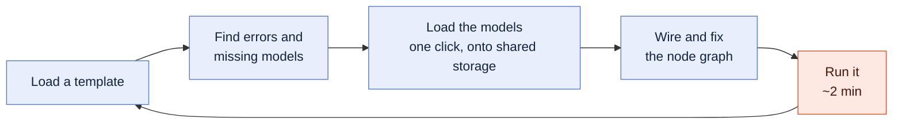
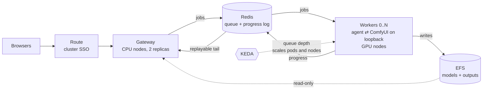
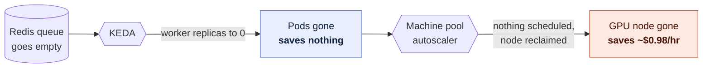
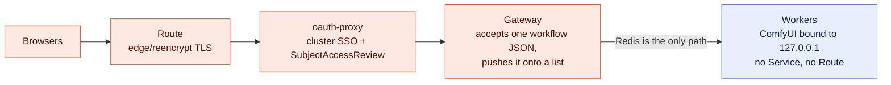
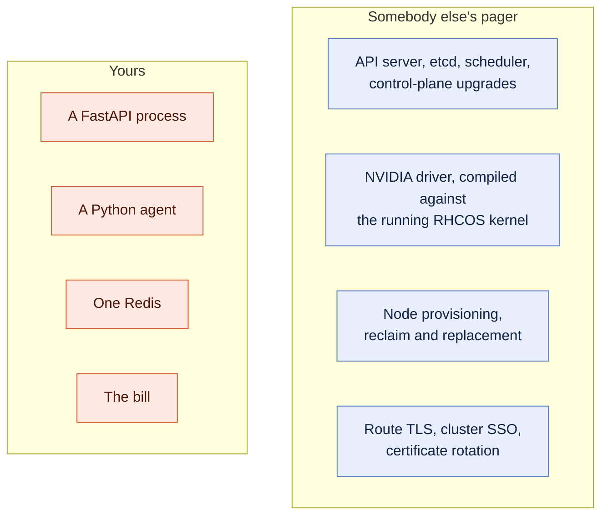

# ComfyUI on OpenShift

**One GPU pool, a whole team — not a card per person.**

[](https://github.com/redhat-et/comfyui-on-openshift/actions/workflows/ci.yaml)
[](https://github.com/redhat-et/comfyui-on-openshift/actions/workflows/nightly.yaml)
[](https://github.com/redhat-et/comfyui-on-openshift/releases)
[](LICENSE)

ComfyUI is a single-user desktop application wearing a web UI. It has no
authentication, its custom-node system executes arbitrary Python by design, and
a GPU is indivisible under Kubernetes, so putting it in front of a team means
an unauthenticated remote-code-execution endpoint *and* a card per person.
OpenShift already solves both — cluster SSO, a machine pool that scales to zero
nodes, network policy, arbitrary-UID isolation, the driver lifecycle, audit
logging, in-cluster image builds — and this repository is the wiring: about
9,000 lines of Python and shell that connect stock ComfyUI to that platform,
built for **ROSA** (Red Hat OpenShift Service on AWS) and portable to any
OpenShift 4.x cluster, plus every piece of failure handling you would otherwise
meet at 2am — the late subscriber, the worker that dies mid-render, the reap
that fails halfway, the output filename that spells a path.

The commercial way to buy this capability — Higgsfield, Krea, Runway,
Midjourney — is credit-metered SaaS: $79–215 per seat per month at the team
tiers, video billed by the second (a $35/month plan buys about ninety seconds
of top-tier video), and every prompt, model and output living in the vendor's
cloud. ComfyUI is the open-source leader of that same category — a
$500M-valuation project with 60,000+ community nodes, the tool behind the
first primarily-AI-generated Super Bowl ad, and "ComfyUI artist" now a job
title. It is already in commercial production: Amazon Studios, Apple,
Autodesk, Netflix, Nike, Tencent and Ubisoft are among the teams building on
it, across VFX, advertising, gaming and eCommerce
([comfy.org](https://www.comfy.org)). What it has never had is the
enterprise deployment story: this repo is
that story — the same tool, on your GPUs, in your VPC, behind your SSO,
metered per user. Open source undercutting the per-seat meter is not a novel
strategy here; it is the strategy this company is built on.

## The number

Ten designers, this repo's own rates (`g6.xlarge`, L4 24 GB, $0.976/hour
all-in — $0.805 to AWS for the card and $0.171 to Red Hat for its vCPUs):

| Ten users | GPU line, per month | Assumes |
|---|---:|---|
| A pod per person, running | ~$7,100 | ten cards × 730 hours |
| One autoscaled pool, light use | ~$120 | 0.4 GPU-hours per person per day — a dozen two-minute renders — so ~120 card-hours a month |
| One pool with a five-worker warm floor, weekdays 9–6 | ~$950 | a team iterating hard all day (26% duty while iterating, ~2.4 GPU-hours per person per day) and nobody ever waiting for a card: 5 × 0.976 × ~195 hours |

Both pool rows are the same queueing model at two duty cycles, and "Sizing the
pool" below reconciles them. Either way the answer is nowhere near a card
each, and the cluster floor of $1.06/hour (~$775/month) sits under all three.

## Thirty seconds

```bash
cp .env.example .env && $EDITOR .env
make tools preflight account    # CLIs; read-only check; GPU quota + budget alarm (days of lead time)
make up                         # cluster, GPU operator, storage, one ComfyUI pod on one GPU   (~55 min)
make enterprise                 # or: the queue, SSO and the pool that scales to zero (STORAGE_MODE=rwx)
```

Zero-cost evaluation, before any of that: **`make test`** runs the real
gateway and the real worker agent against a real Redis and a stub ComfyUI on
your laptop. No cluster, no GPU, no AWS account, about a minute. And when a
stub is not convincing enough, **`make demo-local`** runs the real pool —
gateway, queue, N real workers rendering — on this machine's own GPU, Apple
Silicon included.

## Against the alternatives

| | Cost at 10 users | Cold start | SSO + audit | Per-user showback + quota | RCE containment | Custom nodes | Who operates it | Your VPC / data residency |
|---|---|---|---|---|---|---|---|---|
| **One shared box, ComfyUI `--multi-user`** | list price of one card, always on; ten people queue on one process | none | none — `--multi-user` is a per-user workspace flag in the frontend, not authentication | none | none: every user runs on the box, and any custom node runs as the server | Manager, live, for everyone at once | whoever owns the box | yours |
| **A pod or VM per person** | a card each, ~$7,100/mo before anyone remembers to turn one off | none while running; minutes from stopped | whatever you put in front of each one | the per-instance bill, by construction | one blast radius per person, each on a node with credentials | per person, live | you, ten times | yours |
| **RunPod/Modal-style serverless ComfyUI** | per-second GPU billing with the vendor's markup; cheapest at very low duty | seconds to about a minute on a warm image, longer on a fresh pull | the vendor's account and API keys, not your IdP | per API key, from the vendor's invoice | the vendor's container isolation | your image; rebuild to change | the vendor | no — workflows, models and outputs run in the vendor's cloud |
| **Hosted ComfyDeploy / ViewComfy / Comfy Cloud** | per-seat or per-second subscription | seconds; the vendor keeps it warm | the vendor's login; team SSO depends on plan | the vendor's dashboard | the vendor's | the vendor's catalog and image pipeline | the vendor | no — your data leaves your VPC |
| **Credit-metered creative SaaS (Higgsfield, Krea, Runway, Midjourney)** | $79–215/seat/mo at team tiers; video by the second — ~90 s/mo of top-tier video on a $35 plan | none | the vendor's login; SSO on enterprise plans | the per-seat invoice | not applicable — closed platform | no — the vendor's catalog, the vendor's pipeline | the vendor | no — prompts, models and outputs in the vendor's cloud |
| **A generic Kubernetes Helm chart** | a card per replica, always on; scale-to-zero is yours to build | none while a replica runs | whatever ingress auth you bolt on | none | a reachable ComfyUI Service by default; any NetworkPolicy is yours to write | your image | you: a cluster, a driver, and the app | yours |
| **KServe / Ray Serve** | a resident GPU per served model; a design library is many models | seconds once resident; scale-to-zero costs the same cold start as here | the platform's | per deployment, not per user | the serving container; arbitrary node Python does not fit a fixed serving API | the model is the unit, not the graph — ComfyUI's per-job DAG does not fit | you, plus the serving stack | yours |
| **This repo** | ~$120/mo at 0.4 GPU-h/person/day; ~$950/mo with a five-worker warm floor; plus the $1.06/h cluster floor | **8–17 min unless a warm floor is set** (~$190/mo per warm card, weekdays 9–6) | cluster SSO via oauth-proxy; access is a namespace role; every grant in the cluster audit log | `GET /api/showback` per user; `QUOTA_GPU_SECONDS` per month, off by default, fails open | ComfyUI on loopback with no Service and no Route; namespace default-deny; a worker can reach Redis and DNS and nothing else, as a least-privilege Redis user | **baked into the image — a rebuild**, not a click in Manager | you operate one namespace; the driver, nodes, control plane and TLS are somebody else's pager. **The gateway is not the canvas** | yours — ROSA in your AWS account, or any OpenShift you already have |

The two places this loses are in its own row: the cold start when nothing is
warm, and custom nodes needing a rebuild. Both are priced and both have a
setting; "Where this loses" below is the long form.

One name deliberately absent from the table: **vLLM Omni is a layer here, not
a rival** — a serving engine for the model a team hammers hardest, running
beside this pool on the same cluster and reached from the canvas through the
[`comfyui-vllm-omni`](https://github.com/dougbtv/comfyui-vllm-omni) bridge
nodes. Where each tier wins, the cost arithmetic of both shapes, and the
showback-driven rule for promoting a model from the pool to a resident
engine: **`docs/13-vllm-omni.md`**.

## Which path are you on?

| You are | Start here |
|---|---|
| **A designer**, afraid "on a platform" means a worse tool | "What changes for the people using it" — two things change, both named there rather than discovered later |
| **Cost or finance**, afraid of spend with nobody's name on it | "The number", "Sizing the pool" and "The cost ladder": three states, each with a command and a return time; `GET /api/showback` says whose card it was |
| **A platform engineer**, afraid of going on call for a creative tool | "What you actually operate": a FastAPI process, a Python agent, one Redis, and the bill |
| **Security**, afraid of exactly what ComfyUI is | "Why this platform — security": the GPU pods are unreachable rather than defended. "Proof, not promises" is what has been attacked |
| No AWS account yet | `docs/01-aws-account.md` — ~20 minutes of browser work — then "Thirty seconds" above |
| Your own ComfyUI on a GPU, managed for you | `make up`, then `make forward` — the single-user path under "Running it" |
| A team sharing a GPU pool, with SSO and scale-to-zero | `make enterprise`; `enterprise/README.md` to run it, `docs/06-enterprise-architecture.md` for why it is shaped that way |
| Already have an OpenShift cluster | `PLATFORM=openshift` in `.env`, `oc login`, then `make gpu storage deploy` (or `make gpu storage enterprise`) — nothing in those steps is ROSA-specific |
| Just evaluating the code | `make test`, then `enterprise/test/README.md` for what each assertion is defending |
| "Can we see it work?" — no cluster, no AWS | `make demo-local` — the real gateway, queue and N real workers rendering on this machine's own GPU, Apple Silicon included; `--selftest` proves the whole pipeline with one render |
| Taking this over from someone | `docs/09-engineering-handoff.md` |
| Asking how this relates to vLLM Omni | `docs/13-vllm-omni.md` — layers, not rivals: where the serving engine wins, where the pool wins, and the showback-driven rule for moving a model between them |
| Making the market case | `docs/14-market.md` — the price umbrella, the compliance-captive beachhead, market velocity, aligned incentives, and what could kill this |
| Presenting this to stakeholders | `docs/pitch/` — the briefing, rendered right in the folder view; a click-through PDF and the live `index.html` sit beside it |
| Bringing it up on real hardware for the first time | `docs/12-first-cluster-day.md` — the run CI cannot do, as a checklist: what to measure, where each number goes, what to verify, what to record |

## What changes for the people using it

Almost nothing. This is stock ComfyUI — the upstream project at a pinned
commit, not a reimplementation and not a wrapper — so the loop a designer
already has survives intact:

| Their loop | On this platform |
|---|---|
| Load a template | Stock ComfyUI, the same workflow JSON. Identical. |
| Find errors and missing models | ComfyUI-Manager lists exactly what the workflow needs and you do not have. Identical. |
| Load the models | One click — into `/models`, a volume that outlives the cluster, pulled at datacenter bandwidth rather than over a home connection. Same action, better outcome. |
| Run a complicated node graph | Stock ComfyUI on an L4 24 GB. For most designers, a bigger card than the one under their desk. |
| Load the next template, repeat | Identical. |

Two things are genuinely different, and both are better known up front than
discovered. **Model downloads persist; runtime custom-*node* installs do not** —
Manager will tell you a node is missing, but making it stick means
`app/src/custom_nodes/` and a rebuild. And in the multi-user configuration **the
gateway is not the ComfyUI canvas**: authoring stays in ComfyUI, and the gateway
is where a finished workflow goes to run on a shared GPU.

The reason any of this is worth doing is where the time actually goes:



Four of those five steps never touch a GPU. Setting a scenario up — finding a
template, chasing the models it needs, wiring and fixing the graph — takes far
longer than the inference, which is often a couple of minutes or less. A
designer needs a GPU for a small fraction of their working day, so ten designers
do not need ten GPUs. They need one pool, a queue, and a card that turns off in
between.

## Sizing the pool, five to thirty people

Aggregate GPU-hours answer "what does a month cost." They do not answer "how
many workers does the pool need running at once" — and that second number is
what decides whether the tenth person to hit Queue Prompt waits behind the
other nine, or gets a warm worker immediately.

**The demand assumption, because it drives the number.** Every figure in this
section is one model: a render takes about 2.5 minutes, the setup between
renders takes about 7, so a designer who is iterating needs a card **26% of the
time they are iterating** — about 2.4 GPU-hours across a nine-hour day if they
never stop. That is the heavy end. "The number" above quotes 0.4 GPU-hours a
day, which is the same designer doing a dozen renders spread across a day of
mostly non-GPU work; a middle case, iterating for part of the day, lands near
1.3 GPU-hours (14% of nine hours). The $120 headline is the light case and this
section is the heavy one — the same arithmetic at different duty cycles, and
neither is a card each.

Treating each active user that way, and sizing so the average queueing wait
stays under ~30 seconds — imperceptible against a render that takes minutes —
the number of *concurrent* workers a pool needs grows far slower than headcount:

| Team | Concurrent workers | Pool, warm during active hours | A dedicated pod each, same hours | Savings |
|---:|---:|---:|---:|---:|
| 5 | 3 | $3.99/hr | $5.94/hr | 33% |
| 10 | 5 | $5.94/hr | $10.82/hr | 45% |
| 15 | 6 | $6.92/hr | $15.70/hr | 56% |
| 20 | 8 | $8.87/hr | $20.58/hr | 57% |
| 25 | 9 | $9.84/hr | $25.46/hr | 61% |
| 30 | 10 | $10.82/hr | $30.34/hr | 64% |

Both columns include the $1.06/hour cluster floor and $0.976/hour per
`g6.xlarge`. Savings widen with team size because pooled capacity is a queueing
problem, not a division problem: doubling the team does not double the overlap.

**This only holds if the pool is kept warm at the "concurrent workers" count
during active hours** — interactive iteration is exactly the pattern
`docs/06-enterprise-architecture.md` names as the wrong fit for scale-to-zero,
because the 8–17 minute cold start lands mid-loop. That floor is a shipped
setting, three lines in `.env`:

```bash
WARM_WORKERS=5                    # the "concurrent workers" column for your team
WARM_TIMEZONE=America/New_York    # WARM_START / WARM_END default to 0 9 * * 1-5 / 0 18 * * 1-5
MAX_GPU_WORKERS=8                 # at or above the floor; the default of 3 cannot hold 6-10
```

It is a KEDA `cron` trigger beside the queue trigger, and KEDA takes the
maximum across triggers, so outside the window the queue still decides and a
busy afternoon still bursts past the floor to `MAX_GPU_WORKERS`. For fifteen
people or more, raise `MAX_GPU_WORKERS` *and* `GPU_VCPU_REQUEST` (the default
of 32 vCPUs is eight `g6.xlarge`; ten workers need 40, and the quota increase
takes days). `setup.sh` raises the ceiling to meet a floor above it and says
so; the quota it cannot raise for you.

**When this stops being true.** The saving lives in the duty cycle, and it is
worth seeing how fast it goes. Holding the 2.5-minute render and varying the
gap between renders — savings against a dedicated card each, by team size:

| Gap between renders | Duty while iterating | 5 people | 10 | 20 | 30 |
|---:|---:|---:|---:|---:|---:|
| 12 min | 17% | 33% | 54% | 66% | 71% |
| 7 min | 26% | 33% | 45% | 57% | 64% |
| 4 min | 38% | 16% | 36% | 47% | 51% |
| 2 min | 56% | 0% | 18% | 28% | 32% |
| 1 min | 71% | −16% | 0% | 14% | 19% |

Plainly: **below about 40% duty the pooled floor beats dedicated cards; above
about 55% it does not**, and for a five-person team rendering every two
minutes it saves nothing. A team of ten still comes out ahead at every row but
the last. The model is conservative in two ways that both push the same
direction — it assumes an infinite arrival population where five to thirty
users is a finite one with shorter waits, and exponential service times where
renders are near-deterministic and queue about half as long — so the table
over-provisions rather than under-provisions. It also assumes everyone's active
window fully overlaps, so staggered usage needs fewer workers than shown, and
it excludes EFS, which is small and flat regardless of team size. Nobody has
run this at thirty designers; `docs/09-engineering-handoff.md` §0 says so.

## The cost ladder

The smallest useful cluster — one ComfyUI pod on an L4, us-east-2, on-demand:

| State | $/hour | Getting back |
|---|---:|---|
| Running | ~2.04 | — |
| GPU parked (`make park`) | ~1.06 | ~5 min |
| Cluster torn down (`make down`) | ~0.05 | ~15 min |

| Habit | Monthly |
|---|---:|
| Left running 24/7 | ~$1,490 |
| Weekdays 9–6, `make park` nightly | ~$965 |
| Weekdays 9–6, `make down` nightly | ~$425 |
| Up one day a week | ~$114 |

Weekdays 9–6 is ~195 of a month's 730 hours; `docs/02-cost.md` shows the
arithmetic for every row. **A single cron line is a ~70% cut.** Not a migration
and not a rewrite — a scheduled `make down` and a Monday-morning `make up`, with
models on EFS or S3 so the rebuild costs nothing but time you were asleep for.
Three things to do about cost:

1. **`make account` first.** A new AWS account has a GPU quota of exactly
   zero, and the increase is the one step with a lead time measured in days.
2. **Set `BUDGET_ALERT_EMAIL` in `.env`.** The budget alarm is free and it is
   the guardrail between you and a four-figure surprise.
3. **Park at lunch, down overnight.** `make park` and `make down` — and
   `docs/02-cost.md` has crontab lines that make the habit automatic.

The ladder matters more than any single row in it. Every rung is one platform
operation with a command and a known return time, which is what lets the habit
survive a working week: the card comes back in about five minutes, the whole
cluster in about fifteen. On a cluster that takes forty minutes to rebuild
nobody actually tears down, the ladder is decorative, and the number you pay
is the top row. HCP's fast rebuild and flat control-plane fee are what make the
bottom two rungs something people use rather than something they could use.

The other half of a cost question is whose cost it was. `GET /api/showback`
reports one UTC month's GPU seconds per submitter, from the attribution the
queue envelope was already carrying, and `QUOTA_GPU_SECONDS` turns that same
accounting into a per-person ceiling — off by default, and deliberately
failing open. `docs/10-roadmap.md` (Q4 and Q5) has what the number over-counts
and why.

## How it fits together

One pod and one GPU for a single person. For a team, a FastAPI gateway on cheap
CPU nodes, Redis as the queue and progress bus, and GPU workers that are
unreachable by design and scale between 0 and N on queue depth:




Nothing in that picture is a component this repo invented. The queue is Redis,
the scaling is KEDA and a machine pool, the login is the cluster's own identity
provider, and the thing doing the generating is stock ComfyUI. Queue depth is
the only input to scaling, and it drives two layers: KEDA sets the worker pod
count, and a GPU pod with nowhere to run is exactly what makes the machine pool
provision a node — `Pending` is the mechanism, not a symptom. `docs/11-scaling.md`
walks the sequence and says how far the shape goes.

## Why this platform, specifically

This repo will run on any OpenShift, but ROSA with hosted control planes is
where it is designed to feel best. Every reason below is a file in this
repository rather than a claim.

### Cost — the platform can turn the GPU off, and turn the cluster off

**Scale-to-zero means zero *nodes*, not zero pods.** KEDA watches Redis queue
depth and drops the worker Deployment to 0 replicas; the ROSA machine pool
autoscaler then reclaims the GPU node underneath it. Only the second layer
saves money — an idle GPU node bills identically whether a pod is scheduled on
it or not — and it is the layer most tutorials skip
(`enterprise/manifests/03-autoscale.yaml`).



- **A ~15-minute rebuild makes teardown a habit instead of a heroic act.**
  HCP's flat $0.25/hour control-plane fee and fast build are what turn
  `make down` into a cron line. (`docs/02-cost.md`)
- **The bill is a command, not a spreadsheet.** `make status` reads your live
  machine pools and prints the hourly burn — including the ROSA service fee
  that people forget also applies to the GPU node's vCPUs.
  (`scripts/06-status.sh`)
- **A budget alarm before the first dollar.** `make account` files the GPU
  quota request and arms an AWS budget alarm in the same step, because human
  discipline is exactly what an alarm exists to distrust.

### Utilization — one pool serves the team

- **A queue instead of a card per person.** A FastAPI gateway on cheap CPU
  nodes holds every browser session; workers pull jobs from a Redis list. Ten
  users stop meaning ten GPUs and start meaning a deeper queue.
- **Redis is the entire interface.** No browser ever holds a connection to a
  worker, so workers can vanish mid-shift with no connection state to repair.
  That property is what makes scale-to-zero possible at all.
- **Elastic to a ceiling you set, with a floor you schedule.** One queued job
  asks for one worker, up to `MAX_GPU_WORKERS`; `WARM_WORKERS` holds a floor
  inside working hours. Burst rendering gets parallel cards; a quiet night
  gets none.

### Security — the strongest control is architectural

**The GPU pods are unreachable by construction.** Every worker binds ComfyUI
to `127.0.0.1` and has no Service and no Route. This is not defence in depth,
it is the primary control, and it removes ComfyUI's entire vulnerability class
from the network (`docs/04-exposing.md`).



Everything on the left is reachable and authenticated. The worker on the right
is reachable by nothing at all — which is why ComfyUI having no login of its own
stops being a problem rather than becoming one.

- **And it can reach almost nothing either.** The namespace is default-deny in
  both directions (`enterprise/manifests/06-network-policy.yaml`); a worker's
  only egress is Redis and DNS, so the arbitrary Python in a custom node has
  no route to the internet, the instance metadata service, S3 or another
  namespace. Its Redis credential is a least-privilege ACL user allowed the
  commands the agent issues and nothing else, and neither it nor Redis mounts
  a ServiceAccount token — only the gateway does, under `oauth`, because the
  proxy sidecar really does call the API.
- **SSO you already own.** An `oauth-proxy` sidecar puts the cluster's own
  identity provider in front of the gateway, and rebinds the gateway to
  loopback so the login cannot be bypassed from inside the cluster either.
- **Authorization is a role, not a user database.** Access is a
  SubjectAccessReview against the namespace: grant with
  `oc adm policy add-role-to-user`, revoke by removing it, and read the whole
  history in the cluster audit log. Under `AUTH_MODE=oauth` that identity also
  scopes what a caller can read: their own outputs, their own showback row.
- **Every path is handled as hostile.** The submitter's name, a save node's
  `filename_prefix`, and the filename ComfyUI reports back all end up on the
  shared volume, and all three are sanitized, joined, resolved and verified
  inside the output root — asserted on every `make test`, with the escape one
  check found in how the URL's halves were joined kept as a regression test.

### Operations — the hard parts are somebody else's job

- **The control plane is SRE-managed**, under the joint Red Hat + AWS support
  model. You operate one namespace, not a cluster.
- **Nobody hand-installs a CUDA driver.** NFD labels the cards, the NVIDIA GPU
  Operator compiles and rolls the driver against the running RHCOS kernel, and
  a smoke test proves `nvidia-smi` before you deploy anything.
- **No registry credential to rotate.** Images build in-cluster into the
  internal registry, which sidesteps the ECR trap: a 12-hour pull token that
  works the day you create it and fails the first job of every morning after.
- **Termination is routine, and handled.** The worker traps SIGTERM and drains
  the running job; a TTL'd heartbeat plus a per-worker processing list means
  even an OOM kill surfaces a real failure rather than a progress bar that
  never moves; a liveness probe that checks the agent's own loop, not just
  ComfyUI's HTTP server, restarts a pod that is holding a card and doing
  nothing.

### Correctness — the bugs that only appear in a cluster, already fixed

- **Redis Streams, not pub/sub.** `XREAD` from `0-0` replays history and then
  tails live in one call, so a browser that opens its socket a beat after the
  POST — the common case, not the edge case — loses nothing.
- **Every event filtered by `prompt_id`.** One ComfyUI multiplexes all prompts
  onto one socket; without the filter, another job's terminal event ends yours
  and reports success on work still running.
- **Backpressure instead of a silent Redis OOM.** The gateway rejects
  submissions past a configurable depth — inside the same atomic insert, so
  concurrent submits cannot slip past it — and Redis runs `noeviction`.
- **Long jobs keep their connection.** HAProxy's 30-second default kills a
  generation mid-render and reads like an application bug. Every Route carries
  a four-hour timeout.
- **An abandoned prompt is interrupted.** A job that exceeds `JOB_TIMEOUT`
  is sent ComfyUI's `/interrupt` and drained before the worker takes another,
  so one wedged node cannot turn a pod into a black hole with every probe green.

### Portability and oversight

- **Not a ROSA lock-in.** `PLATFORM=openshift`, `oc login`, and the same GPU,
  storage and deploy steps run against any OpenShift 4.x cluster.
- **Metrics the cluster already knows how to graph.** The gateway exports
  `comfy_queue_depth`, `comfy_workers_registered` and
  `comfy_estimated_wait_seconds` from one cached snapshot every five seconds,
  and `setup.sh` applies a ServiceMonitor so user-workload monitoring can
  alert on a wedged pool before a human notices.
- **Every job has a name attached.** The gateway stamps the authenticated
  username onto job state, so when the GPU bill asks whose job this was, there
  is an answer.
- **Reproducible by policy.** ComfyUI and ComfyUI-Manager are pinned to commit
  SHAs both images build, custom nodes are baked in from
  `app/src/custom_nodes/`, and runtime installers are off by default — so the
  image that passed review is the image that renders.

## Running it

Single user — one pod, one GPU:

```bash
cp .env.example .env && $EDITOR .env

make tools        # aws, rosa, oc, jq
make preflight    # checks everything, changes nothing
make account      # quota requests + budget alarm   <-- run this first, it has a lead time
make cluster      # ROSA HCP + GPU machine pool     (~20 min)
make gpu          # NFD + NVIDIA GPU Operator       (~20 min)
make storage      # model and output volumes
make deploy       # build and run ComfyUI           (~15 min)
make forward      # http://localhost:8188
```

Multi user — queue, SSO, GPU pool that scales to zero. Same cluster, different
last step:

```bash
# STORAGE_MODE=rwx in .env — the gateway and the workers share a volume
make cluster gpu storage
make enterprise                        # one script does the rest
```

Every script is idempotent; re-running skips what is already done.
`enterprise/README.md` runs the multi-user configuration, and
`docs/06-enterprise-architecture.md` says why it is shaped that way.

## What happens when things fail

Most of this repository's design is failure handling. Termination is routine
on a pool that scales to zero, a node drain is an upgrade doing its job, and a
container restarted in place is `restartPolicy: Always` behaving as documented
— so the SIGTERM drain, the TTL'd heartbeat, the incarnation nonce, the
phase breadcrumb and the ownership fence are on the ordinary operating path,
not on an unlikely day. Three kinds of out-of-memory that people call one
thing, five ways a worker can die, a wedged ComfyUI, a laptop that sleeps, a
queue that outgrows the pool, a username that spells a path: each is a code
path you can find, and most are covered by an assertion in `enterprise/test/`.
The full table — what actually happens and what the user sees, row by row —
is in `docs/05-troubleshooting.md` under "What happens when things fail".

## Where this loses, and what to do about it

Both boundaries are narrow, both are priced, and both have a setting.

**Interactive iteration against a cold pool.** The first job after an idle
period is 8–17 minutes: provision a node, pull a ~10 GB image, initialise CUDA,
load the checkpoint. For a designer adjusting a prompt every four minutes,
that lands in the middle of a creative loop.

```mermaid
gantt
    title Minutes to first image
    dateFormat X
    axisFormat %M
    tickInterval 5minute
    todayMarker off
    section Cold pool
    Provision a GPU node        :0, 300
    Pull the ~10 GB image       :300, 780
    CUDA init, custom node scan :780, 900
    Load the checkpoint         :900, 1020
    Generate                    :crit, 1020, 1140
    section Warm worker
    Generate                    :crit, 0, 120
```



The fix is a warm worker, and there are two ways to get one. `SCALE_TO_ZERO`
is all or nothing: `true` scales pods and GPU nodes to zero and pays an 8–17
minute cold start on the first job; `false` pins exactly one worker
permanently and skips KEDA, the ScaledObject and machine-pool autoscaling with
it. `WARM_WORKERS` (needs `SCALE_TO_ZERO=true`) is the middle setting: a KEDA
`cron` trigger holds N workers between `WARM_START` and `WARM_END` in
`WARM_TIMEZONE`, and because KEDA takes the maximum across triggers the queue
still decides outside the window and a busy afternoon still scales past the
floor to `MAX_GPU_WORKERS`. 0 = off. Either way the first job of the day
starts in seconds, at the cost of one GPU node per warm worker for as long as
it is held: **~$190/month per card held weekdays 9–6**, which is less than one
designer waiting fifteen minutes every morning. The gateway's
PodDisruptionBudget applies in both modes.

Worth being precise about what "cold" costs, because the two layers are
separable:

| What is cold | Cost of the first job | Removed by |
|---|---:|---|
| No node — provision + ~10 GB image pull | 6–13 min | a warm worker, which holds its node |
| Node warm, no pod — CUDA init + checkpoint load | 1.5–4 min | a warm worker pod (`WARM_WORKERS`, or `SCALE_TO_ZERO=false`) |
| Warm worker | seconds | — |

So the honest shape for a design team is not "scale-to-zero or don't". It is
**a floor during working hours, zero at night and at weekends** — the cold
start happens at most once, before anyone is at their desk, and scale-to-zero
still does its job for the other fourteen hours a day. "Sizing the pool"
above says how high the floor should be and when it stops paying for itself.

**Custom nodes need a rebuild.** Manager can tell you a node is missing, but a
node installed at runtime lands on a container filesystem that a pool scaling
to zero throws away, and a worker has no route to the internet to fetch it
anyway. The durable path is `app/src/custom_nodes/` plus
`app/requirements-extra.txt` and a rebuild — which is also the path that gives
you a reviewable image. If your team installs nodes several times a day, that
is a real cost; if it installs them several times a quarter, it is a feature.

**One person, one GPU, nothing to share.** If you are not exercising OpenShift
semantics and there is no team to serve, a plain EC2 instance with podman is
$0.81/hour and this is a heavier answer than the question. `docs/02-cost.md`
says so itself, with a comparison table.

## How far this scales, and what else the cluster can host

Roughly a hundred designers on the architecture as it stands, and the limit is
storage rather than the queue: every cold worker reads a 7 GB checkpoint over
NFS, and more designers means more distinct models and more first-loads. The
economics run backwards from the intuition — the $1.06/hour cluster floor makes
this expensive per person for five people and cheap for a hundred — and the
saving is not "we remember to turn the cluster off": the queue converts one
person's setup time into another person's inference capacity, which no amount
of discipline does. Five changes, cheapest first, take the design to several
hundred designers without a rewrite; the AWS accelerator catalog and where each
card fits, and why this is a layer beside a model server like vLLM rather than
a competitor to it, are in the same place: **`docs/11-scaling.md`**.

## Ideas worth doing next

The list of twelve, ordered by payoff per unit of work — six landed, one half
landed, one decided against, four ahead — lives in **`docs/10-roadmap.md`** with what each
touches, what proves it, and which cannot be finished without a real cluster.
Struck items stay on it: shipped ones because a roadmap that never visibly
moves is a wish list, and decided-against ones because the reasoning is the
useful part. `docs/06-enterprise-architecture.md` has the complementary list —
what is deliberately *not* here and why.

## What you actually operate

Worth being concrete about, because it is the difference between running this
and running a Kubernetes cluster:



That division is why this repository is about 9,000 lines of Python and shell
and not a distributed system. When you are deciding whether to add something,
the first question is whether OpenShift already does it — because in this
problem domain it usually does, and the version you would write is the version
nobody maintains. `docs/09-engineering-handoff.md` is the long form, for
whoever picks this up next.

## What is in here

```
.env.example              all configuration, one file
Makefile                  one target per step
scripts/
  00-tools.sh             install aws / rosa / oc / jq
  00-preflight.sh         read-only readiness check
  01-bootstrap-account.sh quota requests, budget alarm
  02-cluster.sh           IAM roles, VPC, ROSA HCP cluster, GPU pool
  03-gpu-operators.sh     NFD + NVIDIA GPU Operator + nvidia-smi smoke test
  04-storage.sh           gp3 (default) or EFS RWX
  05-deploy.sh            in-cluster build + deploy
  06-status.sh            what is running and the hourly burn
  07-login.sh             how to reach the cluster
  08-unstick-storage.sh   repair a volume a dead pod never released
  09-s3-models.sh         S3 bucket + IAM role so models outlive everything
  10-push-models.sh       rsync local models into the cluster
  99-teardown.sh          park | cluster | all
  lint.sh                 everything CI checks, runnable locally
  unit-tests.sh           the parsing edge cases and the lint fixtures, pinned
  ci-smoke-comfyui.sh     real ComfyUI on CPU proving the model-path contract
manifests/base/           single-user Deployment and Service, kustomize
app/
  Containerfile           OpenShift-compatible ComfyUI image
  src/                    >>> your code goes here <<<
enterprise/               the multi-user configuration
  setup.sh                one script: Redis, images, KEDA, SSO, route, policy
  teardown.sh
  gateway/                FastAPI hub — queue jobs, stream progress, serve images
  worker/                 ComfyUI + Redis agent, bound to loopback
  manifests/              Redis, gateway, worker, KEDA, oauth-proxy, NetworkPolicy
  test/                   the e2e suite and the pytest layer — real Redis, stub ComfyUI, no cluster
docs/
  01-aws-account.md       the browser-only steps
  02-cost.md              the numbers, and how to keep them down
  03-storage.md           gp3 vs EFS vs S3, and why models are the hard part
  04-exposing.md          how to let other people reach it, safely
  05-troubleshooting.md   the failures you will actually hit, and what the system does about each
  06-enterprise-architecture.md   hub and spoke, Streams, what the worker can reach
  07-design-review.md     what changed from the original design doc, and why
  08-stuck-volumes.md     when a dead pod will not release the volume
  09-engineering-handoff.md  taking ownership: invariants, runbook, open items
  10-roadmap.md           the ideas, as a work plan with lanes and gates
  11-scaling.md           how far this goes, and which AWS cards it runs on
  12-first-cluster-day.md the run CI cannot do, as a checklist
  13-vllm-omni.md         the serving tier and this tier: costs, the bridge, the promotion rule
  14-market.md            the category, its price umbrella, the captive segment, the risks
  pitch/                  the stakeholder briefing: slides render in the folder view,
                          plus a click-through PDF and the live index.html
.github/workflows/
  ci.yaml                 four jobs on every PR: lint (+ kubeconform), the e2e suite,
                          real ComfyUI on CPU, the gateway image as an arbitrary UID
  nightly.yaml            both GPU images built, booted as an arbitrary UID, scanned
```

## Proof, not promises

Four CI jobs run on every pull request — `lint` (shellcheck, YAML, Python, the
manifest shape rules, and every manifest validated against the Kubernetes,
OpenShift and KEDA schemas), `e2e`, `comfyui-smoke` (the pinned ComfyUI booted
on CPU with the images' own path flags, asserting checkpoints are visible and
custom nodes load) and `image-uid` (the gateway image run as UID 1000670000
with GID 0, exactly as `restricted-v2` will run it). The local `make` targets
are the same ones CI invokes, so local and CI cannot drift. `nightly.yaml`
does for the two GPU images what a PR job cannot afford to.

`make test` runs 40 shell unit assertions, 210 pytest cases against the pure
functions in both Python files, and 378 end-to-end assertions across 21 check
files — the real gateway and the real worker agent against a real Redis and a
stub ComfyUI, in about a minute. The count is the least interesting thing
about it. **An assertion nobody has watched fail is a decoration, and this
suite has caught ten of its own being exactly that**, plus two behaviours no
assertion reached at all: three "the queue is empty afterwards" assertions
proven unable to fail by mutation testing and replaced by counting the command
Redis actually executed; a guard for a server-side socket close deleted
outright with the whole suite staying green; a watcher armed after the submit
it was watching, in two files; "at least three progress events" passing on an
agent that filters progress and not terminals; four estimated-wait assertions
run against a one-entry queue where the head and the tail are the same entry;
and a requeue that jumped the queue invisibly to every other check. Each
replacement is named, with what it replaced, in `enterprise/test/README.md`
under "The assertions that could not fail", along with the ten hostile strings
driven through the output path on every run and the one performance claim
that was measured rather than reasoned.

The file-level half of the guarantees is enforced rather than reviewed:
`scripts/lint.sh` fails the build on a worker that lost its GPU toleration, a
Route that lost `timeout-tunnel`, a Service that regained the gateway's own
port, a Deployment no NetworkPolicy selects, a Redis ACL user widened past its
allowlist, a warm floor above `maxReplicaCount`, a Containerfile that lost its
`chgrp 0` block, or a GPU pod whose memory limit no longer fits the node. The
end-to-end suite runs no cluster and reads no manifest, so it can see none of
them.

So the useful thing to do with this suite is to distrust the authors and
check. Delete the `prompt_id` filter in `worker_agent.py`, or its SIGTERM
handler, or the workspace confinement, and run `make test`: something goes
red, and which assertion goes red tells you what that code was actually
holding. `docs/07-design-review.md` is the written account of every claim the
original design's manifests did not implement and every line of its Python
that would not have run — the list of things you would otherwise have
discovered at 2am.

## Configuration

Everything lives in `.env`. The ones you are most likely to change:

| Variable | Default | Notes |
|---|---|---|
| `PLATFORM` | `rosa` | `openshift` to use a cluster you already have |
| `AWS_REGION` | `us-east-2` | good G-family capacity, cheaper than us-east-1 |
| `GPU_INSTANCE_TYPE` | `g6.xlarge` | L4 24 GB, ~$0.80/hr — fits SDXL comfortably |
| `STORAGE_MODE` | `rwo` | `rwx` for EFS shared across pods — see docs/03-storage.md |
| `COMFYUI_IMAGE` | empty | empty means build in-cluster from `app/Containerfile` |
| `COMFYUI_REF` | the `v0.32.0` commit | ComfyUI revision both images build — a commit, because a tag can move |
| `SCALE_TO_ZERO` | `true` | `false` pins exactly one worker and skips KEDA — see "Where this loses" |
| `WARM_WORKERS` | `0` (off) | hold this many workers inside `WARM_START`–`WARM_END` in `WARM_TIMEZONE`; needs `SCALE_TO_ZERO=true` — see "Sizing the pool" |
| `MAX_GPU_WORKERS` | `3` | ceiling for both autoscalers; raise it, and `GPU_VCPU_REQUEST`, for a floor above it |
| `ENABLE_MANAGER` | `false` | **Turn this on for the single-user path.** It is what keeps the familiar loop intact: load a workflow, Manager lists every model you are missing, one click puts them on the persistent volume. Leave it off for the shared pool — there it hands every UI user code execution on a node with cloud credentials, and the workers have no route to the internet for it anyway. `app/Containerfile` has the full reasoning. |
| `QUOTA_GPU_SECONDS` | `0` (off) | per-user GPU-second ceiling per UTC month; fails open |
| `BUDGET_ALERT_EMAIL` | empty | **set this** |

## Three things that will bite you

Each of these is the platform holding an opinion, and in each case the opinion
is what makes something else in this README true. They bite because they are
load-bearing, not because they are rough edges nobody got around to sanding.

**The GPU node is tainted** `nvidia.com/gpu=true:NoSchedule`. Anything you
deploy onto it needs the matching toleration. The manifests here have it; your
own pods will not. That taint is also why a $0.98/hour node cannot quietly fill
with whatever else wanted scheduling — it is what lets the GPU pool be sized
from queue depth alone, and what makes a node with nothing left on it safe
for the autoscaler to reclaim. `scripts/lint.sh` fails a worker that loses the
toleration.

**OpenShift runs your container as an arbitrary UID**, not the one in your
Dockerfile. Every path the process writes to must be a mounted volume or be
group-writable and group-root-owned at build time. This is the single most
common reason an image that works under `podman run` crash-loops here — see the
bottom third of `app/Containerfile` for the fix. It is the same rule that makes
a compromised container not a compromised node, which is most of why running
ComfyUI's arbitrary-Python node system in front of a team is defensible at all.
It also propagates: the per-user output workspaces are `2775` and setgid
because the next pod to write into one will be a different UID.

**First GPU Operator run takes 10–20 minutes.** It compiles a driver against
the running RHCOS kernel and pulls multi-gigabyte images. It is not hung. What
you are watching is the driver lifecycle being handed over — the operator
recompiles on every kernel move, for the life of the cluster, which is the job
that would otherwise be yours forever.

## Sources

- [Set up to use ROSA](https://docs.aws.amazon.com/rosa/latest/userguide/set-up.html)
- [Create a ROSA HCP cluster using the ROSA CLI](https://docs.aws.amazon.com/rosa/latest/userguide/getting-started-hcp.html)
- [ROSA pricing](https://aws.amazon.com/rosa/pricing/)
- [ROSA endpoints and quotas](https://docs.aws.amazon.com/general/latest/gr/rosa.html)
- [rosa create network](https://access.redhat.com/articles/7096266)
- [ROSA with NVIDIA GPU workloads](https://cloud.redhat.com/experts/rosa/gpu/)
