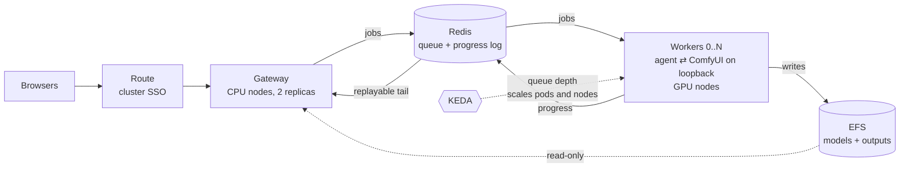

# ComfyUI on OpenShift

[](https://github.com/redhat-et/comfyui-on-openshift/actions/workflows/ci.yaml)

A ComfyUI (PyTorch) inference backend on GPU nodes, built for **ROSA** — Red
Hat OpenShift Service on AWS — and portable to any OpenShift 4.x cluster you
already have.

Two configurations sharing one cluster, one GPU operator, and one set of
volumes: a single-user pod for one person and one GPU, and a multi-user
configuration with a queue, cluster SSO, and a GPU pool that scales to zero.
The queue and gateway logic is covered by an end-to-end test suite that runs
on your laptop in about a minute — no cluster, no GPU, no AWS account
(`make test`).

## Which path are you on?

| You | Do this |
|---|---|
| No AWS account yet | `docs/01-aws-account.md` — ~20 minutes of browser work — then the quickstart below |
| Your own ComfyUI on a GPU, managed for you | The single-user quickstart below |
| A team sharing a GPU pool, with SSO and scale-to-zero | The multi-user quickstart below |
| Already have an OpenShift cluster | `PLATFORM=openshift` in `.env`, `oc login`, then `make gpu storage deploy` (or `make gpu storage enterprise`) — nothing in those steps is ROSA-specific |
| Just evaluating the code | `make test` runs the gateway and worker against a real Redis and a stub ComfyUI, locally |

## Why ROSA

This repo will run on any OpenShift, but ROSA with hosted control planes is
where it is designed to feel best:

- **The control plane is Red Hat's problem.** SRE-managed, backed by the
  joint Red Hat + AWS support model — you operate one namespace, not a
  cluster. When something goes wrong at 2am, it is somebody's pager and it is
  not yours.
- **HCP economics make honest cost control possible.** A flat $0.25/hour
  control-plane fee and a ~15-minute cluster build mean `make down` every
  night is a habit, not a heroic act — which is the single biggest lever on
  what a GPU cluster actually costs. `make cluster` in the morning restores
  everything; with `STORAGE_MODE=rwx` your models survive the gap.
- **GPU capacity on demand, inside your own account.** The GPU machine pool
  scales 0..N against AWS's G-family fleet, with your quotas, your VPC, and
  your budget alarm — not a shared waitlist.
- **The multi-user configuration leans on the platform.** SSO is the
  cluster's own identity provider via oauth-proxy; authorization is an
  OpenShift role; access shows up in the cluster audit log. No user database
  to build, secure, or forget to secure.

## Single user — one pod, one GPU

```bash
cp .env.example .env && $EDITOR .env

make tools        # aws, rosa, oc, jq
make preflight    # checks everything, changes nothing
make account      # quota requests + budget alarm   <-- run this first, it has a lead time
make cluster      # ROSA HCP + GPU machine pool     (~20 min)
make gpu          # NFD + NVIDIA GPU Operator       (~20 min)
make storage      # model and output volumes
make deploy       # build and run ComfyUI           (~15 min)
make forward      # http://localhost:8188
```

## Multi user — queue, SSO, GPU pool that scales to zero

Same cluster, different last step:

```bash
# STORAGE_MODE=rwx in .env — the gateway and the workers share a volume
make cluster gpu storage
make enterprise                        # one script does the rest
```

A FastAPI gateway on cheap CPU nodes, Redis as the queue and progress bus, and
GPU workers that are unreachable by design and scale between 0 and N on queue
depth:




`enterprise/README.md` to run it, `docs/06-enterprise-architecture.md` for why
it is shaped that way.

## The numbers, briefly

The smallest useful cluster is **~$2.04/hour running, ~$1.06 parked, ~$0.05
torn down** — and because HCP rebuilds in ~15 minutes, tearing down nightly is
the intended rhythm, not an emergency measure. Three things to do about it:

1. **`make account` first.** A new AWS account has a GPU quota of exactly
   zero, and the increase is the one step with a lead time measured in days.
2. **Set `BUDGET_ALERT_EMAIL` in `.env`.** The budget alarm is free and it is
   the guardrail between you and a four-figure surprise.
3. **Park at lunch, down overnight.** `make park` and `make down` — and
   `docs/02-cost.md` has crontab lines that make the habit automatic.

The full accounting — every fee, the monthly patterns, and where money leaks
— is in `docs/02-cost.md`.

## What is in here

```
.env.example              all configuration, one file
Makefile                  one target per step
scripts/
  00-tools.sh             install aws / rosa / oc / jq
  00-preflight.sh         read-only readiness check
  01-bootstrap-account.sh quota requests, budget alarm
  02-cluster.sh           IAM roles, VPC, ROSA HCP cluster, GPU pool
  03-gpu-operators.sh     NFD + NVIDIA GPU Operator + nvidia-smi smoke test
  04-storage.sh           gp3 (default) or EFS RWX
  05-deploy.sh            in-cluster build + deploy
  06-status.sh            what is running and the hourly burn
  07-login.sh             how to reach the cluster
  08-unstick-storage.sh   repair a volume a dead pod never released
  09-s3-models.sh         S3 bucket + IAM role so models outlive everything
  10-push-models.sh       rsync local models into the cluster
  99-teardown.sh          park | cluster | all
  lint.sh                 everything CI checks, runnable locally
  unit-tests.sh           the parsing edge cases, pinned
  ci-smoke-comfyui.sh     real ComfyUI on CPU proving the model-path contract
manifests/base/           single-user Deployment and Service, kustomize
app/
  Containerfile           OpenShift-compatible ComfyUI image
  src/                    >>> your code goes here <<<
enterprise/               the multi-user configuration
  setup.sh                one script: Redis, images, KEDA, SSO, route
  teardown.sh
  gateway/                FastAPI hub — queue jobs, stream progress, serve images
  worker/                 ComfyUI + Redis agent, bound to loopback
  manifests/
  test/                   the e2e suite — real Redis, stub ComfyUI, no cluster
docs/
  01-aws-account.md       the browser-only steps
  02-cost.md              the numbers, and how to keep them down
  03-storage.md           gp3 vs EFS vs S3, and why models are the hard part
  04-exposing.md          how to let other people reach it, safely
  05-troubleshooting.md   the failures you will actually hit
  06-enterprise-architecture.md   hub and spoke, Streams, scale-to-zero economics
  07-design-review.md     what changed from the original design doc, and why
  08-stuck-volumes.md     when a dead pod will not release the volume
.github/workflows/ci.yaml lint + the e2e suite, on every PR
```

Scripts are idempotent. Re-running any of them is safe and skips what is
already done.

## Configuration

Everything lives in `.env`. The ones you are most likely to change:

| Variable | Default | Notes |
|---|---|---|
| `PLATFORM` | `rosa` | `openshift` to use a cluster you already have |
| `AWS_REGION` | `us-east-2` | good G-family capacity, cheaper than us-east-1 |
| `GPU_INSTANCE_TYPE` | `g6.xlarge` | L4 24 GB, ~$0.80/hr — fits SDXL comfortably |
| `STORAGE_MODE` | `rwo` | `rwx` for EFS shared across pods — see docs/03-storage.md |
| `COMFYUI_IMAGE` | empty | empty means build in-cluster from `app/Containerfile` |
| `COMFYUI_REF` | `v0.32.0` | ComfyUI tag both images build — pinning is deliberate |
| `ENABLE_MANAGER` | `false` | bake in ComfyUI-Manager (one-click missing-model downloads) — read the note in `.env.example` |
| `BUDGET_ALERT_EMAIL` | empty | **set this** |

## Three things that will bite you

**The GPU node is tainted** `nvidia.com/gpu=true:NoSchedule`. Anything you
deploy onto it needs the matching toleration. The manifests here have it; your
own pods will not.

**OpenShift runs your container as an arbitrary UID**, not the one in your
Dockerfile. Every path the process writes to must be a mounted volume or be
group-writable and group-root-owned at build time. This is the single most
common reason an image that works under `podman run` crash-loops here — see the
bottom third of `app/Containerfile` for the fix.

**First GPU Operator run takes 10–20 minutes.** It compiles a driver against
the running RHCOS kernel and pulls multi-gigabyte images. It is not hung.

## Sources

- [Set up to use ROSA](https://docs.aws.amazon.com/rosa/latest/userguide/set-up.html)
- [Create a ROSA HCP cluster using the ROSA CLI](https://docs.aws.amazon.com/rosa/latest/userguide/getting-started-hcp.html)
- [ROSA pricing](https://aws.amazon.com/rosa/pricing/)
- [ROSA endpoints and quotas](https://docs.aws.amazon.com/general/latest/gr/rosa.html)
- [rosa create network](https://access.redhat.com/articles/7096266)
- [ROSA with NVIDIA GPU workloads](https://cloud.redhat.com/experts/rosa/gpu/)
