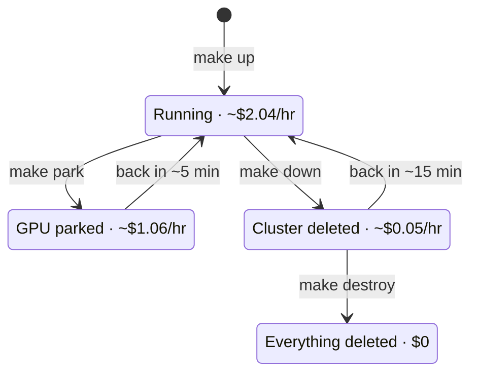

# Cost

## The floor

Smallest ROSA HCP cluster that can run one ComfyUI pod on an L4, us-east-2,
on-demand, August 2026:

| Line item | $/hour |
|---|---:|
| ROSA HCP control plane fee | 0.250 |
| ROSA service fee — 2 base workers, 8 vCPU | 0.342 |
| EC2 — 2 × m5.xlarge | 0.384 |
| ROSA service fee — GPU node, 4 vCPU | 0.171 |
| EC2 — 1 × g6.xlarge (L4, 24 GB) | 0.805 |
| NAT gateway + load balancer + EBS | ~0.088 |
| **Running** | **~2.04** |
| GPU pool parked at 0 | ~1.06 |
| Cluster deleted, VPC kept | ~0.05 |
| Everything deleted | ~0.00 |

The ROSA service fee is $0.171 per 4 worker vCPUs per hour. It applies to the
GPU node too, which surprises people — you pay Red Hat for the GPU node's vCPUs
on top of what you pay AWS for the card.

`make status` computes this live from your actual machine pools.



## What that means in practice

| Pattern | Monthly |
|---|---:|
| Left running 24/7 | ~$1,490 |
| Weekdays 9–6, `make park` nightly | ~$965 |
| Weekdays 9–6, `make down` nightly | ~$425 |
| Occasional — up for a day a week | ~$114 |

Every row is the three rates above against a 730-hour month. Weekdays 9–6 is
~195 running hours (730 × 5/7 × 9/24); the other 535 are billed at the parked
or the torn-down rate. One day a week is ~39 running hours. So: 2.04 × 730;
2.04 × 195 + 1.06 × 535; 2.04 × 195 + 0.05 × 535; 2.04 × 39 + 0.05 × 691.
The nightly teardown row is a **~70% cut** from the first row, and it is one
cron line.

Plus AWS Business support at the greater of $100/month or 10% of usage, which
bills whether or not a cluster exists.

## Three more ways to read the same bill

**The idle tax.** A dedicated card at this workload's own duty cycles
(4–26% — the README's "Sizing the pool" derives them) is idle 74–96% of the
time. Ten always-on seats are ~$85,000/year of GPU line, of which roughly
$63,000–82,000 buys idleness. Framing the pool as removing an idle tax,
rather than as a discount, is the version finance acts on.

**Cost per finished asset.** A 2.5-minute render on a `g6.xlarge` is about
**four cents** of GPU time. On a credit-metered suite, top-tier video runs
about $0.39 per second of output — ten seconds is ~$3.90 — before seat
fees. The models differ, so this is not a like-for-like quality claim; it
is a claim about who owns the meter.

**The designer-hour.** The most expensive component in the loop is the
person. A designer at $75/hour idled ten minutes by a cold start costs
$12.50 — more than twelve hours of the warm-floor card ($0.976/hour) that
removes the wait. Sizing the warm floor is not a GPU cost decision; it is
a people-throughput decision that happens to involve GPUs.

## Park vs down

`make park` scales the GPU pool to zero. Takes seconds, comes back in ~5
minutes, keeps your volumes and models. But it only removes $0.98/hour — the
control plane fee, two base workers, and NAT gateway are $1.06/hour on their
own, which is ~$775/month of doing nothing.

`make down` deletes the cluster. Takes ~10 minutes, comes back in ~15, and drops
you to ~$0.05/hour. It destroys gp3 volumes, so your models go with it.

**Park at lunch. Down overnight.** The reason HCP is the right architecture here
is precisely that a 15-minute rebuild makes "down" a reasonable default rather
than a last resort. On ROSA Classic, with a 40-minute build and 5 extra nodes,
nobody tears down and everybody overpays.

To make `down` painless, put your models somewhere that outlives the cluster —
`STORAGE_MODE=rwx` (EFS) or an S3 bucket. See `03-storage.md`.

## Make the habit automatic

The advice above only saves money if it happens every day, and human
discipline is exactly what the budget alarm exists to distrust. Put it in
cron instead. `make park` is already non-interactive; teardown normally asks
you to type the cluster name, so the scheduled form takes `--yes`:

```cron
# park the GPU pool at 19:00 on weeknights          ~$2.04/hr -> ~$1.06/hr
0 19 * * 1-5  cd /path/to/comfyui-on-openshift && make park            >> cost-cron.log 2>&1

# tear the cluster down Friday night                ~$2.04/hr -> ~$0.05/hr
0 20 * * 5    cd /path/to/comfyui-on-openshift && scripts/99-teardown.sh cluster --yes >> cost-cron.log 2>&1

# rebuild Monday morning before you sit down (~50 min unattended)
30 7 * * 1    cd /path/to/comfyui-on-openshift && make up              >> cost-cron.log 2>&1
```

Three caveats before trusting it:

- **cron runs on the machine it is installed on.** A laptop that is asleep at
  19:00 parks nothing. Put these lines on any always-on box that has the repo,
  `aws`, `rosa`, and `oc` configured — or accept that the laptop schedule is
  best-effort and keep the budget alarm as the backstop.
- **The Friday teardown destroys gp3 volumes, models included.**
  `STORAGE_MODE=rwx` or the S3 sync path (`03-storage.md`) is what turns that
  from a re-download into a non-event.
- **Monday's `make up` rebuilds the single-user stack.** For the multi-user
  configuration, use `make cluster gpu storage && enterprise/setup.sh` in that
  line instead.

## The warm floor, priced

The multi-user configuration has one more knob that spends money on a
schedule: `WARM_WORKERS` holds N GPU workers between `WARM_START` and
`WARM_END` so the first job of the morning does not pay the 8–17 minute cold
start (`enterprise/README.md`). Price it the same way as the rows above: one
`g6.xlarge` is $0.976/hour all-in — $0.805 to AWS and $0.171 to Red Hat for
its four vCPUs — so one warm card on weekdays 9–6 is 0.976 × 195 ≈ **$190 a
month**, and N cards are N times that, on top of whatever the queue itself
provokes. It is off by default. The README's "Sizing the pool" section says
how many to hold for a given team, and when holding them stops being cheaper
than a card each.

## Where the money actually goes if you are not careful

- **NAT gateway: ~$32/month plus $0.045/GB processed.** It bills while the
  cluster exists and while it does not, if you only ran `make down`. Pulling
  multi-gigabyte model files and driver images through it is real money.
  `make destroy` removes it.
- **Load balancers: ~$16/month each.** ROSA creates them for ingress. Deleting
  the cluster removes them; failed deletions sometimes leave them behind.
  `make down` lists stragglers.
- **Unattached EBS volumes.** A deleted pod with a Retain policy leaves a
  100 GiB gp3 volume billing at ~$8/month forever.
- **The support plan.** Easiest thing in the world to forget. If you stop using
  ROSA, downgrade it in the console.

## Cheaper alternatives, honestly

| Option | $/hour | Trade-off |
|---|---:|---|
| ROSA HCP, this repo | 2.04 | managed OpenShift, the real thing |
| Self-managed SNO on g6.2xlarge | 1.61 | real OpenShift, you operate it, no support plan needed |
| Plain EC2 g6.xlarge + podman | 0.81 | no OpenShift at all — only useful if OpenShift is not what you are testing |
| Lambda / RunPod / Vast L4 | 0.40–0.80 | no OpenShift, no AWS integration, minutes to provision |

If OpenShift semantics are what you are validating — SCCs, operators, the GPU
operator, OpenShift networking — SNO is the value pick. If the ROSA managed
service itself is under test, pay for ROSA. If neither, you are on the wrong
platform for this workload.
