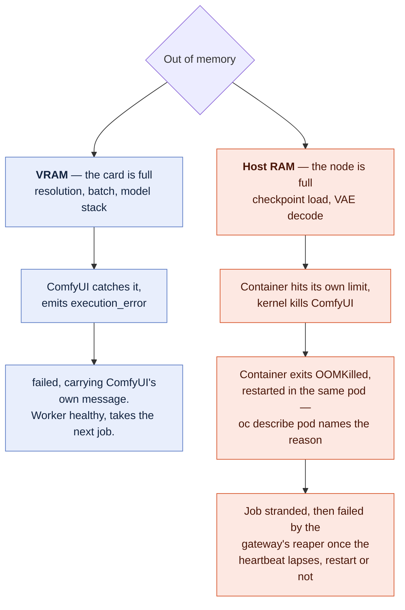

# Troubleshooting

Ordered by how likely you are to hit it.

## A dead pod is holding the volume

`Multi-Attach error`, a mount that never completes, or a pod in `Terminating`
for hours after a node died.

```bash
./scripts/08-unstick-storage.sh --repair
```

**Do not reach for `oc delete pod --force --grace-period=0`.** It deletes the
pod record while the container may still be running, which strands the volume
permanently instead of releasing it. `docs/08-stuck-volumes.md` has the full
explanation and the supported fix.

## GPU pool stuck in Provisioning forever

Two different causes that look identical.

**Quota.** `make preflight` catches this. If G/VT vCPUs is 0, no amount of
waiting helps.

```bash
aws service-quotas get-service-quota --service-code ec2 --quota-code L-DB2E81BA
aws service-quotas list-requested-service-quota-change-history --status PENDING
```

**Capacity.** The quota is fine and AWS simply has no `g6.xlarge` free in that
AZ. Offerings say the type exists there; they say nothing about capacity.

```bash
rosa describe machinepool --cluster "$CLUSTER_NAME" gpu
oc get events -A --field-selector reason=FailedCreate
```

Switching region is faster than waiting. `us-west-2` and `us-east-1` have the
deepest G-family pools; `us-east-2` is cheaper when it has stock. Changing
`GPU_INSTANCE_TYPE` to a different family (`g5.xlarge` instead of `g6.xlarge`)
also works — they draw from separate capacity pools.

## ClusterPolicy never becomes ready

```bash
oc get clusterpolicy -o yaml | grep -A5 status
oc get pods -n nvidia-gpu-operator
oc logs -n nvidia-gpu-operator -l app=nvidia-driver-daemonset --tail=100
```

**If it has been under 20 minutes, it is not stuck.** The driver container
compiles against the running RHCOS kernel and pulls several GB. First run on a
fresh node is genuinely slow.

**`nvidia-driver-daemonset` in `Init` or `ImagePullBackOff`** — usually the node
cannot reach `nvcr.io`. Check the NAT gateway exists and the private route table
points at it.

**No driver pods scheduled at all** — NFD did not label the node. Check:

```bash
oc get nodes -l feature.node.kubernetes.io/pci-10de.present=true
oc get pods -n openshift-nfd
```

If NFD is running and the label is missing, the node has no NVIDIA card — you
are looking at a base worker, not the GPU pool.

## ComfyUI pod is CrashLoopBackOff

Almost always the arbitrary UID.

```bash
oc logs -n comfyui -l app=comfyui --previous
```

`Permission denied` on any path is the tell. OpenShift assigned your container
a random high UID with GID 0 supplementary; the path it is writing to is not
group-writable. The fix is in the image, not the manifest:

```dockerfile
RUN chgrp -R 0 /the/path && chmod -R g=u /the/path
```

`OSError: [Errno 30] Read-only file system` means the same thing about a path
that is not a volume at all. Mount it or move the write.

`ModuleNotFoundError` at start means a custom node tried to install its own
dependencies at import time. Add them to `app/requirements-extra.txt` and
rebuild.

## Pod stays Pending

```bash
oc describe pod -n comfyui -l app=comfyui | sed -n '/Events/,$p'
```

- `0/3 nodes are available: 3 Insufficient nvidia.com/gpu` — the GPU node is not
  ready or the operator has not advertised capacity yet. `oc get nodes -o
  custom-columns='N:.metadata.name,G:.status.capacity.nvidia\.com/gpu'`
- `node(s) had untolerated taint {nvidia.com/gpu: true}` — your pod is missing
  the toleration. The manifests here have it; anything you wrote yourself does
  not.
- `pod has unbound immediate PersistentVolumeClaims` — see below.

## PVC stuck in Pending

```bash
oc describe pvc -n comfyui comfyui-models
oc get storageclass
```

**`rwo` mode**: the default StorageClass name differs by platform (`gp3-csi` on
ROSA, often `gp3` on self-managed). `04-storage.sh` resolves it from the
cluster's default-class annotation, so a failure here usually means there is no
default StorageClass at all. Set one:

```bash
oc patch storageclass <name> -p \
  '{"metadata":{"annotations":{"storageclass.kubernetes.io/is-default-class":"true"}}}'
```

**`rwx` mode**: almost always the credentials secret or a missing mount target.

```bash
oc logs -n openshift-cluster-csi-drivers -l app=aws-efs-csi-driver-controller -c csi-provisioner
```

`AccessDenied` → the `aws-efs-cloud-credentials` secret is missing, has the
wrong key, or the IAM role's trust policy does not name both service accounts.
The secret must carry a `credentials` key holding an AWS config file
(`[default]` + `role_arn` + `web_identity_token_file`) — a bare `role_arn` key
is silently ignored and produces exactly this symptom. Check with:

```bash
oc get secret aws-efs-cloud-credentials -n openshift-cluster-csi-drivers \
  -o jsonpath='{.data.credentials}' | base64 -d
```
Timeout on mount → no mount target in the node's subnet, or the security group
does not allow 2049 from the VPC CIDR.

## The namespace is default-deny (multi-user)

`enterprise/manifests/06-network-policy.yaml` denies everything in both
directions and then allows six specific flows. The failures it produces all
look the same from the outside — a pod that is `Running` and `Ready`, probes
green, and every connection it opens or should receive timing out with no
event anywhere — so check the policy before the application.

**The Route stops answering right after `setup.sh`, gateway pod healthy.**
The `gateway-ingress` policy admits the router's traffic from a pod in
`openshift-ingress`. That is right on ROSA and on any cluster whose
IngressController publishes through a LoadBalancer Service. Where the router
runs on the **host network** — some bare-metal and single-node installs — the
traffic arrives from a node address, no `namespaceSelector` matches it, and
the browser times out. Confirm with `oc get pods -n openshift-ingress -o wide`
(host-network routers show the node's own IP), then either replace the first
`from` entry with an `ipBlock` for your node network or, to prove the
diagnosis, `oc delete networkpolicy gateway-ingress -n comfyui` and reload.

**A second `setup.sh` run hangs on the image build, at `git fetch`.** Build
pods need the internet — that is what `allow-build-egress` is for, matched on
the `openshift.io/build.name` label every BuildConfig pod carries. If that
policy is missing, or your build pods are labelled differently, the clone
inside the build hangs rather than failing. `oc get networkpolicy -n comfyui`
should list seven objects; `oc logs -n comfyui bc/comfy-worker` sitting on a
fetch with no error is the tell.

**The ScaledObject sits in `ScalerFailed`, queue growing, no workers.** The
KEDA scaler dials Redis from its own operator pod in `openshift-keda`, and a
bare `podSelector` means "pods in this namespace". `redis-allow-app-only`
carries an explicit `openshift-keda` exception for exactly this; if someone
tidied it away, this is the symptom.

**`ENABLE_MANAGER=true` hangs, or a workflow's downloader node never
finishes.** By design. `worker-egress-redis-only` gives a GPU pod a route to
Redis and DNS and nothing else — not the internet, not S3, not the instance
metadata service. Manager's node list and model downloads cannot fetch;
`docs/06-enterprise-architecture.md` says why that is the stance and what to
do instead.

**A pod you added yourself can reach nothing.** Same cause. Every Deployment
in the namespace must be selected by a policy of its own; `make lint` fails
one that is not, but lint reads the manifests in this repository, not what
you applied by hand.

## A worker is restarted every few minutes with ComfyUI healthy (multi-user)

The worker's liveness probe is two assertions in one `exec`: ComfyUI answers
on loopback, *and* `AGENT_LIVENESS_FILE` (`/tmp/comfy-agent-alive`) is under
120 seconds old. The agent touches that file on every pass of its loop, idle
and mid-job, so a restart here means the agent stopped going round — parked
on a Redis connection that is blackholed rather than refused, usually.
`oc describe pod` shows the probe's output; `oc logs -c` the previous
container shows where the agent was. If the restarts coincide with long
generations, that is a regression in the agent's in-job touch, not a tuning
problem: `check-68-agent-liveness-file.py` in `make test` asserts the mtime
advances mid-job.

## Build fails

```bash
oc logs -n comfyui bc/comfyui
```

`OOMKilled` — the torch install needs headroom. Raise the BuildConfig memory
limit in `scripts/05-deploy.sh` above 8Gi.

`no space left on device` — the build node's ephemeral storage. Build on the
base pool (the default) rather than the GPU node, or build locally and push to a
registry, setting `COMFYUI_IMAGE` in `.env`.

## rosa create cluster fails immediately

- `ERR: Failed to verify AWS support plan` — you are on Basic or Developer.
  See `docs/01-aws-account.md` — AWS lists Business+ as a prerequisite, Red Hat
  calls it recommended, and which of those you are hitting depends on the CLI
  version.
- `ERR: --installer-role-arn is required` on `rosa create operator-roles` — the
  account roles step did not produce an HCP installer role. Re-run
  `rosa create account-roles --mode auto --hosted-cp --force-policy-creation --yes`
  and check `rosa list account-roles` shows one with `HCP` in the name.
- `ERR: Insufficient quota` — run `make account` and wait.
- `ERR: The AWS account is not linked to a Red Hat account` — you skipped
  enabling ROSA at `console.aws.amazon.com/rosa`, or the Red Hat account behind
  `ROSA_TOKEN` is not the one you linked.
- Operator role errors after re-creating a cluster with the same name — the old
  OIDC config is stale. `rosa delete operator-roles --prefix "$CLUSTER_NAME"
  --mode auto` and re-run.

## Everything works but generation is slow

Check you are actually on the GPU:

```bash
oc rsh -n comfyui deploy/comfyui nvidia-smi
```

If `nvidia-smi` shows 0% utilization during a generation, torch fell back to
CPU — usually a CUDA/torch version mismatch after editing the Containerfile.
`python3 -c "import torch; print(torch.cuda.is_available())"` inside the pod
tells you in one line.

If utilization is high and it is still slow, it is the card. An L4 is roughly
half an A10G for fp16 diffusion. `GPU_INSTANCE_TYPE=g5.xlarge` or `g6e.xlarge`
and `make cluster` again.

## What happens when things fail (multi-user)

Everything above is what *you* do. This is what the system does, every failure
mode in one place, because most of the multi-user configuration's design is
failure handling and it is worth being able to read it as a whole. Nothing
below is aspirational: each row is a code path you can find, and most are
covered by an assertion in `enterprise/test/`.

Read it as evidence rather than as a list of defences. Almost nothing here is
exceptional: a pool that scales to zero terminates workers as a matter of
routine, a node drain is an upgrade doing its job, and a container restarted in
place is `restartPolicy: Always` behaving exactly as documented. The platform
generates this traffic by design, which is why the SIGTERM drain, the TTL'd
heartbeat and the incarnation nonce are asserted rather than assumed — they
are on the ordinary operating path, not on an unlikely day. Termination being
routine is what makes scale-to-zero affordable; handling it is the price of the
cost ladder.

### Out of memory — three different failures that people call one thing

ComfyUI makes it easy to exceed memory, and the three ways it happens are not
handled alike. Knowing which one you hit is most of the diagnosis.

| | What actually happens | What the user sees |
|---|---|---|
| **VRAM / CUDA OOM** — the common one: a resolution, batch size or model stack that does not fit the card | ComfyUI catches it and emits `execution_error`. The agent (`worker_agent.py`, `run_job()`) turns that into a terminal `failed` carrying ComfyUI's own exception message. The worker stays healthy and takes the next job. | `failed: Allocation on device ...` — the real message, not a generic error. Nothing is retried, because the same workflow would fail the same way on any card. |
| **Host RAM OOM** — a large checkpoint load, a VAE decode, a wide batch | The container hits its own memory limit and the kernel kills ComfyUI inside that cgroup. `start.sh` waits on both children, so the container exits rather than limping on with a dead ComfyUI and a live agent claiming jobs it cannot run — `restartPolicy: Always` then restarts the container inside this same pod, which keeps its name and its `HOSTNAME`. | The job is stranded, then failed by the gateway's reaper (below) once the worker's heartbeat lapses — including across that restart, because the worker's identity is its pod name plus a nonce chosen at process start (`worker_agent.py`, note 9), not the pod name alone. At the queue level this is still indistinguishable from infrastructure death — but the container is not: it terminates as `OOMKilled` and `oc describe pod` names the reason. |
| **Node-level pressure** — eviction rather than a container kill | The kubelet evicts with a grace period, so SIGTERM arrives first and the drain below applies. A GPU pod is Guaranteed QoS, so it is the last thing evicted, not the first. | Usually nothing: the job finishes before the pod goes. |

That the second row says `OOMKilled` and not "the node decided" is a property of
the manifest, not of luck: the GPU pod's memory limit is set to something the
node can actually give it, so the container reaches its own ceiling first. A
limit larger than the node — the shape this repo shipped with, `24Gi` on a
16 GiB `g6.xlarge` — can never be reached, which turns the second row into the
third and costs you the attribution. `scripts/lint.sh` fails a GPU pod that
drifts back to it.



### Worker death

| Failure | Handling | User-visible result |
|---|---|---|
| **Graceful termination** — scale-to-zero, a node drain, a rolling deploy, a spot interruption notice | The agent traps SIGTERM, stops accepting new work, and **finishes the job in flight** before exiting (`worker_agent.py`, note 4). Termination is routine on a pool that scales to zero, so this is the common path, not the exceptional one. The worker Deployment rolls one pod at a time with no surge, and a PodDisruptionBudget keeps a drain from taking the whole pool at once. | The generation completes normally. Asserted by the e2e suite. |
| **Hard kill** — SIGKILL, kernel OOM, node death | The agent parks each job in a per-worker processing list with `BLMOVE` and holds a TTL'd heartbeat (note 5), and writes a `phase` breadcrumb as it goes (note 6). When the heartbeat lapses, the gateway's reaper reads that breadcrumb and either fails the stranded job **naming the dead worker**, or — only if the worker died before ComfyUI was ever handed the workflow — requeues it once. | Died mid-generation: `failed: worker comfy-worker-xxxx died`, loudly, rather than a progress bar that never moves. Failed and not requeued on purpose — a workflow that OOM-killed one worker would OOM-kill the next one too, at GPU prices — and the message points at `oc describe pod`, which *can* tell an OOM kill from a reclaim. Died before it started: a non-terminal `retry` event the browser reads past, and a second worker finishes the job. Both asserted by the e2e suite. |
| **A worker that comes straight back** — the container is restarted inside its own pod, which is how `restartPolicy: Always` answers a kernel OOM | The heartbeat key and the processing list are named from the worker's *incarnation* — its pod name plus a nonce chosen at process start (`worker_agent.py`, note 9) — not from the pod name alone, which a restart keeps. The reaper's whole liveness test is pairing those two keys by name, so an id that outlives the process it names lets the replacement vouch for its own predecessor. | The restart is invisible to the stranded job: it is failed by the reaper on exactly the schedule it would have been if the pod had never come back. Without the nonce the *same* row above silently stops applying — the job never reaches a terminal state at all, its GPU seconds land in neither bucket, and its queue entry stays in Redis for the life of the pod. Asserted by the e2e suite, restart and all. |
| **A worker that is alive and was called dead** — the reaper's whole liveness test is whether one heartbeat key exists, and `run_job()`'s prologue blocks in three places: an unbounded `mkdir` on the shared volume, a 30-second WebSocket connect, a 30-second POST | The heartbeat is refreshed by a thread that runs for the whole process rather than from inside the two loops (`worker_agent.py`, note 10), so it is a property of the process being alive. That shrinks the window and cannot close it, so the job also carries an **owner**: the reaper stamps its own mark over that field before it touches a stranded entry, and the worker's claim to `executing` is a Lua compare-and-set against it — one atomic operation, not a read and then a write — and `finish()` re-reads it before writing a terminal outcome. Reaped means abandon — no submit, no terminal event, no accrual. | Without both halves a live worker's job is requeued underneath it and ComfyUI is handed one workflow twice, on one GPU pool, with the second `completed` landing on a stream the browser stopped reading. Asserted by the e2e suite (`check-36-live-worker-fencing.py`), which kills nothing; its scenario C reaches the microseconds between the old read and the old write with a test-only pause. What remains is the POST itself — a reap landing between a successful claim and ComfyUI receiving the request — and `docs/10-roadmap.md`, F4, says why that is a redesign of the worker/ComfyUI contract rather than an edit. |
| **A reap that fails halfway** — the reaper is the only code that ever writes a terminal event for a job whose worker died, so its own crash is the job's last chance | The stranded entry is *read*, not popped: it leaves the processing list only after its reap has returned, a reap that raised is retried on a later tick, and an entry that can never be reaped is set aside on a capped, expiring list rather than dropped. Exclusion between the two gateway replicas is an explicit per-entry claim rather than a side effect of popping. A job the reaper requeued remembers which entry it came from, so a second look at that entry — after an `LREM` that failed — removes it rather than re-deciding it and failing the live retry. | The trade is at-least-once for at-most-once: a gateway dying between a reap and its cleanup costs a duplicate terminal event on a stream the browser stopped reading at the first one, where popping first cost the job itself. Asserted by the e2e suite (`check-37-reap-durability.py`), which injects one fault per scenario rather than killing anything. |
| **ComfyUI wedges or dies mid-job** | The agent's `recv()` is bounded and each job carries a deadline (`JOB_TIMEOUT`, 1800s). On every timeout it re-checks `/history` in case a completion event was simply missed. A socket that ComfyUI closes does not wait that deadline out: the close surfaces as an empty frame rather than an exception, the agent treats it as the close it is, asks `/history` once in case the prompt landed in the instant before the process went, and otherwise fails immediately naming the lost connection. Either way the abandoned prompt is sent `/interrupt`, and the agent waits up to `INTERRUPT_DRAIN_TIMEOUT` (60 s) for ComfyUI's queue to empty before taking the next job; a ComfyUI that never drains makes the agent exit so the pod restarts. | The job fails with a reason instead of the pod sitting `Running` and `Ready` while silently consuming nothing — which is worse than a crash, because KEDA sees a growing queue and adds more workers beside the dead one. And the next job on that worker runs normally, rather than queueing inside ComfyUI behind a prompt nobody interrupted and timing out in turn. Asserted by the e2e suite (`check-75-closed-socket.py`, `check-67-job-timeout-interrupt.py`). |
| **The agent wedges with ComfyUI healthy** — a Redis connection blackholed rather than refused, a heartbeat thread that cannot reach Redis | The agent touches `AGENT_LIVENESS_FILE` on every pass of its loop, idle and mid-job, and the pod's exec liveness probe checks that file's age alongside ComfyUI's `/system_stats`; older than 120 s and the container is restarted. Redis socket and connect timeouts are set explicitly so `BLMOVE` cannot park forever. | A pod that was holding a card and taking no work is replaced within a few minutes, rather than sitting `Running` until somebody notices the queue. Asserted by the e2e suite (`check-68-agent-liveness-file.py`). |

### The job itself

| Failure | Handling | User-visible result |
|---|---|---|
| **Invalid workflow** — wrong format, missing input, unknown node | ComfyUI rejects it at submit and the agent propagates the rejection verbatim. | `failed: required input is missing: ckpt_name` rather than `failed`. The difference is most of the support burden. |
| **Job runs too long** | The per-job deadline fires, and the prompt is interrupted at ComfyUI. | `failed: job exceeded 1800s`. Raise `JOB_TIMEOUT` if your workflows legitimately run longer. |
| **Cancel** | Cooperative on the gateway's side: a queued job is removed, a running one has a flag set. The agent reads that flag between events — including immediately before the `/prompt` POST, so a job cancelled while queued never starts — and sends ComfyUI's `/interrupt` itself, which takes effect between sampler steps. The gateway never reaches the worker. | Queued jobs stop immediately; running ones stop at the next event boundary, which during sampling is the next progress tick. |
| **Not JSON, wrong content type, too big** | `POST /api/generate` requires `Content-Type: application/json` (415 otherwise), malformed JSON is a 400, and a body over `MAX_BODY_BYTES` is a 413 before it is read. | An explicit refusal at the door, rather than a job that fails later or a cross-site form post that queues one. |

### The connection

| Failure | Handling | User-visible result |
|---|---|---|
| **The browser opens its WebSocket after the job already started** | Progress lives in a Redis Stream, not pub/sub. `XREAD` from `0-0` replays the whole history and then tails live in one call. | Nothing is lost. This is the common case — the POST and the socket open are two separate round trips — not an edge case. |
| **Laptop sleeps, network drops, gateway pod rolls** | Same mechanism: reconnecting replays identically from the beginning. A PodDisruptionBudget keeps one gateway serving through drains and upgrades so both replicas cannot go at once, in both `SCALE_TO_ZERO` modes. | The progress bar picks up where it was. |
| **A WebSocket for a job that does not exist, or one held open forever** | An unknown job id is closed with code 4404 instead of being parked on a ping loop holding a Redis connection; a socket that has lived `EVENT_STREAM_TTL` is closed with 4408, because the stream it tails expired then. The Redis pool is bounded (`REDIS_MAX_CONNECTIONS`). | A closed socket with a reason, rather than a gateway slowly running out of connections. |
| **A long generation outlives the router's idle timeout** | Every Route carries both `haproxy.router.openshift.io/timeout: 4h` and `timeout-tunnel` — on edge and reencrypt Routes only the tunnel timeout governs the upgraded WebSocket. | Long jobs keep their connection. Without both annotations they drop at a fixed point every time, which reads exactly like an application bug. |

### The system

| Failure | Handling | User-visible result |
|---|---|---|
| **Queue grows faster than the pool drains** | The gateway refuses submissions past `MAX_QUEUE_DEPTH` — inside the same atomic Lua insert, so a dozen simultaneous submits cannot slip past a ceiling of three — and Redis runs `maxmemory-policy noeviction`. | An explicit rejection. The default eviction policy would silently drop queued jobs instead, which presents as work disappearing at random. |
| **Every browser tab polls `/api/stats`** | One cached snapshot per `STATS_CACHE_SECONDS` (5) serves `/api/stats` and `/metrics`, instead of a full-keyspace `SCAN` of a single-threaded Redis per call. | A busy team's dashboards cost Redis the same as one. |
| **Redis restarts** | AOF persistence. | Queued and in-flight state survives a pod restart. It does not survive a zone outage — Redis is a single instance, deliberately, at one-GPU scale. |
| **A dead pod will not release its volume** | `scripts/08-unstick-storage.sh --repair`, which confirms the EC2 instance is genuinely terminated before force-detaching. | Repairable. Do **not** reach for `oc delete pod --force --grace-period=0`: it strands the volume permanently instead of freeing it. `docs/08-stuck-volumes.md`. |
| **No GPU capacity, or no quota** | The worker pod stays `Pending`. `make preflight` distinguishes the two — quota is a multi-day fix, capacity is a region or instance-family change. | "GPU pool stuck in Provisioning forever", above. |
| **First job after an idle period** | Not a failure, but it looks like one: a node has to be provisioned and a ~10 GB image pulled. | 8–17 minutes, and the gateway says so rather than leaving a bar that has not moved. Removed by a warm floor — `WARM_WORKERS` in `.env`; the README's "Where this loses". |
| **Someone requests a path outside the output directory** | Resolved and compared against the output root before anything is served. | `/outputs/../../etc/passwd` does not resolve. Asserted by the e2e suite. |
| **A submitter's name, or a workflow's filename prefix, tries to become a path** | Both are caller-supplied and both end up on the filesystem, so both are handled as hostile. The username is sanitized to a name that cannot contain a separator, then joined, then resolved, then verified inside the output root — in that order. A `filename_prefix` carrying `..` or an absolute path is refused outright. | A username of `../../etc/passwd` gets an ordinary confined workspace rather than a traversal; a workflow trying to write outside its workspace fails with a message naming the prefix. Asserted by the e2e suite. |
| **ComfyUI's own reported output tries to become a path** | Not caller-supplied, but not trusted either: the reported `subfolder` and `filename` are confined on the same footing, per component, and `collect_outputs()` refuses to build a served URL from either half until both pass. Only `type: output` entries are served; an output reported inside another submitter's workspace is refused rather than moved; the per-node `executed` events the worker forwards carry no paths at all, and the gateway independently drops a URL from any raw event whose components are not bare names. | A node reporting `{subfolder: "", filename: "../../OUTSIDE/secret.txt"}` produces no image entry at all — not a traversal, and not a same-named file served from the wrong place either. Asserted by the e2e suite (`check-65-output-filename-confinement.py`, `check-10`). |
| **Someone reads another user's output workspace** | Under `AUTH_MODE=oauth`, refused: `/outputs/...` serves a caller only files inside their own workspace, on the resolved path, and `/api/showback` names other submitters only to `SHOWBACK_OPERATORS`. Under `AUTH_MODE=none` it is deliberately possible, and documented rather than pretended: the identity there is a client-supplied header, and a scope keyed on it would be a lock with the key on the door. | Under `oauth`, bob gets a 403 for alice's file, and `/outputs/<alice>/../<bob>/x` is refused too. Under `none`, knowing a username is enough to compute its workspace path — `docs/06-enterprise-architecture.md`. Both asserted by `check-66-output-scoping.py`. |
| **Under `AUTH_MODE=none`, a caller writes into someone else's workspace** | `X-Forwarded-User` is client-supplied in this mode (`hub.py` says so in three places), and the worker writes into whichever workspace that header names, overwriting an existing same-named file there. Inherent to `AUTH_MODE=none`: with nobody authenticated, there is no "someone else" for the header to misrepresent. | Setting `X-Forwarded-User: alice` writes into (and can silently overwrite) alice's output workspace, no login required — on top of the GPU budget `AUTH_MODE=none` already warns about. Run `AUTH_MODE=oauth` if either matters to you. |
| **A custom node phones home, or reaches for the instance metadata service** | The namespace is default-deny and a worker's only egress is Redis and DNS; its Redis credential is an ACL user allowed the agent's commands and the `comfy:*` keys and nothing else; no pod mounts a ServiceAccount token. | The connection times out. "The namespace is default-deny", above, is the same fact seen from the operator's side. |
