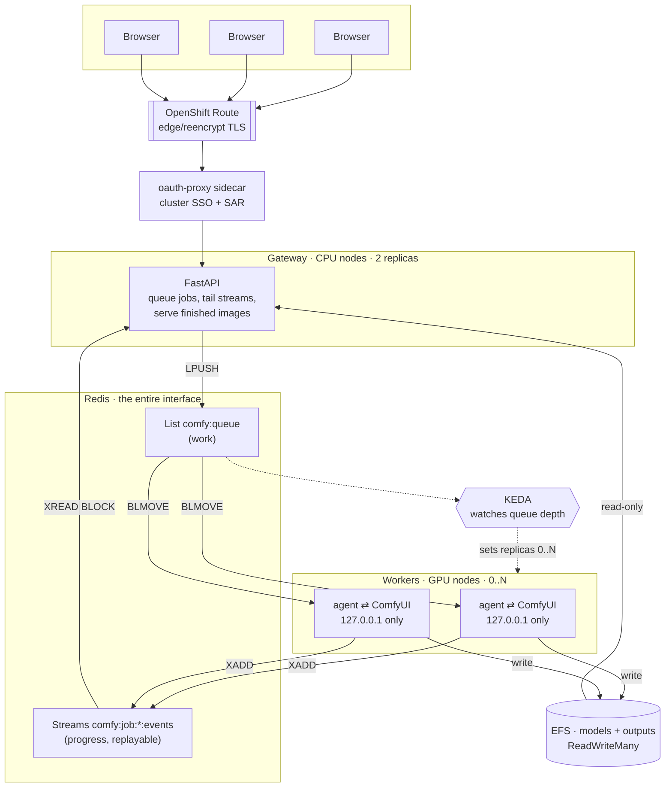

# Multi-user architecture

Design rationale for the `enterprise/` configuration. No commands here — those
are in `enterprise/README.md`, and there is one of them.

## The problem this solves

ComfyUI is a single-player application wearing a web UI. Its server holds
per-client state and streams progress over a WebSocket keyed to a `clientId`
the browser picks. Put ten people in front of one instance and they share one
queue, one set of preview frames, and one progress bar — user A watches user B's
generation, and prompts land in an order nobody chose.

The instinct is to give each user their own pod. That fails on economics before
it fails on anything else: a GPU is indivisible under Kubernetes, so ten users
means ten GPUs, idle most of the day, at roughly $0.80/hour each.

## Hub and spoke

Separate the thing users touch from the thing that costs money.

**The gateway** runs on cheap CPU nodes. It accepts a workflow, puts it on a
Redis list, and holds the browser's WebSocket. It never talks to a worker.

**The workers** run on GPU nodes. Each is one pod containing ComfyUI bound to
`127.0.0.1` and an agent process. The agent pops a job, drives the local
ComfyUI, and writes progress back to Redis. It is the only route in or out.

**Redis** is the whole interface between the two. That is the point: with no
direct connection between a browser and a worker, workers can appear and vanish
freely, which is what makes scale-to-zero possible at all.

## Why the workers are unreachable

Every GPU pod binds ComfyUI to loopback and has no Service and no Route.

This is not defence in depth, it is the primary control. ComfyUI has no
authentication and its custom-node system executes arbitrary Python by design.
A reachable ComfyUI pod is an unauthenticated remote code execution endpoint on
a node that holds an instance role, sits inside your VPC, and has the shared
model volume mounted writable.

The gateway, by contrast, accepts exactly one thing — a workflow JSON object —
and does nothing with it but push it onto a list. Its attack surface is a JSON
parser.

If you change `--listen 127.0.0.1` to `0.0.0.0` in `enterprise/worker/start.sh`,
you have removed the security model, not just a network binding.

## What the worker can reach, and with what

Unreachable is half of it. The other half is what a worker pod can *initiate*,
because the code running in it is whatever custom-node Python was baked into
the image, on a node with an instance role, inside your VPC. Three controls,
all in the manifests:

- **The namespace is default-deny in both directions**
  (`enterprise/manifests/06-network-policy.yaml`), and then six policies
  allow exactly the flows that exist: DNS for everyone; the workers to Redis
  and nothing else; the gateway in from the router in `openshift-ingress` and
  from the Prometheus and KEDA namespaces, out to Redis and to TLS on the
  control-plane ports the oauth-proxy sidecar needs; Redis in from the
  gateway, the workers and KEDA; and build pods out to the internet, because
  the images are built in-cluster. A worker therefore has no route to the
  internet, the instance metadata service, another namespace's Service, or
  S3 — which is also why `ENABLE_MANAGER=true` cannot fetch a node list or a
  model at runtime in this configuration and will hang trying. The one
  assumption that varies between clusters is that the router is a pod in
  `openshift-ingress`; it is on ROSA, and the file says what to change where
  it is not. `scripts/lint.sh` fails a Deployment no policy selects.
- **The worker's Redis credential is its own ACL user**, `comfy-worker`
  (`00-redis.yaml`), allowed the commands `worker_agent.py` issues against the
  five `comfy:*` key patterns it names and nothing else — no `FLUSHALL`, no
  `CONFIG`, no `SCAN`, no reading a key outside its own. That is the only
  Redis credential a GPU pod holds; the gateway, KEDA and the readiness probe
  use the default user. `setup.sh` adds the second password to an existing
  Secret without rotating the first, and lint pins the ACL to `-@all` plus
  the allowlist.
- **No pod mounts a ServiceAccount token.** `automountServiceAccountToken:
  false` on Redis, the gateway and the worker: nothing in the namespace calls
  the Kubernetes API, so the projected token was a credential with no reader
  except whatever else ended up executing in the pod. The oauth-proxy patch
  turns it back on for the gateway alone, because the proxy really does call
  TokenReview and SubjectAccessReview.

Two smaller shapes in the same spirit. The worker has a **combined liveness
probe**: one `exec` that asks ComfyUI on loopback whether it is up *and*
checks that `AGENT_LIVENESS_FILE` — touched by the agent on every pass of its
loop, idle or mid-job — is under 120 seconds old, so an agent parked forever
on a blackholed Redis socket beside a healthy ComfyUI is restarted rather than
holding a card. And the worker Deployment rolls **one pod at a time with no
surge** (`maxUnavailable: 1`, `maxSurge: 0`), with a PodDisruptionBudget on
the workers, on Redis and on the gateway pair, so a cluster upgrade drains the
pool in sequence instead of all at once.

## Why Redis Streams, not pub/sub

The obvious implementation publishes progress to a pub/sub channel and has the
gateway subscribe. It works in a demo and drops messages in production, because
pub/sub delivers only to subscribers connected at the moment of publication, and
there are two ordinary situations where the gateway is not:

- The browser POSTs the job and *then* opens the WebSocket. Those are separate
  round trips. A worker that picks the job up in between publishes into an empty
  room.
- The WebSocket drops — a laptop sleeps, a gateway pod is rolled during a
  deploy — and reconnects. Everything that happened meanwhile is gone.

Both produce the same user-visible symptom: a progress bar that never moves on a
job that is running perfectly well. It is intermittent, it depends on timing,
and it is horrible to debug.

A Redis Stream is an append-only log with an ID per entry. `XREAD` from `0-0`
replays the whole history and then blocks for new entries — replay and live tail
through one call, with no window between them where an event can be lost. A
reconnecting browser gets the full history and catches up. Streams carry a TTL
so finished jobs expire on their own.

The cost is a few megabytes of Redis and one extra concept. It buys away an
entire category of bug.

## Scale to zero, honestly

Two independent layers, and only one of them saves money.

**Pods.** KEDA watches `LLEN comfy:queue` and sets the worker Deployment's
replica count, including to zero. On its own this saves nothing: an idle GPU
*node* bills identically whether a pod is scheduled on it or not.

**Nodes.** The GPU machine pool is autoscaled with `--min-replicas 0`. When the
last worker pod goes away the node is reclaimed; when a worker pod goes Pending
for want of a GPU, a node is provisioned. This is where the ~$0.98/hour goes.

ROSA permits zero on this pool specifically because it is tainted and is not the
cluster's only untainted pool — ROSA requires one untainted pool with at least
two replicas, which the base pool provides. `enterprise/setup.sh` attempts zero
and falls back to one with a loud warning if the API refuses.

### The cold start is real

From a fully idle cluster, the first job waits for:

| | |
|---|---:|
| Machine pool provisions an EC2 instance and it joins the cluster | 3–5 min |
| Pull a ~10 GB CUDA + torch + ComfyUI image onto a fresh node | 3–8 min |
| CUDA init, custom node scan, ComfyUI ready | 1–2 min |
| Checkpoint load into VRAM | 0.5–2 min |
| **First image** | **8–17 min** |

Subsequent jobs on a warm worker start in seconds.

`cooldownPeriod: 600` in the ScaledObject is the number that trades these off:
too short and someone taking a coffee break pays the cold start repeatedly, too
long and you buy idle GPU. Ten minutes is a starting point, not a truth. It is
the first thing to tune.

**When scale-to-zero is the wrong choice:** interactive iteration, where a
designer runs a prompt, looks at it, adjusts, and runs again over an afternoon.
There, the cold start lands in the middle of a creative loop and the honest
configuration is a warm floor during work hours and zero at night. That is
`WARM_WORKERS` in `.env`: a second, `cron`-type trigger on the same
ScaledObject that holds N workers between `WARM_START` and `WARM_END` in
`WARM_TIMEZONE`. KEDA takes the maximum across its triggers, so inside the
window the pool never drops below N and a busy afternoon still scales past it
to `MAX_GPU_WORKERS`; outside the window the queue is the only thing deciding
and the pool drains as before. The floor lives in `.env`, so a `setup.sh`
re-run reasserts it rather than resetting it — which is why it is a trigger
and not a cron job editing the machine pool. Scale-to-zero earns its keep
unmodified for bursty, batch, and out-of-hours work.

`SCALE_TO_ZERO=false` is the other end: it pins exactly one worker
permanently and skips KEDA, the ScaledObject and machine-pool autoscaling with
it, so `WARM_WORKERS` does nothing there and `setup.sh` warns if you set both.

## Storage: why this configuration requires EFS

The gateway serves finished images. The workers produce them. Those pods are on
different nodes by construction — one on CPU, one on GPU.

A gp3 volume is `ReadWriteOnce`: one node at a time, full stop. So the
multi-user configuration needs `ReadWriteMany`, which on AWS means EFS.
`enterprise/setup.sh` refuses to run without `STORAGE_MODE=rwx` rather than
letting you discover this as a pod stuck in `ContainerCreating`.

EFS costs roughly 4× gp3 per GB and is slower for large sequential reads, which
matters when a checkpoint is 7 GB. Two things make that acceptable here: the
model is read once per worker start rather than per job, and the volume outlives
the cluster, so `make down` no longer means re-downloading a model library.

`docs/03-storage.md` has the full comparison including the S3-sync middle path.

## Authentication

`AUTH_MODE=oauth` puts an `oauth-proxy` sidecar in the gateway pod and rebinds
the gateway itself to loopback, so there is no port on the pod that bypasses the
login. Users authenticate against whatever identity provider the cluster is
wired to; authorisation is a SubjectAccessReview — you must be able to `get` the
application namespace.

Grant access by granting a role, revoke it by removing one, and the access shows
up in the cluster audit log. No separate user database.

Under `oauth` the gateway also trusts the identity for two things it refuses
to trust it for under `none`. `/outputs/<path>` serves a file only if it lies
inside the caller's own workspace — anyone else's is a 403, and the check is
on the *resolved* path, so `/outputs/<mine>/../<theirs>/x` is refused too.
And `/api/showback` returns only the caller's own row plus the pool totals
(`users_total_gpu_seconds`, with `scoped_to` naming the caller) unless the
caller is listed in `SHOWBACK_OPERATORS`, a comma-separated list of
identities exactly as oauth-proxy reports them. Both are asserted by
`enterprise/test/check-66-output-scoping.py` against a gateway started in
`oauth` mode.

`AUTH_MODE=none` exists for a solo test cluster. It publishes the gateway with
no login. The GPU pods stay unreachable either way, so this is not catastrophic,
but anyone who finds the hostname can spend your GPU budget — and Route
hostnames appear in certificate transparency logs within minutes.

It also means more than budget once output workspaces (above) are in the
picture. `X-Forwarded-User` is client-supplied in this mode — `hub.py` says
so in three places — so nothing stops a caller from setting it to someone
else's identity. The worker does not know the difference: it writes into
whatever workspace that header names, and an existing file of the same name
there is silently overwritten. Under `AUTH_MODE=none` this is not a
bypass of anything — nobody is authenticated, so there is no "other user"
this mode was ever protecting — but it does mean a caller can overwrite
another *named* user's prior outputs, not just spend GPU time, with nothing
but a header of their choosing. `AUTH_MODE=oauth` is what makes
`X-Forwarded-User` trustworthy again: the proxy sets it from a real login,
so a caller can no longer simply assert someone else's name.

## ComfyUI-Manager and auto-downloaders

Off by default (`ENABLE_MANAGER=false`), for two reasons. (The single-user
configuration honors the same flag, where the calculus differs: one person
behind an authenticated port-forward is the "single-user sandbox" below, and
Manager's missing-model downloads land on the persistent volume. The
reasoning here is about *this* configuration — a shared cluster.)

**Security.** Manager installs arbitrary Python from the internet and runs it in
the worker pod. In a single-user sandbox that is a convenience. In a shared
cluster it hands every user with UI access code execution on a node with cloud
credentials — which undoes the isolation the rest of this design is built
around.

**It does not survive.** The worker pool scales to zero. Anything Manager writes
to the container filesystem is gone when the node is reclaimed. The durable path
for custom nodes is `app/src/custom_nodes/` and a rebuild, which is also the
path that gets you a reproducible image and a review step.

The same logic applies to workflow-driven model downloaders. Beyond pulling
gigabytes through a NAT gateway at $0.045/GB on someone's whim, `.ckpt` files
are Python pickles: loading one executes whatever is inside it. `.safetensors`
is the format that does not have this property, and a shared writable model
volume is exactly the wrong place to relax about it.

If you want auto-download, put it behind a job that validates the source and the
format rather than behind a button in a shared UI.

## What is deliberately not here

- **Per-user isolation of outputs under `AUTH_MODE=none`.** The workspaces
  are here — `docs/10-roadmap.md` (Q3) landed them — so each job writes into
  `/output/<workspace>/`, named from the submitter's identity by the worker
  agent, and every output that comes back out is confined to that directory
  whether or not the save node cooperated. Under `AUTH_MODE=oauth`, reads are
  scoped too (above): the gateway serves a caller only their own workspace.

  What is deliberately absent is read isolation under `AUTH_MODE=none`. The
  only identity this system has there is `X-Forwarded-User`, and it is
  client-supplied — `hub.py` says in three places that it must never be
  treated as authorization — so scoping reads on it would be a lock whose key
  is written on the door. The gateway therefore serves `/outputs/...` to any
  caller in that mode, and says so rather than pretending. The earlier
  version of this entry declined to scope reads in *either* mode, on the
  argument that a control that evaporates in one mode is worse than a
  documented absence; that argument lost to a simpler one, which is that
  under `oauth` the header comes from a real login and any logged-in user
  could otherwise read any other's images by computing a workspace name.
  `check-66-output-scoping.py` pins both halves: alice gets her file, bob
  gets a 403, and the `none`-mode gateway still serves alice's file to bob.

  Three smaller consequences worth knowing. Usernames are sanitized to an
  allowlist slug plus a hash of the original, so an output directory is
  readable ("alice-smith-example-com-7dcd3a39ad3a") without two different
  usernames ever sharing one; nothing is rejected for the *shape* of a
  username, because an IdP's spelling of a person's name is not something
  they can fix. And a workflow's `filename_prefix` **is** rejected if it
  contains `..` or an absolute path: ComfyUI treats that prefix as a subpath
  of its output directory, the caller wrote it, and it has an unambiguous
  safe form.

  The third is why the `oauth` scoping had to exist: `workspace_name()`
  (`worker_agent.py`, mirrored into `hub.py` as the `SHARED WORKSPACE` block
  that lint keeps identical) is a **pure, publicly computable function of the
  username** — NFC-normalise the string so that the composed and decomposed
  spellings of one accented name are one name, allowlist-slug it, append 12
  hex characters of its `sha256`, nothing else. It takes no secret as input, so knowing
  a colleague's username is enough to compute their workspace path offline.
  That is fine as *organisation*; it is exactly why, once an identity can be
  trusted, the gateway has to check it on the way out. It is also why
  `/api/showback` under `oauth` no longer lists every submitter to every
  caller: the list of names was the lookup key.

  On the same footing, what the worker reports back is not trusted either:
  only manifest entries of `type: output` are served (a preview is a 404 into
  the shared volume), an output ComfyUI reports inside *another* submitter's
  workspace is refused rather than moved into this one, every subfolder
  component is validated like a filename, URLs are percent-encoded, and the
  raw `data.output` manifest is stripped from the per-node `executed` events
  the worker forwards, so nothing unconfined reaches a browser on the way
  through (`check-65-output-filename-confinement.py`, scenarios (e)–(i)).
- **Job priority.** Still not here, on purpose, and the reasoning changed once
  `docs/10-roadmap.md` (Q1) landed fair queueing. A priority lane needs a claim
  from the caller — "I'm interactive" — and the only identity this gateway can
  read, `X-Forwarded-User`, is exactly that self-declared and unauthenticated
  under `AUTH_MODE=none`; a priority lane would just be a header everyone sets
  on themselves. Round-robin sidesteps the trust decision entirely instead of
  solving it: each submitter identity hub.py already records is a lane, lanes
  take turns, and impersonating someone else only shares their turns, not a
  faster one. It also did not need the second list this bullet used to say
  priority would require — the pop is still one `BLMOVE` from one list into a
  per-worker processing list the reaper depends on; a new job is inserted at
  its fairness-computed position within that *same* list (`hub.py`'s
  `fair_enqueue_script`, one atomic Lua `EVAL`) rather than always at the
  back. What is still deliberately absent is an actual priority claim — no
  caller, authenticated or not, can ask to go first.
- **Multi-GPU workers.** One pod, one GPU. A worker with four cards would need
  ComfyUI's own batching or four ComfyUI processes.
- **Redis HA.** One instance with AOF persistence. It survives a pod restart; it
  does not survive a zone outage. At one-GPU scale, adding three Redis nodes
  protects against a failure less likely than the ones you have not fixed yet.
- **General job retry.** Still not here, and for the reason this bullet always
  gave — but `docs/10-roadmap.md` (Q2) has since carved out the one death that
  reason does not cover, so it is worth saying exactly where the line now
  falls. A worker that dies without warning still does not lose its job
  silently: the agent parks each job in a per-worker processing list (BLMOVE)
  and holds a TTL'd heartbeat, and the gateway's reaper acts on stranded jobs
  once the heartbeat lapses. What it does now depends on a `phase` breadcrumb
  the agent writes on the job's own state — `dispatched` until ComfyUI has been
  handed the workflow, `executing` afterwards — and on nothing else.

  A job whose worker died at `executing` is still failed, not requeued, on the
  original argument unchanged: a host-RAM OOM kills the pod and is
  indistinguishable *at the queue layer* from a node reclaim, so requeueing it
  would walk a workflow that killed one worker across the whole pool, in
  sequence, at GPU prices. The user resubmits. A job whose worker died at
  `dispatched` is requeued once, because nothing ran: there is no poison pill
  to replay, and the death was about the cluster rather than about the
  workflow. Everything the agent itself reports — a rejected workflow, an
  `execution_error` (which is how a VRAM OOM arrives), a job deadline — is
  terminal as it always was; retryable is a phase, never an exception.

  Two things follow. The retry is announced as a non-terminal `retry` event, so
  a browser tailing the job reads past it into the second attempt rather than
  stopping; and the attempt counter is a Redis `HINCRBY` whose return value the
  decision is taken from, because the gateway runs two replicas and the
  reaper's per-entry claim — which is what a stranded entry is handed to
  exactly one reaper by, now that the entry is read rather than popped —
  bounds failing a job once without bounding requeueing it once. What
  is still deliberately absent is retry as a general policy — nothing retries a
  workflow that has been anywhere near a GPU. The ambiguity that argument rests
  on is also no longer total for the *operator*: since the worker is sized
  Guaranteed and within what its node can give one pod, a host-RAM OOM
  terminates the pod `OOMKilled` and `oc describe pod` names it. The gateway
  cannot see that; the person reading the failure can, and the failure text
  says so.
- **A gateway that reaches into ComfyUI.** Cancel is cooperative on the
  gateway's side — it removes a queued job and sets a flag on a running one —
  and the workers are not reachable from the gateway, so the gateway itself
  can never call ComfyUI's `/interrupt`. The *agent* can, and does: it reads
  the cancel flag on every pass of its receive loop and sends `/interrupt` to
  its own loopback ComfyUI, which takes effect between sampler steps. The
  same call is made for any prompt the agent gives up on — a `JOB_TIMEOUT`,
  a closed socket — and the agent then waits up to `INTERRUPT_DRAIN_TIMEOUT`
  (60 s) for ComfyUI's queue to empty before taking the next job; a ComfyUI
  that will not drain makes the agent exit so the pod restarts, rather than
  queueing every later job behind a prompt that never finishes
  (`check-67-job-timeout-interrupt.py`). What is deliberately absent is any
  path by which anything *outside* the pod talks to ComfyUI.

## Sources

- [KEDA Redis Lists scaler](https://keda.sh/docs/2.12/scalers/redis-lists/)
- [Custom Metrics Autoscaler on OpenShift](https://docs.redhat.com/en/documentation/openshift_dedicated/4/html/nodes/automatically-scaling-pods-with-the-custom-metrics-autoscaler-operator)
- [ROSA machine pools](https://docs.redhat.com/en/documentation/red_hat_openshift_service_on_aws/4/html/cluster_administration/manage-nodes-using-machine-pools)
- [ROSA pricing](https://aws.amazon.com/rosa/pricing/)
