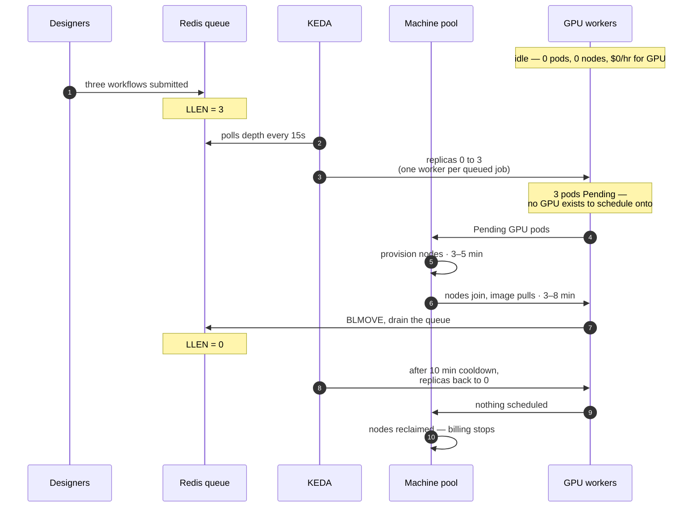

# How far this scales

Roughly a hundred designers on the architecture as it stands, and the limit is
not the one people expect. This page is the long form of the README's one
paragraph: how the pool grows, why it is cheap, where it stops, what to change
first, which AWS cards it runs on, and why it sits beside a model server rather
than competing with one.

## GPU machines scale up automatically with demand

Nobody provisions anything. Queue depth is the only input, and it drives both
layers — the pods, and then the machines underneath them:

**`Pending` is the mechanism, not a symptom.** A GPU pod with nowhere to run is
exactly what makes the machine pool provision a node — the thing that looks like
a failure is the signal. The ceiling is `MAX_GPU_WORKERS`, so a burst cannot
quietly become a four-figure afternoon.

The timings are the honest part. The second worker pays the same cold start as
the first, so autoscaling out serves a sustained batch well and often arrives
after a short spike has already been drained by the worker that was already
warm. `WARM_WORKERS` adds a second, `cron`-type trigger to the same
ScaledObject so that inside working hours the pool never drops below a floor;
KEDA takes the maximum across triggers, so the sequence above is unchanged
outside the window and above the floor (`enterprise/README.md`).

## The economics run backwards

**This is expensive per person for a small team and cheap for a large one.**
The cluster floor — control plane, base workers, NAT gateway — is about
$1.06/hour whether one person uses it or a hundred. Across five designers that
is over $150 each per month before a single image is generated; across a hundred
it is under $8. If your team is small, the honest comparison is not against
dedicated cloud GPUs, it is against the workstations they already have.

### Why it is cheap, which is not the reason people assume

Not "we remember to turn the cluster off". A designer needs a GPU for roughly
**14% of their working day** — call it 1.3 GPU-hours out of nine. Finding a
template, chasing the models it wants, wiring the graph and fixing what it
reports back is the other 86%, and none of it touches a card. The inference is
a couple of minutes at the end of a long setup. (The README's headline uses
0.4 GPU-hours a day, the light case; its sizing table uses 26% duty while
iterating, the heavy case. All three are one model — a render length and a gap
between renders — at different duty cycles, and the README's "Sizing the pool"
section reconciles them and says where the saving stops.)

So a dedicated GPU sits idle about **six of every seven working hours**, not
through carelessness but because that is the shape of the work. Splitting the
saving for thirty designers, GPU line only:

| Arrangement | Card-hours/month | |
|---|---:|---|
| A card each, running 24/7 | 21,900 | — |
| A card each, off outside work hours | 5,940 | **3.7×** — just turning it off |
| Pooled, scaling with demand | 1,257 | **4.7× more** — recovering the setup time |

The assumptions, because they are what drive the rows: thirty designers,
nine-hour days, twenty-two working days a month. The first row is
30 × 730 card-hours, the second 30 × 9 × 22. The third is **not** simply
30 × 1.3 × 22 — that is 858 card-hours of generation, and a pool does not pack
that perfectly. A worker stays up for `cooldownPeriod` (600s in
`03-autoscale.yaml`) after its queue empties, and a cold pool pays for a node
before it pays for a job, so the pooled row carries the pool's own idle on top
of the generation itself. Treat 1,257 as an estimate of that overhead rather
than as arithmetic you can reproduce from the two numbers above; nobody has
run this at thirty designers, and `docs/09-engineering-handoff.md` §0 says so.

The first factor is not architectural: anyone disciplined enough to shut
instances down nightly gets it without a cluster. The second is, and it is the
one worth defending. **The queue does not create a saving; it converts one
person's setup time into another person's inference capacity.** You can turn a
card off overnight. You cannot turn it off for the forty minutes somebody
spends wiring a graph and have it back the instant they press run — not without
a pool and a queue.

That also explains the `SCALE_TO_ZERO`, `cooldownPeriod` and `WARM_WORKERS`
knobs: each is a decision about how much of that recovered idleness to hand
back in exchange for latency.

## The bottleneck is storage, not GPUs

Every cold worker reads a 7 GB checkpoint over NFS, and a pool that scales
means "this node does not have that model yet" is the normal case rather than
the exception. More designers means more distinct models, which means more
first-loads. The queue, the gateway, the reaper and the security model are all
nowhere near their limits.

The reason is a design detail worth naming: **models and outputs have opposite
requirements and share one volume.** Models are read-only, huge, identical
across pods, and perfectly cacheable — a per-node copy is ideal. Outputs are
written by one pod and read by another, which is the *only* reason this design
requires `ReadWriteMany`. EFS exists to solve outputs; models were put on it
because it was already there.

### Five changes, cheapest first

1. **Bake the hot model set into the worker image.** If five checkpoints cover
   most jobs, ship them in the image — the node pulls it anyway, so the
   container runtime becomes the cache. A day's work, and the right thing to
   price before building anything cleverer.
2. **Managed multi-AZ Redis.** Redis is the queue, the progress log and the job
   state, currently one pod that survives a restart but not a zone. ElastiCache
   removes that single point of failure with no application change at all —
   same protocol. The highest ratio of risk removed to work done here.
3. **Outputs to S3, with presigned URLs.** Workers write results straight to
   object storage and the gateway returns a URL rather than serving bytes off a
   mount. This is the one that removes the `ReadWriteMany` requirement outright.
4. **Models to S3, hot copies on node-local NVMe — then group them.** Stage on
   first use so every later load is local. Then cache hit rate becomes a
   placement problem: group models by family, give each family a machine pool,
   pre-warm it, route by declared model. Blocked on a real unknown — ROSA HCP
   exposes no MachineSet, so how instance store is attached at all is
   unanswered. That is the spike in `docs/10-roadmap.md` (I5).
5. **Kueue for scheduling, MIG on the big cards.** The fair-queueing here is
   correct and measured, and it is also a small scheduler written by hand;
   Kueue is the Kubernetes-native one, with quota-aware queueing and fair
   sharing across teams. And on A100/H100 — unlike L4 — MIG partitions a card
   in hardware with genuinely isolated memory, which is the property
   time-slicing lacks and the reason time-slicing is rejected in
   `docs/10-roadmap.md` (I6). Only worth it at hundreds of GPUs.

With those, this design reaches several hundred designers and low hundreds of
GPUs without a rewrite; the shape stays the same. Past that it is multi-cluster
with a federated queue, and the hard problems stop being technical.

## What AWS actually offers here

Every number in the README uses `g6.xlarge` because that is this repo's
default, not because it is the only option. AWS's accelerated-compute catalog
that ROSA schedules onto, and where each one fits:

| Family | GPU | VRAM | ~$/hr (on-demand) | Fits |
|---|---|---:|---:|---|
| G4dn | NVIDIA T4 | 16 GB | ~0.526 | Cheapest; SD1.5-class workflows |
| G5 | NVIDIA A10G | 24 GB | ~1.01 | SDXL-class, general default before G6 |
| G6 | NVIDIA L4 | 24 GB | ~0.80 | This repo's default — same VRAM as G5, lower cost |
| G6e | NVIDIA L40S | 48 GB | ~1.86 | Larger checkpoints, longer video jobs |
| P4d | NVIDIA A100 | 40 GB ×8 | ~22–33 (24xlarge, 8 GPUs, varies by region) | Training-scale; the smallest unit is eight cards |
| P5 | NVIDIA H100 | 80 GB ×8 | ~55+ (48xlarge, 8 GPUs) | Same eight-card floor, newer silicon |

Two families that exist on AWS but do not belong in this table: **AMD**
(`G4ad`, Radeon Pro V520) has no ROCm math-library support for its `gfx1011`
die — an unresolved upstream gap since the instance launched — so it never
gets past `rocBLAS` regardless of how the GPU Operator side is wired. **AWS
Trainium/Inferentia** (Neuron SDK) require ahead-of-time graph compilation,
which is fundamentally at odds with ComfyUI's dynamic node graph. Neither is a
"not yet" — they're a different chip's programming model, not a configuration
gap in this repo.

On-demand GPU pricing moves in both directions and varies by region; treat the
table as a way to compare families against each other, not as this week's
invoice. `make status` reports what your actual machine pools cost right now,
and warns when it does not know a type's rate rather than guessing.

### One thing to know about the big cards

You cannot buy three H100s. AWS sells them as `p5.48xlarge` — eight of them,
192 vCPU, one node — so the smallest unit you can scale to is eight, the ROSA
service fee alone is about $8.21/hour on that node before EC2, and the worker
sizing in `enterprise/manifests/02-worker.yaml` is calibrated for a 4-vCPU
16 GiB machine and would need rework. Going up the range is a decision about
VRAM, not throughput: it buys the workflows that do not fit at all. If the queue
is simply long, two L4s beat one L40S at about the same price.

## Running alongside model-serving workloads

This is not a model server and is not trying to be one. The difference is the
unit of work, not the quality of either.

A serving engine like vLLM holds one model resident and multiplexes many
requests against it — continuous batching, a shared KV cache, throughput from
packing concurrent sequences into a single forward pass. That is the right
shape when the model is fixed and the requests are many.

ComfyUI's unit of work is a graph, not a prompt: a DAG of dozens of nodes whose
composition changes per job, over a model set the user keeps changing.
Diffusion is not autoregressive, so there is no KV cache to share and no
token-level interleaving to exploit — batching means batching identical
configurations, which ComfyUI already does inside a single workflow. And the
custom-node ecosystem, arbitrary Python per node, is both why designers use it
and exactly what does not fit behind a fixed serving API.

The economics follow from that, and they are what decides it. A serving engine
earns its throughput by keeping a model resident, so serving N models means N
deployments, each pinning a GPU — and a server that has scaled to zero is not
serving. Adapters can be multiplexed onto a shared base model; different base
checkpoints cannot. A design team's library is many base models — SD1.5, SDXL,
FLUX, a video model, and whatever last week's template pulled in — so residency
would mean close to a machine per model, held warm whether or not anyone
touches it that afternoon.

This workload inverts both sides of that. Many models, few requests each,
loaded per job from a shared volume onto a card that turns off in between. It
is the same observation as the loop at the top of the README: the models are
many and the requests are few, so residency optimises the wrong thing.

None of which makes them competitors. They are layers, and **everything the
README argues applies to both** — the GPU operator, the machine pool that
scales to zero, cluster SSO, the audit log, quota and the cost controls are
properties of the platform, not of ComfyUI. A cluster built this way hosts a
serving deployment as readily as it hosts this one.

If you run both, give them separate machine pools. A serving deployment wants a
warm resident GPU and suffers under scale-to-zero; this workload is bursty and
depends on it. They also draw on the same GPU quota, which is the constraint
that bites first — `make preflight` checks it, and it is a multi-day fix.
