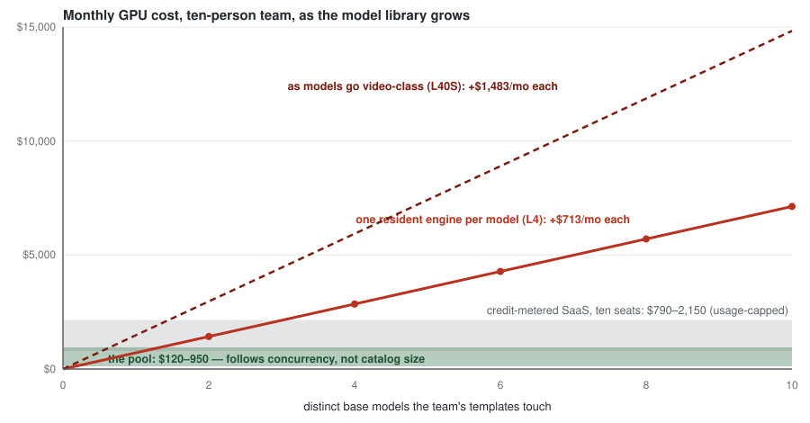

# vLLM Omni and this repo

The question arrives in one of two forms. From strategy: "Red Hat's inference
bet is vLLM Omni — why does this exist?" From engineering: "could Omni serve
this workload?" Both deserve a precise answer rather than a defensive one,
because the precise answer is better for both projects: **they are two tiers
of one stack, and the interesting decision is when a model moves from one
tier to the other** — not which project wins.

`docs/11-scaling.md` makes the general serving-engine argument. This page
names names: what vLLM Omni is, what the existing
[`comfyui-vllm-omni`](https://github.com/dougbtv/comfyui-vllm-omni) bridge
does, the cost arithmetic of each shape, and the composition rule.

## What vLLM Omni is, stated fairly

[vLLM Omni](https://github.com/vllm-project/vllm-omni) extends vLLM to
omni-modality serving: diffusion transformers alongside autoregressive
models on the same engine abstractions, stage-disaggregated pipelines
(encoder → AR → generation), an OpenAI-compatible API, and the performance
work vLLM is known for — request-level batching for diffusion, async output
materialization, distributed layerwise offload. It serves image, video, TTS,
omni (Qwen3-Omni, MiniCPM-o) and robot-policy models, and it is very good at
what it is built for: **one model pipeline, held resident, multiplexing many
requests at high throughput behind an API**.

That sentence contains both the strength and the boundary. Everything below
follows from it.

## What the bridge already does

[`comfyui-vllm-omni`](https://github.com/dougbtv/comfyui-vllm-omni) is a set
of ComfyUI custom nodes that delegate generation calls to a vLLM Omni server
over its OpenAI-compatible API: the node collects parameters, POSTs, decodes
the returned image into ComfyUI tensors, and hands it to the next node. It
ships presets for Omni-served models (Qwen-Image, Z-Image-Turbo), and running
several models means running several Omni servers on several ports.

This is the **right shape of integration** — a ComfyUI node is exactly where
an external engine belongs, because it composes with everything else on the
canvas. What the bridge is not, and does not claim to be, is a deployment
story: by its own README there is no authentication, no load balancing or
failover, no progress streaming, and one manually-started server per model.
Which is the same list of gaps stock ComfyUI has — the list this repo exists
to close. **The bridge and this repo are complementary by construction: the
bridge puts Omni on the canvas; this repo puts the canvas in production.**

## The two axes that actually decide it

**Axis 1 — what a model is.** To a serving engine, a model is a *deployment*:
resident weights, warm cache, an endpoint. To a workflow tool, a model is
*data*: a file on shared storage that this job loads and the next job
replaces. Residency buys throughput on the model you kept; it costs a GPU per
model you kept. Adapters (LoRA) can be multiplexed onto a shared base;
different base checkpoints cannot — and a design team's library is many base
checkpoints. SD1.5, SDXL, FLUX, Qwen-Image, a video model, an upscaler,
whatever last week's template pulled in: `docs/03-storage.md` plans for a
40–120 GB library because that is what real teams have.

**Axis 2 — what a request is.** Omni's API takes a prompt and parameters —
the right interface for an application backend. A designer's unit of work is
a **workflow graph**: a DAG of dozens of nodes whose composition changes per
job, where most nodes are not model inference at all — they are the 60,000+
community nodes of arbitrary Python that do the compositing, masking,
control-signal wiring and format juggling that make the output usable. A
graph does not decompose into API calls without a runtime that executes the
graph; that runtime is ComfyUI. This is not an intake feature Omni is
missing so much as a different product category — and building a graph
runtime, checkpoint hot-swap, and a custom-node execution environment into a
serving engine would be rebuilding ComfyUI inside vLLM, a very large effort
with an unclear payoff when ComfyUI already exists and already runs here.

## The arithmetic

Rates are this repo's own (`docs/02-cost.md`): `g6.xlarge` L4 at $0.976/hour
all-in, `g6e.xlarge` L40S at $2.03/hour all-in for video-class models.

A ten-person team whose templates touch six base models — four image-class,
one video-class, one auxiliary — served residency-style, one engine per
model:

| Shape | GPU line, per month | The assumption doing the work |
|---|---:|---|
| Six resident Omni engines, 24/7 | ~$5,000 | 5 × g6.xlarge + 1 × g6e.xlarge × 730 h |
| Six resident engines, weekday 9–6 | ~$1,350 | same, × 195 h — and someone rebuilds them every morning |
| This repo's pool, heavy iteration | ~$950 | five warm workers, weekdays — the README's own number |
| This repo's pool, light use | ~$120 | 0.4 GPU-h/person/day, scale-to-zero |

The gap is not an efficiency gap — engine for engine, Omni is *more*
efficient at serving the model it holds. The gap is structural: **residency
scales with catalog size; the pool scales with concurrency.** Ten designers
generate 4–24 GPU-hours of demand a day between them, spread across a
catalog. Six resident engines supply 144 GPU-hours a day of capacity, most
of it idle, all of it billed. Add a seventh model to the library and the
residency bill grows a card; the pool bill does not move.

Two multipliers make it worse in practice. **Quota**: six resident engines
need six GPUs of quota held permanently — and G/VT-family quota is the
multi-day support-ticket constraint this repo's `make preflight` exists to
catch. **Duty cycle**: the README's loop diagram shows four of a designer's
five steps never touch a GPU, which is why the pool wins below ~40% duty and
why a serving engine — built for sustained request streams — is mismatched
to this traffic in the first place.

### The catalog curve

The table above holds the catalog at six models; the picture shows what
happens when it grows — which is what model catalogs do, because every new
template drags in a checkpoint. Residency is a staircase: each model added
is another resident engine, **+$713/month on an L4 and +$1,483/month on the
L40S a video model wants**. The pool line does not move: its cost follows
concurrency, and ten people generate the same 4–24 GPU-hours a day whether
their templates touch three models or thirty. Credit-metered SaaS is flat
against models but linear in seats, and capped by credits either way.

The whole argument in one line: **on a serving tier the marginal model
costs a machine; on the pool it costs disk** — $2–30/month for another
100 GB, depending on storage class (`docs/03-storage.md`).

### Two curves compound

Residency cost is N(t) × P(t), and both factors climb. N: catalogs only
grow. P: video models are moving from five-second clips toward multi-shot,
multi-minute generations, and the card each one wants moves with them —
L4 ($0.98/hour) → L40S ($2.03/hour) → H100-class ($7–12/hour per card,
on-demand). A six-model library that residency serves for ~$5,000/month on
today's cards passes $25,000/month when three of those models want H100s.
The pool decouples both curves: the catalog lives on storage, the silicon
is shared, and a bigger card is a bigger *tier* in the same pool
(`docs/11-scaling.md`), not a bigger per-model bill.

## Where Omni genuinely wins

Stated plainly, because a comparison that never concedes anything is
advertising:

- **Text-to-speech and voice — arguably Omni's largest commercial corner.**
  Contact centers, IVR, voice agents, accessibility: classic enterprise
  workloads, sustained request streams, hard latency floors, and no canvas
  anywhere in the picture. Pure serving, exactly Omni's shape (Qwen3-TTS,
  CosyVoice, IndexTTS, the realtime full-duplex work), and the buyer is the
  enterprise customer Red Hat already sells to.
- **API consumers.** A product calling image or video generation from code
  wants an endpoint, an SLA, and throughput — not a canvas. That customer
  should be sold vLLM Omni, full stop.
- **One dominant model at sustained load.** When usage concentrates — every
  job hits Qwen-Image, requests arrive continuously — request-level batching
  on a resident engine beats per-job checkpoint loading by a wide margin.
- **Latency SLOs.** A resident engine answers in seconds every time; this
  pool's cold start is 8–17 minutes unless a warm floor is paid for.
- **The models Omni serves that ComfyUI does not** — the omni and
  robot-policy families have no meaningful ComfyUI story at all.

Video generation is the corner where the two meet and where expectations
diverge: served through an API it is an application feature, but the people
who make video for a living arrive expecting the template → missing models →
node graph → iterate loop, a catalog of checkpoints and LoRAs, and sixty
thousand community nodes. Meeting them there is a workflow-runtime problem,
not a serving problem — which is why this tier exists.

## The composition rule

Both run on the same platform, and `docs/11-scaling.md` already says the
quiet part: the GPU operator, the machine pools, SSO, audit, quota and cost
controls are properties of the cluster, not of either workload. So:

1. **The pool serves the tail.** Every checkpoint, LoRA, ControlNet and
   custom node a template can name, loaded as data from shared storage,
   scaled 0..N on queue depth. This is the flexibility tier, and it is what
   designers actually touch.
2. **Omni serves the head.** When `GET /api/showback` shows one model
   dominating GPU-seconds at sustained duty, promote it: stand up a vLLM
   Omni engine for that model in the same cluster, on its own warm machine
   pool, and let workflows reach it through the bridge nodes — which on this
   platform inherit the gateway's SSO, the namespace's NetworkPolicy, and
   the audit log that the bridge alone does not have.
3. **The showback data is the promotion signal.** "Is usage concentrated
   enough to pin a card to this model?" stops being a strategy debate and
   becomes a query. Demote the engine when concentration drops.

That is the whole relationship: **Omni is the throughput tier for the head
of the usage distribution; this repo is the flexibility tier for the tail —
and the tail is where designers live.** A cluster running both is not a
compromise between two strategies; it is the strategy.

## The corners of the multimodal market, and who serves each

The same picture from the market side — every corner covered, each by the
tier shaped for it, nothing competing with anything:

| Corner | Who buys it | The tier |
|---|---|---|
| Voice: TTS, speech, realtime agents | Contact centers, IVR, accessibility — the classic enterprise buyer | vLLM Omni, resident |
| Generation called from application code | Product teams that want an endpoint and an SLA | vLLM Omni, resident |
| Designer/artist image and video workflows | Studios, agencies, brand and marketing teams | The ComfyUI pool — this repo |
| A hot model *inside* those workflows | The same studios, once showback shows concentration | An Omni engine beside the pool, reached through the bridge nodes |
| Omni-modal and robot-policy models | Robotics and agents programs | vLLM Omni |

One platform underneath all five rows — which is the part that is actually
Red Hat's to sell.

## Sources

- [vLLM Omni announcement](https://vllm.ai/blog/2025-11-30-vllm-omni) and
  [documentation](https://docs.vllm.ai/projects/vllm-omni/en/latest/)
- [Inside the vLLM-Omni architecture — Red Hat Developer](https://developers.redhat.com/articles/2026/07/01/inside-vllm-omni-architecture-serving-qwen3-omni)
- [comfyui-vllm-omni](https://github.com/dougbtv/comfyui-vllm-omni) — the
  bridge nodes
- `docs/11-scaling.md` — the general serving-engine argument;
  `docs/02-cost.md` — the rates; `docs/06-enterprise-architecture.md` — the
  queueing design the pool tier rests on
