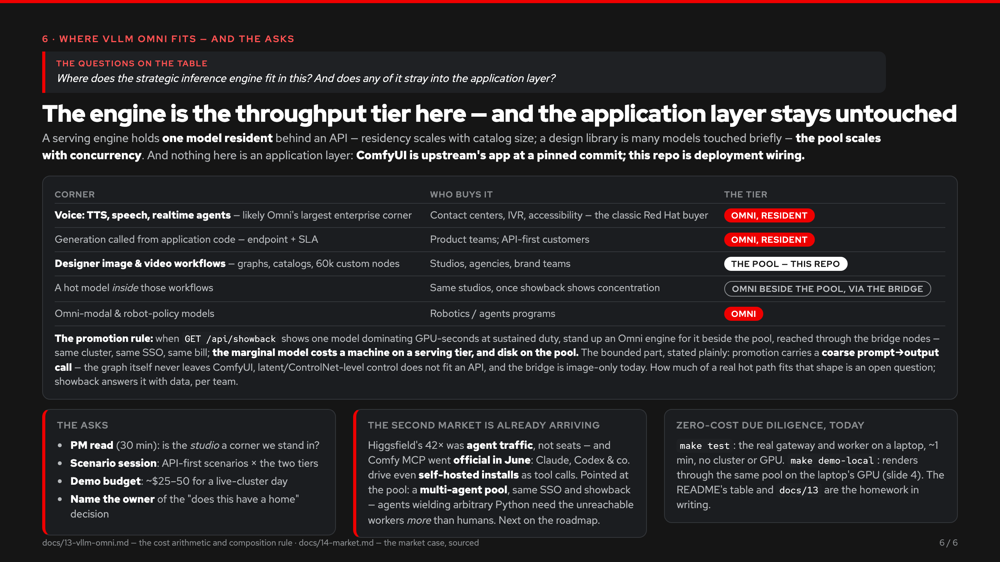
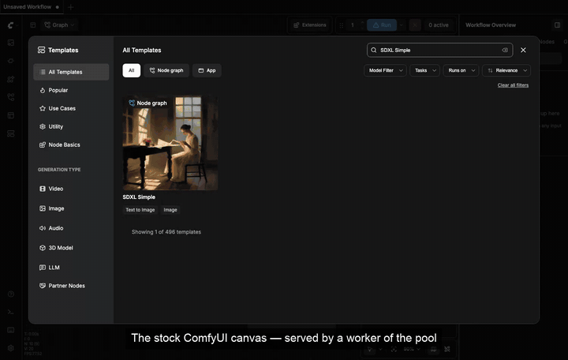

# The briefing

Six slides. Each opens with the questions on the table and answers them:
the current state of ComfyUI teams, the proposed state, what this repository
does to enable it, the pool running live on a laptop, the one-sentence
economics — *residency scales with catalog size; the pool scales with
concurrency* — and where vLLM Omni fits.

*(GitHub renders this page when you browse the folder — the deck below is
the deck. For presenting: [`index.html`](index.html) is the live version,
arrow keys to navigate; [`comfyui-on-openshift-pitch.pdf`](comfyui-on-openshift-pitch.pdf)
is the same slides as a click-through PDF.)*

---

---

---

---

---

---

---

Slide 4 also exists in motion. Ten seconds of it, autoplaying — the
template found, two missing models named and sized, ComfyUI-Manager
pulling both to the worker — and clicking through lands on the full take:

The full clips, both recorded off `make demo-local`, real renders
throughout, reproducible on any machine with a GPU, Apple silicon
included:

- [`demo-local-designer-loop.mp4`](demo-local-designer-loop.mp4) — the
  designer's loop, end to end: the stock ComfyUI canvas a pool worker
  serves, the SDXL template loaded, two missing checkpoints found, named
  and sized, **ComfyUI-Manager pulling 12.6 GB to the worker server-side**
  (time-lapsed), errors clearing, and the graph rendering with per-node
  progress. The add-on is the hinge of the whole story: the desktop habit
  survives while the models and the GPU move to the datacenter.
- [`demo-local-pool.mp4`](demo-local-pool.mp4) — the multi-user half: two
  browser panes queueing against the two-worker pool at once, progress
  streaming over WebSockets, two different renders landing.

Since those takes, the fetch grew its product button: the gateway's Models
section — paste the URL the missing-models panel hands you, **Install to
pool**, watch the bar. Same validated server-side pull, one click, shown
live on slide 4 (a real Hugging Face download at 40%). In the cluster this
is the only road models can arrive by: the workers have no internet by
design, so the gateway — which runs no user code — validates the source
and the format and pulls once for everyone.

Every number on these slides is backed in this repository: the cost model in
[`../02-cost.md`](../02-cost.md), the comparison table on the
[front page](../../README.md), the serving-tier arithmetic in
[`../13-vllm-omni.md`](../13-vllm-omni.md), and the market case in
[`../14-market.md`](../14-market.md). The slide images and the PDF are
exported from `index.html` by [`export.py`](export.py) — rerun it after any
edit to the deck (it drives the deck's own `#Nx` export mode: slide N, nav
hidden, videos pinned to their poster frame).
