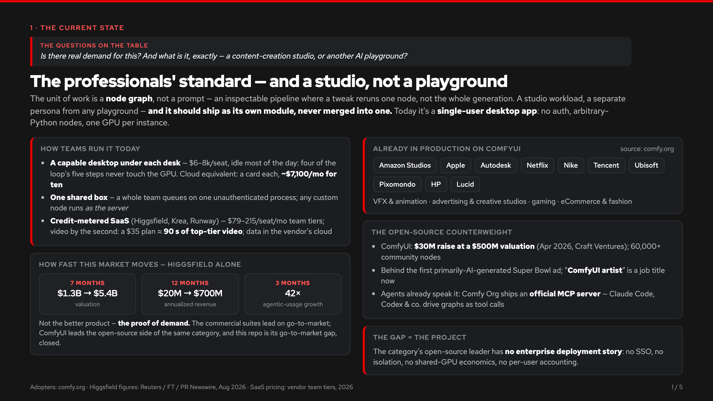
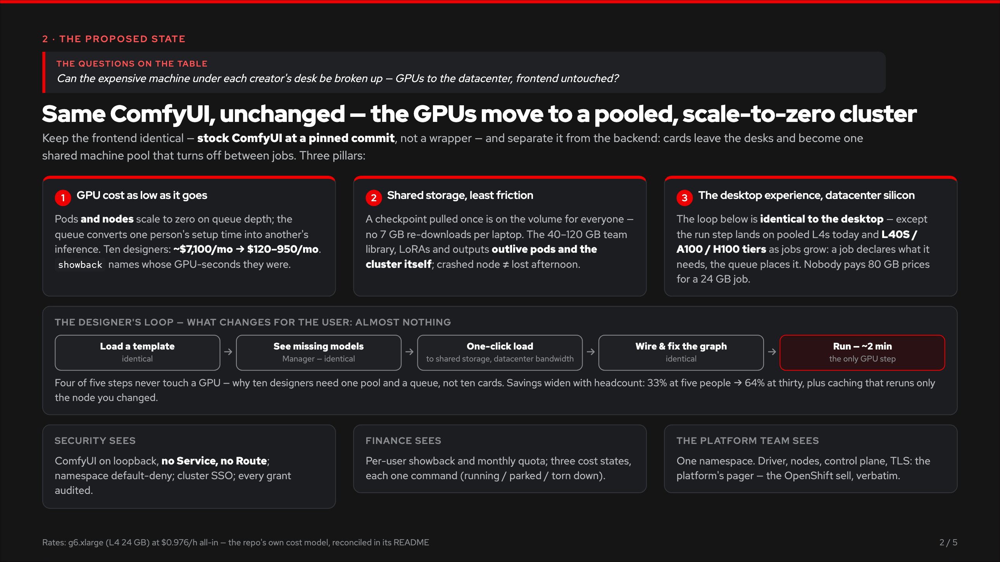
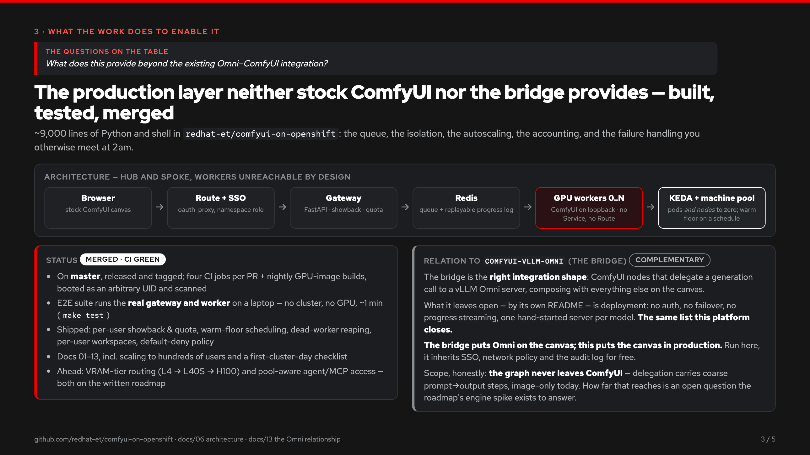
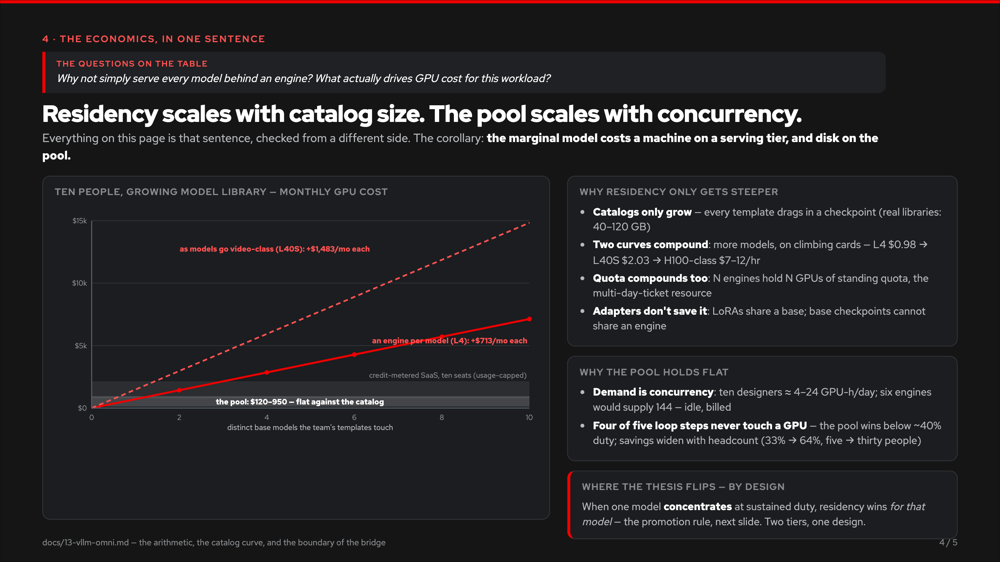
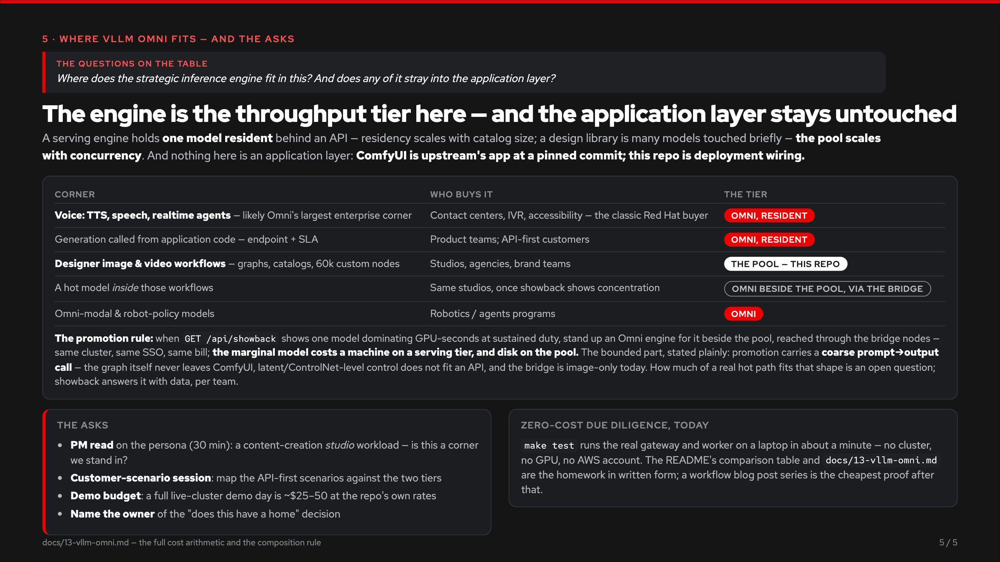

# The briefing

Five slides. Each opens with the questions on the table and answers them:
the current state of ComfyUI teams, the proposed state, what this repository
does to enable it, the one-sentence economics — *residency scales with
catalog size; the pool scales with concurrency* — and where vLLM Omni fits.

*(GitHub renders this page when you browse the folder — the deck below is
the deck. For presenting: [`index.html`](index.html) is the live version,
arrow keys to navigate; [`comfyui-on-openshift-pitch.pdf`](comfyui-on-openshift-pitch.pdf)
is the same slides as a click-through PDF.)*

---

---

---

---

---

---

Every number on these slides is backed in this repository: the cost model in
[`../02-cost.md`](../02-cost.md), the comparison table on the
[front page](../../README.md), the serving-tier arithmetic in
[`../13-vllm-omni.md`](../13-vllm-omni.md), and the market case in
[`../14-market.md`](../14-market.md). The slide images are exported from
`index.html`; regenerate them after editing it.
