# The brief

The six-slide deck one folder up, cut to what a mixed room retains: ten
slides, each opening with the question on the table and answering it in the
title, three or four bullets, one picture — the same hub-and-spoke diagram
drawn identically on slides 5, 8 and 9 with only the red highlight moving —
and a one-line takeaway at the foot. Three appendix slides hold the
comparison table, the cost ladder and the sources for Q&A.

Written for two readers at once: an engineer who knows text inference
(slide 2's "if you know vLLM" door: *the model is a deployment there, a part
pulled from the shelf here*) and a program manager new to the space (the other door: *a prompt box
is a vending machine, a graph is a production line*). The vocabulary is fixed on
slide 2 and never swapped afterwards: model (checkpoint), graph (workflow),
canvas (frontend), worker (pod).

**Leaner still:** [`index-lean.html`](index-lean.html) / [`comfyui-on-openshift-brief-lean.pdf`](comfyui-on-openshift-brief-lean.pdf) is the same ten slides with the chrome stripped — the question large, three or four short bullets, one picture, no appendix. Fill the rest by talking, or point at this deck and the repo.

*(For presenting: [`index.html`](index.html) is the live version, arrow keys
to navigate; [`comfyui-on-openshift-brief.pdf`](comfyui-on-openshift-brief.pdf)
is the same slides as a click-through PDF.)*

---

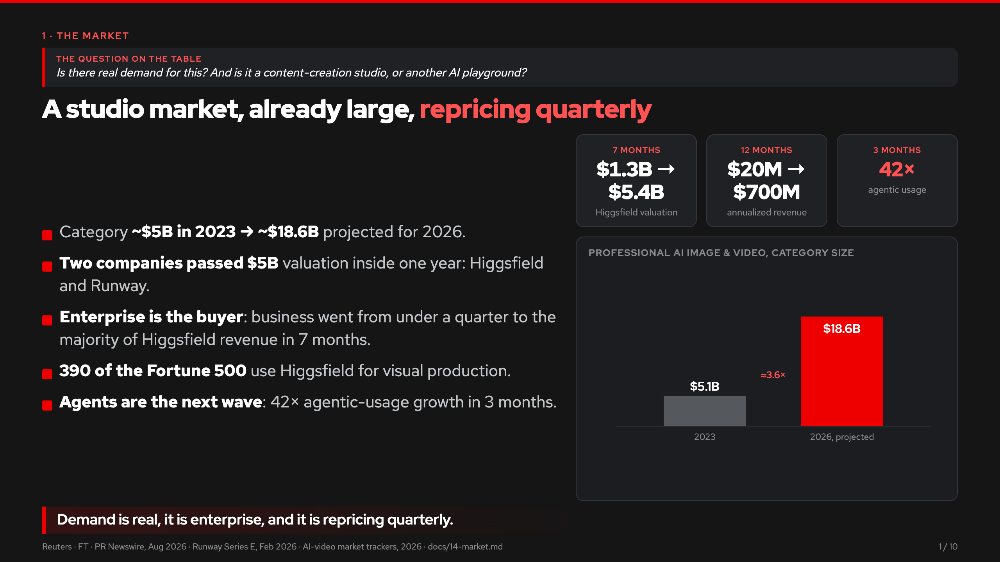

---

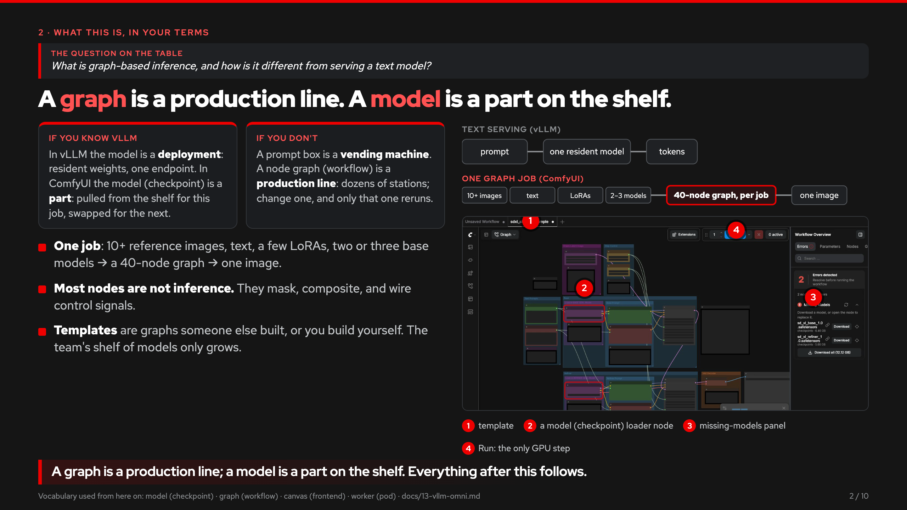

---

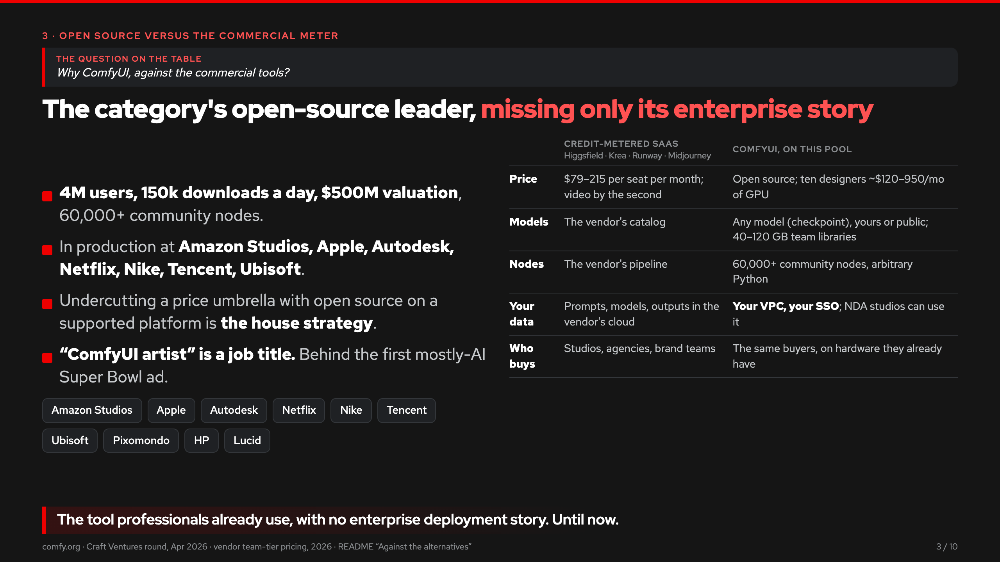

---

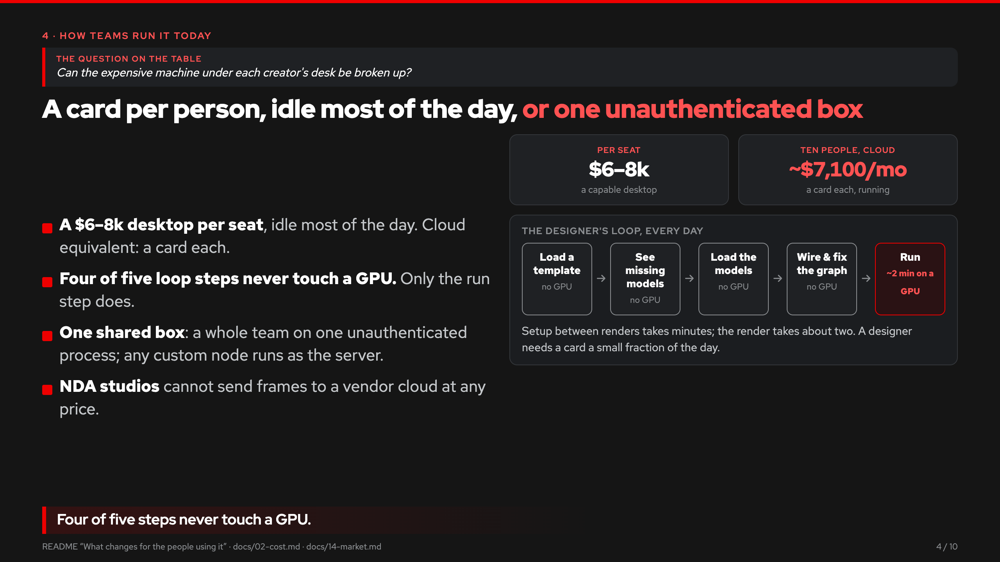

---

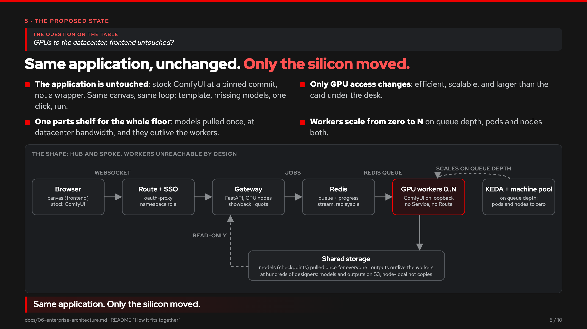

---

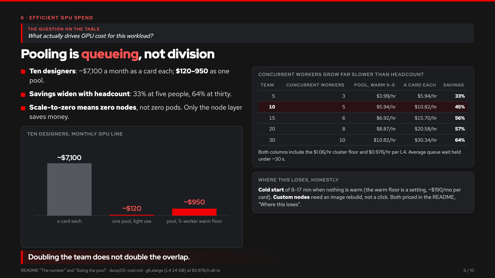

---

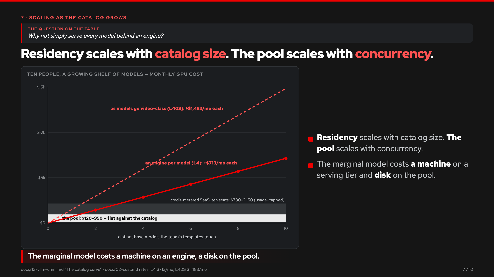

---

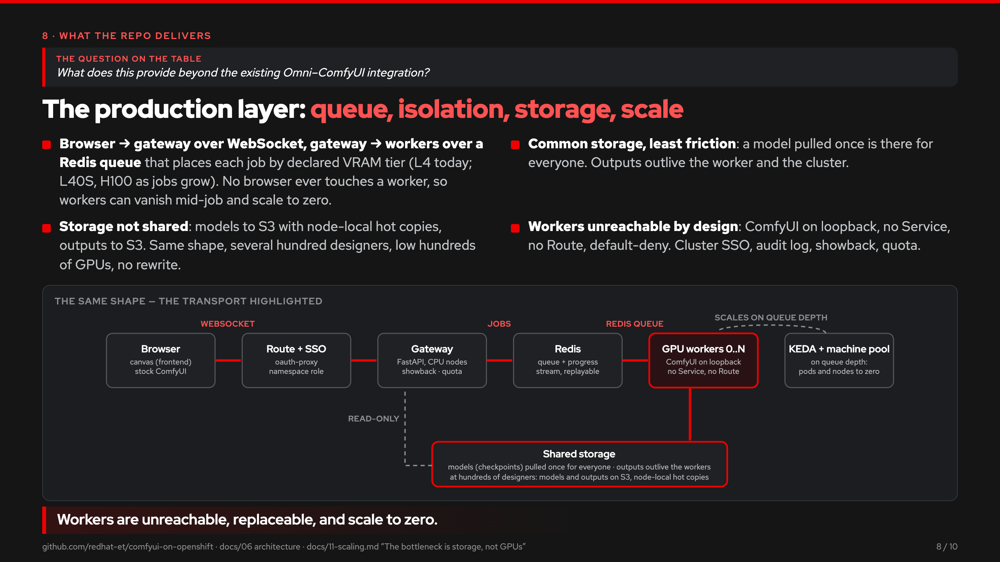

---

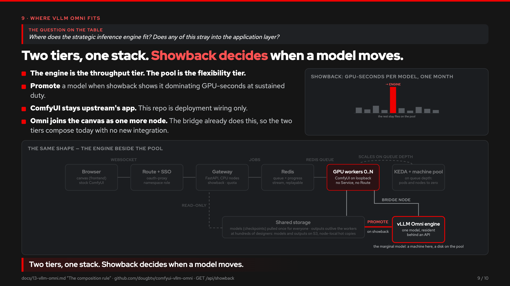

---

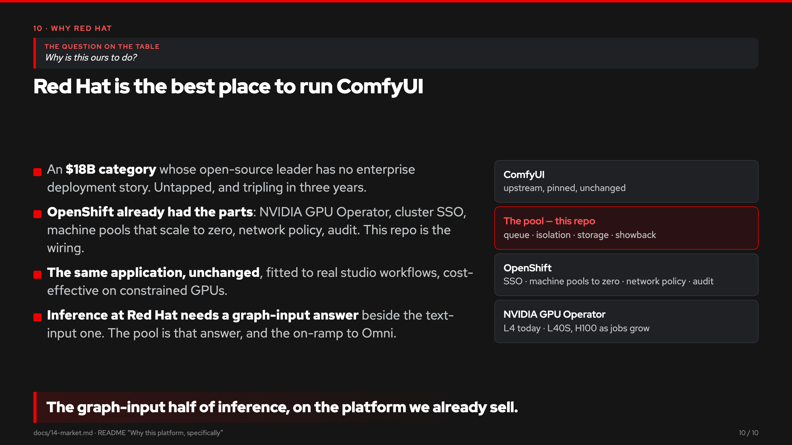

---

Appendix, for the questions that follow:

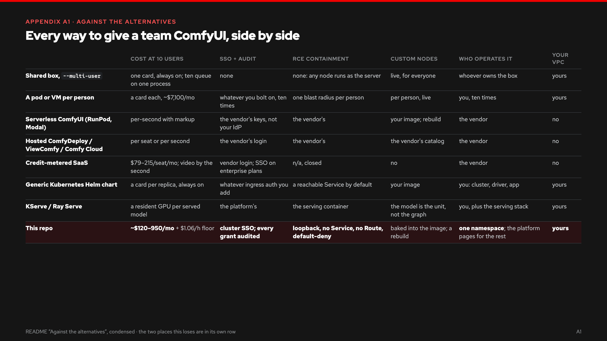

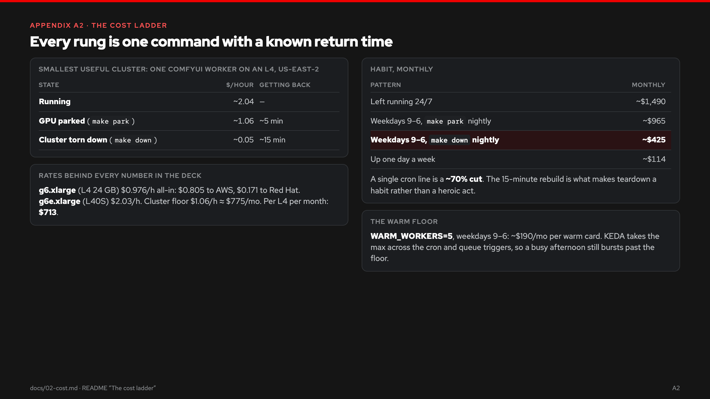

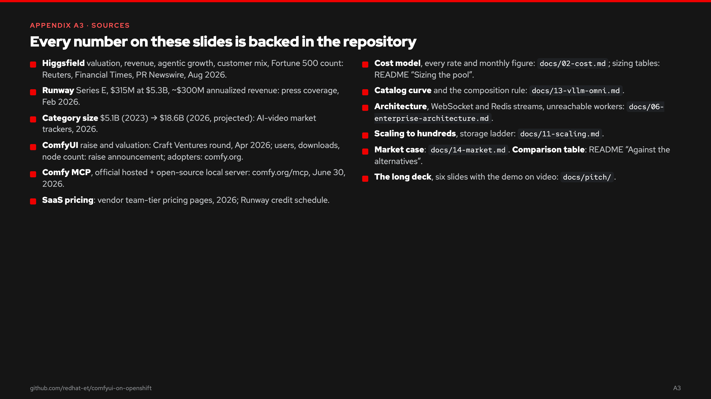

Every number is backed one folder up and in the repository: the cost model in
[`../../02-cost.md`](../../02-cost.md), the comparison table on the
[front page](../../../README.md), the catalog curve in
[`../../13-vllm-omni.md`](../../13-vllm-omni.md), the market case in
[`../../14-market.md`](../../14-market.md). The slide images and the PDF are
exported from `index.html` by [`export.py`](export.py) — rerun it after any
edit to the deck; `export.py lean` does the same for the lean variant.
